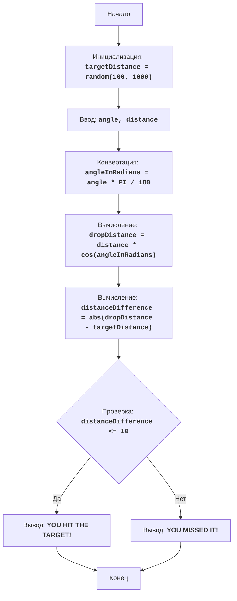

# BOMBER

## סקירה כללית

משחק "Bomber" הוא משחק פאזל שבו השחקן מנסה להפיל פצצה על מטרה הממוקמת במרחק שנוצר באופן אקראי. השחקן מזין את זווית ההטלה והמרחק, והמחשב מחשב את מסלול הפצצה. מטרת המשחק היא לפגוע במטרה בדיוק רב ככל האפשר.

## תוכן עניינים

1. [סקירה כללית](#סקירה-כללית)
2. [חוקי המשחק](#חוקי-המשחק)
3. [אלגוריתם](#אלגוריתם)
4. [תרשים זרימה](#תרשים-זרימה)
5. [מקרא](#מקרא)

## חוקי המשחק

1. המחשב יוצר מרחק אקראי למטרה בטווח של 100 עד 1000.
2. השחקן מזין את זווית הטלת הפצצה ואת מרחק הטלת הפצצה.
3. המחשב מחשב את המרחק שהפצצה תיפול.
4. אם מרחק הנפילה של הפצצה נמצא בטווח של 10 יחידות ממרחק המטרה, השחקן מנצח.
5. אם מרחק הנפילה של הפצצה אינו בטווח, השחקן מפסיד.

## אלגוריתם

1. צור מרחק אקראי למטרה בטווח של 100 עד 1000 והקצה אותו למשתנה `targetDistance`.
2. בקש מהשחקן את זווית הטלת הפצצה במעלות (זווית) ואת מרחק ההטלה (מרחק).
3. המר את הזווית ממעלות לרדיאנים `angleInRadians = angle * 3.14159 / 180`.
4. חשב את מרחק הנפילה של הפצצה באמצעות הנוסחה: `dropDistance = distance * cos(angleInRadians)`.
5. חשב את ההפרש בין מרחק הנפילה של הפצצה למרחק המטרה: `distanceDifference = abs(dropDistance - targetDistance)`.
6. אם ההפרש בין המרחקים קטן או שווה ל-10, הצג הודעת ניצחון.
7. אחרת, הצג הודעת הפסד.
8. סיום המשחק.

## תרשים זרימה

## מקרא

    Start - תחילת התוכנית.
    InitializeTargetDistance - אתחול: מרחק אקראי למטרה (targetDistance) מ-100 עד 1000.
    InputAngleDistance - בקשה מהמשתמש לזווית הטלה (angle) ומרחק הטלה (distance).
    ConvertAngle - המרת הזווית ממעלות לרדיאנים (angleInRadians).
    CalculateDropDistance - חישוב מרחק הנפילה של הפצצה (dropDistance) על סמך הנתונים שהוזנו.
    CalculateDistanceDifference - חישוב ההפרש המוחלט בין מרחק הנפילה של הפצצה (dropDistance) למרחק המטרה (targetDistance).
    CheckDistanceDifference - בדיקה אם ההפרש בין המרחקים נמצא בטווח של 10 יחידות (distanceDifference <= 10).
    OutputWin - הצגת הודעה על ניצחון, אם ההפרש נמצא בטווח של 10 יחידות.
    End - סיום התוכנית.
    OutputLose - הצגת הודעה על הפסד, אם ההפרש גדול מ-10 יחידות.