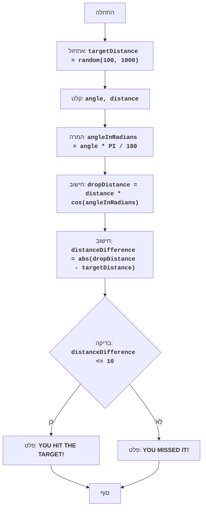

# BOMBER

## סקירה כללית

משחק "הבומר" הוא משחק פאזל שבו השחקן מנסה להפיל פצצה על מטרה הממוקמת במרחק שנוצר באופן אקראי. השחקן מזין את זווית השחרור והמרחק, והמחשב מחשב את מסלול הפצצה. מטרת המשחק היא לפגוע במטרה בצורה מדויקת ככל האפשר.

## תוכן עניינים

1. [חוקי המשחק](#חוקי-המשחק)
2. [אלגוריתם](#אלגוריתם)
3. [תרשים זרימה](#תרשים-זרימה)
4. [מקרא](#מקרא)

## חוקי המשחק

1. המחשב מייצר מרחק אקראי למטרה בטווח שבין 100 ל-1000.
2. השחקן מזין את זווית שחרור הפצצה ואת מרחק שחרור הפצצה.
3. המחשב מחשב את המרחק אליו תיפול הפצצה.
4. אם מרחק נפילת הפצצה נמצא בטווח של 10 יחידות מהמרחק למטרה, השחקן מנצח.
5. אם מרחק נפילת הפצצה אינו נופל בטווח, השחקן מפסיד.

## אלגוריתם

1. יצירת מרחק אקראי למטרה בטווח שבין 100 ל-1000 והקצאתו למשתנה `targetDistance`.
2. בקשת זווית שחרור הפצצה במעלות (זווית) ומרחק שחרור (מרחק) מהשחקן.
3. המרת זווית ממעלות לרדיאנים `angleInRadians = angle * 3.14159 / 180`.
4. חישוב מרחק נפילת הפצצה על פי הנוסחה: `dropDistance = distance * cos(angleInRadians)`.
5. חישוב ההפרש בין מרחק נפילת הפצצה למרחק למטרה: `distanceDifference = abs(dropDistance - targetDistance)`.
6. אם ההפרש בין המרחקים קטן או שווה ל-10, יש להציג הודעה על ניצחון.
7. אחרת, יש להציג הודעה על הפסד.
8. סיום המשחק.

## תרשים זרימה

## מקרא

- **Start** - תחילת התוכנית.
- **InitializeTargetDistance** - אתחול: יוצר מרחק אקראי למטרה (targetDistance) בין 100 ל-1000.
- **InputAngleDistance** - קלט ממשתמש של זווית השחרור (angle) ומרחק השחרור (distance).
- **ConvertAngle** - המרת זווית ממעלות לרדיאנים (angleInRadians).
- **CalculateDropDistance** - חישוב מרחק נפילת הפצצה (dropDistance) על סמך נתוני הקלט.
- **CalculateDistanceDifference** - חישוב ההפרש המוחלט בין מרחק נפילת הפצצה (dropDistance) למרחק למטרה (targetDistance).
- **CheckDistanceDifference** - בדיקה האם ההפרש בין המרחקים נמצא בטווח של 10 יחידות (distanceDifference <= 10).
- **OutputWin** - פלט הודעת ניצחון, אם ההפרש נמצא בטווח של 10 יחידות.
- **End** - סוף התוכנית.
- **OutputLose** - פלט הודעת הפסד, אם ההפרש גדול מ-10 יחידות.