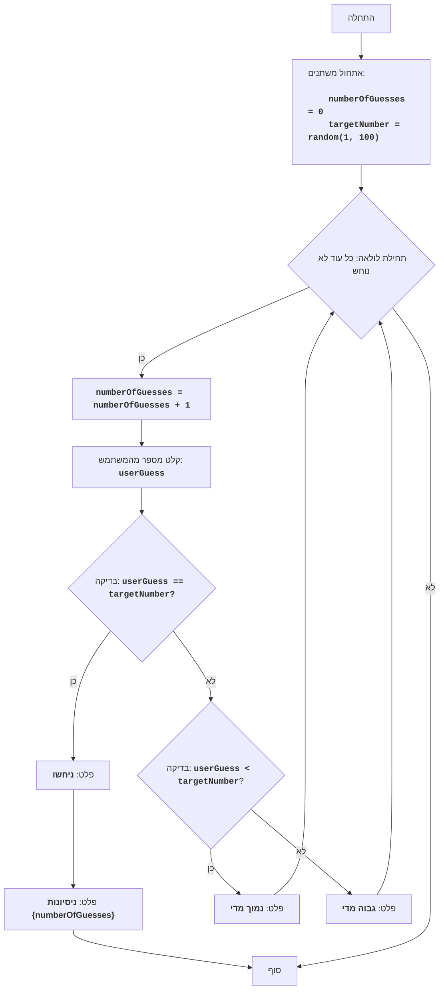

# BUZZWD

## סקירה כללית

משחק "BUZZWD" הוא משחק ניחוש מספרים פשוט, בו המחשב מייצר מספר אקראי והשחקן צריך לנחש אותו על ידי הזנת מספרים בתורות. לאחר כל קלט, התוכנית מציינת אם המספר שהוכנס הוא "גבוה מדי", "נמוך מדי" או שניחשו אותו נכון. המשחק מסתיים כאשר השחקן מנחש נכון את המספר.

## תוכן עניינים

1. [סקירה כללית](#סקירה-כללית)
2. [חוקי המשחק](#חוקי-המשחק)
3. [אלגוריתם](#אלגוריתם)
4. [תרשים זרימה](#תרשים-זרימה)
5. [מקרא](#מקרא)

## חוקי המשחק

1. המחשב בוחר מספר שלם אקראי בין 1 ל-100.
2. השחקן מזין את הניחושים שלו למספר המסתורי.
3. לאחר כל ניסיון, המחשב מציין האם המספר שהוכנס נמוך מדי, גבוה מדי או שניחשו אותו נכון.
4. המשחק ממשיך עד שהשחקן מנחש נכון את המספר המסתורי.

## אלגוריתם

1. אתחל מונה ניסיונות ל-0.
2. צור מספר אקראי בטווח 1 עד 100.
3. התחל בלולאה "כל עוד לא נוחש המספר":
   3.1 הגדל את מונה הניסיונות ב-1.
   3.2 בקש מהשחקן להזין מספר.
   3.3 אם המספר שהוזן שווה למספר המסתורי, הצג הודעה "ניחשו" ועבור לשלב 4.
   3.4 אם המספר שהוזן קטן מהמספר המסתורי, הצג הודעה "נמוך מדי".
   3.5 אם המספר שהוזן גדול מהמספר המסתורי, הצג הודעה "גבוה מדי".
4. הצג הודעה "ניסיונות {מונה ניסיונות}".
5. סוף המשחק.

## תרשים זרימה

## מקרא

    Start - תחילת התוכנית.
    InitializeVariables - אתחול משתנים: numberOfGuesses (מספר ניסיונות) מוגדר ל-0, ו-targetNumber (המספר המסתורי) נוצר באופן אקראי מ-1 עד 100.
    LoopStart - תחילת לולאה, שממשיכה עד שמנחשים את המספר.
    IncreaseGuesses - הגדלת מונה הניסיונות ב-1.
    InputGuess - בקשה מהמשתמש להזין מספר ושמירתו במשתנה userGuess.
    CheckGuess - בדיקה האם המספר שהוזן userGuess שווה למספר המסתורי targetNumber.
    OutputWin - פלט הודעה "ניחשו", אם המספרים שווים.
    OutputAttempts - פלט הודעה "ניסיונות {numberOfGuesses}", עם ציון מספר הניסיונות.
    End - סוף התוכנית.
    CheckLow - בדיקה האם המספר שהוזן userGuess קטן מהמספר המסתורי targetNumber.
    OutputLow - פלט הודעה "נמוך מדי", אם המספר שהוזן קטן מהמספר המסתורי.
    OutputHigh - פלט הודעה "גבוה מדי", אם המספר שהוזן גדול מהמספר המסתורי.