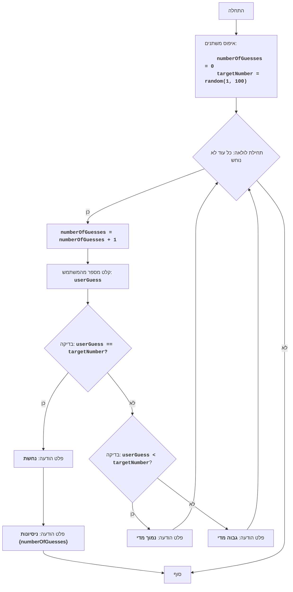

# BUZZWD

## סקירה כללית

משחק "BUZZWD" הוא משחק ניחושי מספרים פשוט, בו המחשב מייצר מספר אקראי והשחקן צריך לנחש אותו על ידי הזנת מספרים בתורו. לאחר כל הזנה, התוכנית מודיעה האם המספר שהוזן "גבוה מדי", "נמוך מדי", או שאותו ניחשו. המשחק מסתיים כאשר השחקן מנחש נכון את המספר.

## תוכן עניינים

1. [סקירה כללית](#סקירה-כללית)
2. [חוקי המשחק](#חוקי-המשחק)
3. [אלגוריתם](#אלגוריתם)
4. [תרשים זרימה](#תרשים-זרימה)
5. [מקרא](#מקרא)

## חוקי המשחק

1. המחשב בוחר מספר שלם אקראי בין 1 ל-100.
2. השחקן מזין את ניחושיו לגבי המספר הנבחר.
3. לאחר כל ניסיון, המחשב מודיע האם המספר שהוזן היה נמוך מדי, גבוה מדי או שנוחש.
4. המשחק נמשך עד שהשחקן מנחש את המספר הנבחר.

## אלגוריתם

1. הגדר את מונה הניסיונות ל-0.
2. צור מספר אקראי בטווח שבין 1 ל-100.
3. התחל לולאה "כל עוד המספר לא נוחש":
    3.1 הגדל את מונה הניסיונות ב-1.
    3.2 בקש מהשחקן להזין מספר.
    3.3 אם המספר שהוזן שווה למספר הנבחר, הדפס הודעה "נחשת" ועבור לשלב 4.
    3.4 אם המספר שהוזן קטן מהמספר הנבחר, הדפס הודעה "נמוך מדי".
    3.5 אם המספר שהוזן גדול מהמספר הנבחר, הדפס הודעה "גבוה מדי".
4. הדפס הודעה "ניסיונות {מונה ניסיונות}".
5. סוף המשחק.

## תרשים זרימה

## מקרא

    Start - תחילת התוכנית.
    InitializeVariables - אתחול משתנים: numberOfGuesses (מספר הניסיונות) מוגדר ל-0, ו-targetNumber (המספר המיועד) נוצר באופן אקראי מ-1 עד 100.
    LoopStart - תחילת לולאה, שנמשכת עד שהמספר נוחש.
    IncreaseGuesses - הגדלת מונה מספר הניסיונות ב-1.
    InputGuess - בקשה מהמשתמש להזין מספר ושמירתו במשתנה userGuess.
    CheckGuess - בדיקה האם המספר שהוזן userGuess שווה למספר המיועד targetNumber.
    OutputWin - פלט הודעה "נחשת", אם המספרים שווים.
    OutputAttempts - פלט הודעה "ניסיונות {numberOfGuesses}", עם ציון מספר הניסיונות.
    End - סוף התוכנית.
    CheckLow - בדיקה האם המספר שהוזן userGuess קטן מהמספר המיועד targetNumber.
    OutputLow - פלט הודעה "נמוך מדי", אם המספר שהוזן קטן מהמספר המיועד.
    OutputHigh - פלט הודעה "גבוה מדי", אם המספר שהוזן גדול מהמספר המיועד.