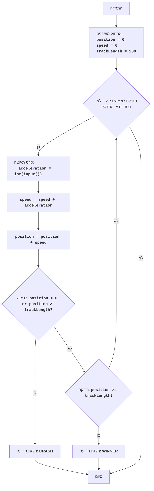

# CAN AM

## סקירה כללית

המשחק "CAN AM" הוא סימולציה של מרוץ על מסלול. השחקן שולט במכונית וקובע כמה פעמים עליו ללחוץ על הגז כדי להגיע לקו הסיום. השחקן צריך לחשב נכון את התאוצה כדי לא לצאת מהמסלול או לעצור מוקדם מדי.

## תוכן עניינים

1. [סקירה כללית](#סקירה-כללית)
2. [תיאור המשחק](#תיאור-המשחק)
3. [אלגוריתם](#אלגוריתם)
4. [תרשים זרימה](#תרשים-זרימה)
5. [קוד Python](#קוד-python)
6. [הסבר קוד](#הסבר-קוד)

## תיאור המשחק

1. השחקן מתחיל את המרוץ מנקודת התחלה 0.
2. אורך המסלול קבוע ושווה ל-200.
3. בכל תור, השחקן מזין את מספר הלחיצות על הגז (מ-0 עד 9).
4. מהירות המכונית גדלה בערך שהוזן.
5. המיקום החדש של המכונית מחושב על ידי הוספת המהירות הנוכחית למיקום הנוכחי.
6. אם מיקום המכונית קטן מאפס או גדול מ-200, השחקן מפסיד במשחק.
7. אם מיקום המכונית מגיע ל-200 או יותר, השחקן מנצח במשחק.
8. המשחק נמשך עד שהשחקן מגיע לקו הסיום או יוצא מהמסלול.

## אלגוריתם

1. הגדר את המיקום ההתחלתי של המכונית ל-0.
2. הגדר את המהירות ההתחלתית של המכונית ל-0.
3. הגדר את אורך המסלול ל-200.
4. התחל לולאה "כל עוד המכונית לא הגיעה לקו הסיום או יצאה מהמסלול":
   4.1. בקש מהשחקן את מספר הלחיצות על הגז.
   4.2. הגדל את המהירות בערך שהוזן.
   4.3. שנה את המיקום על ידי הוספת המהירות הנוכחית למיקום הנוכחי.
   4.4. אם המיקום קטן מאפס או גדול מאורך המסלול, הצג הודעה "CRASH" וסיים את המשחק.
   4.5. אם המיקום גדול או שווה לאורך המסלול, הצג הודעה "WINNER" וסיים את המשחק.
5. סוף המשחק.

## תרשים זרימה



מקרא:

- `Start`: תחילת התוכנית.
- `InitializeVariables`: אתחול משתנים: `position` (מיקום נוכחי) מוגדר ל-0, `speed` (מהירות נוכחית) מוגדר ל-0, `trackLength` (אורך המסלול) מוגדר ל-200.
- `LoopStart`: תחילת לולאה, שנמשכת כל עוד המכונית לא הגיעה לקו הסיום או לא התרסקה.
- `InputAcceleration`: בקשת קלט מהמשתמש עבור התאוצה ושמירה במשתנה `acceleration`.
- `UpdateSpeed`: עדכון המהירות: למהירות הנוכחית מתווספת התאוצה שהוזנה.
- `UpdatePosition`: עדכון המיקום: למיקום הנוכחי מתווספת המהירות הנוכחית.
- `CheckCrash`: בדיקה, האם המיקום יצא מחוץ לגבולות המסלול (קטן מ-0 או גדול מ-`trackLength`).
- `OutputCrash`: הצגת הודעה "CRASH", אם התרחשה תאונה.
- `End`: סיום התוכנית.
- `CheckWin`: בדיקה, האם המיקום הגיע לקצה המסלול (גדול או שווה ל-`trackLength`).
- `OutputWin`: הצגת הודעה "WINNER", אם הושג קו הסיום.

## קוד Python

```python
import time

# Инициализация переменных
position = 0 # Начальная позиция автомобиля
speed = 0    # Начальная скорость автомобиля
trackLength = 200 # Длина трассы

print("Игра CAN AM началась!")
time.sleep(1)  # Задержка 1 секунду
# Основной игровой цикл
while True:
    print(f"Текущая позиция: {position}, текущая скорость: {speed}")
    # Запрашиваем у пользователя ввод ускорения
    try:
        acceleration = int(input("Введите ускорение (0-9): "))
    except ValueError:
        print("Пожалуйста, введите целое число от 0 до 9.")
        continue
    
    if acceleration < 0 or acceleration > 9:
      print("Ускорение должно быть в диапазоне от 0 до 9.")
      continue

    # Обновляем скорость
    speed += acceleration
    # Обновляем позицию
    position += speed

    # Проверяем, не вылетела ли машина с трассы
    if position < 0 or position > trackLength:
        print("CRASH! Вы вылетели с трассы!")
        break # Завершаем игру
    # Проверяем, не достигли ли финиша
    if position >= trackLength:
        print("WINNER! Вы достигли финиша!")
        break # Завершаем игру
    time.sleep(1) # Задержка 1 секунду
```

## הסבר קוד

1. **ייבוא מודול `time`**:
    - `import time`: מייבא את מודול `time`, שמשמש ליצירת עיכוב בביצוע התוכנית.

2. **אתחול משתנים**:
   - `position = 0`: מאתחל את המשתנה `position` (המיקום ההתחלתי של המכונית) לערך 0.
   - `speed = 0`: מאתחל את המשתנה `speed` (המהירות ההתחלתית של המכונית) לערך 0.
   - `trackLength = 200`: מאתחל את המשתנה `trackLength` (אורך המסלול) לערך 200.

3.  **הודעת פתיחה**:
    - מודפסת הודעה "המשחק CAN AM התחיל!".
    - `time.sleep(1)` - יוצר עיכוב של שנייה אחת.

4. **לולאה ראשית `while True:`**:
    - לולאה אינסופית שנמשכת עד שהשחקן מגיע לקו הסיום או יוצא מהמסלול (מתבצעת פקודת `break`).
    - `print(f"המיקום הנוכחי: {position}, המהירות הנוכחית: {speed}")`: מדפיס את המיקום והמהירות הנוכחיים של המכונית.

5.  **קליטת נתונים**:
    - `try...except ValueError`: בלוק try-except מטפל בשגיאות קלט אפשריות. אם המשתמש מזין לא מספר שלם, תודפס הודעת שגיאה.
    - `acceleration = int(input("הזן תאוצה (0-9): "))`: מבקש מהמשתמש להזין תאוצה וממיר אותו למספר שלם.

6. **בדיקת טווח התאוצה**:
    - `if acceleration < 0 or acceleration > 9:`: בודק האם התאוצה חורגת מהטווח המותר.
    - `print("התאוצה צריכה להיות בטווח בין 0 ל-9.")`: אם התאוצה אינה נכונה, מודפסת הודעת שגיאה והלולאה ממשיכה לאיטרציה הבאה.

7.  **עדכון מהירות ומיקום**:
    - `speed += acceleration`: מגדיל את המהירות הנוכחית של המכונית בערך התאוצה שהוזן.
    - `position += speed`: מעדכן את המיקום הנוכחי של המכונית על ידי הוספת המהירות הנוכחית.

8.  **בדיקת התרסקות**:
    - `if position < 0 or position > trackLength:`: בודק האם המכונית יצאה מגבולות המסלול.
    - `print("CRASH! יצאת מהמסלול!")`: מדפיס הודעה על הפסד.
    - `break`: מסיים את הלולאה אם התרחשה התרסקות.

9.  **בדיקת ניצחון**:
    - `if position >= trackLength:`: בודק האם המכונית הגיעה לקו הסיום.
    - `print("WINNER! הגעת לקו הסיום!")`: מדפיס הודעת ניצחון.
    - `break`: מסיים את הלולאה אם השחקן ניצח.

10.  `time.sleep(1)`: יוצר הפסקה של שנייה אחת כדי שהשחקן יוכל לראות את התוצאות.