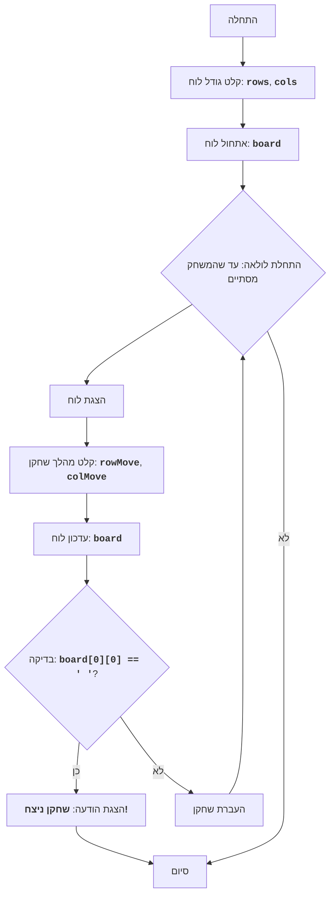

# CHOMP

## סקירה כללית

המשחק "CHOMP" הוא משחק לשני שחקנים המשתמש בלוח מלבני המייצג חפיסת שוקולד. אחת הפינות (בדרך כלל השמאלית התחתונה) מייצגת "חתיכה" רעילה. השחקנים בתורם שוברים חתיכות מהלוח, ונעים. מטרת המשחק היא לגרום ליריב לאכול את החתיכה הרעילה.
השחקן שנאלץ לאכול את החתיכה הרעילה מפסיד.

## תוכן עניינים

1. [כללי המשחק](#כללי-המשחק)
2. [אלגוריתם](#אלגוריתם)
3. [תרשים זרימה](#תרשים-זרימה)

## כללי המשחק

1.  שדה המשחק הוא חפיסת שוקולד מלבנית.
2.  אחת הפינות (השמאלית התחתונה) נחשבת רעילה.
3.  שחקנים בתורם נוגסים חלק מחפיסת השוקולד.
4.  השחקן בוחר שורה ועמודה (נוגס חתיכת שוקולד).
5.  כל התאים מימין ומעל המיקום שנבחר נמחקים.
6.  המטרה היא לגרום ליריב לאכול את החתיכה הרעילה.
7.  השחקן שאוכל את החתיכה הרעילה מפסיד.

## אלגוריתם

1.  תחילת המשחק.
2.  בקשת גודל חפיסת השוקולד מהמשתמש (מספר השורות והעמודות).
3.  אתחול לוח המשחק המייצג את חפיסת השוקולד.
4.  התחלת מחזור המשחק עד לסיומו:
    4.1. הצגת מצב הלוח הנוכחי על המסך.
    4.2. בקשת קואורדינטות החתיכה הנגוסה מהשחקן הנוכחי.
    4.3. עדכון מצב הלוח על ידי נגיסת החתיכה שנבחרה.
    4.4. בדיקה האם השחקן הנוכחי אכל את החתיכה הרעילה.
    4.5. אם כן, הכרזה על ניצחון השחקן השני וסיום המשחק.
    4.6. העברת התור לשחקן הבא.
5. סיום המשחק.

## תרשים זרימה

### מפתח

*   **התחלה** - תחילת המשחק.
*   **קלט גודל לוח** - בקשת גודל הלוח (מספר השורות והעמודות).
*   **אתחול לוח** - אתחול לוח המשחק.
*   **התחלת לולאה** - התחלת לולאת המשחק, שנמשכת עד שהמשחק מסתיים.
*   **הצגת לוח** - הצגת מצב הלוח הנוכחי על המסך.
*   **קלט מהלך שחקן** - בקשת קואורדינטות החתיכה הנגוסה מהשחקן הנוכחי.
*   **עדכון לוח** - עדכון מצב הלוח לאחר מהלך השחקן.
*   **בדיקה** - בדיקה, האם השחקן הנוכחי אכל את החתיכה הרעילה.
*   **הצגת הודעת ניצחון** - הצגת הודעה על ניצחון השחקן האחר.
*   **סיום** - סיום המשחק.
*  **העברת שחקן** - העברת התור לשחקן הבא.