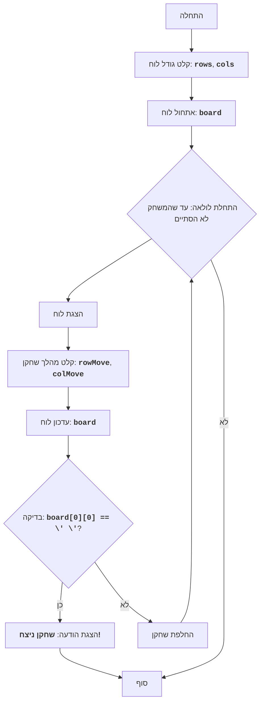

# CHOMP

## סקירה כללית

המשחק "CHOMP" הוא משחק לשני שחקנים המשתמש בלוח מלבני המייצג חפיסת שוקולד. אחת הפינות (בדרך כלל השמאלית התחתונה) מייצגת "חתיכה" רעילה. שחקנים מתחלפים לשבור חתיכות מהחפיסה, ויוצרים מהלכים. מטרת המשחק היא לגרום ליריב לאכול את החתיכה המורעלת.

השחקן שאולץ לאכול את החתיכה המורעלת מפסיד.

חוקי המשחק:

1. שדה המשחק הוא חפיסת שוקולד מלבנית.
2. אחת הפינות (השמאלית התחתונה) נחשבת מורעלת.
3. שחקנים מתחלפים לנשוך חלק מחפיסת השוקולד.
4. השחקן בוחר שורה ועמודה (נושך חתיכת שוקולד).
5. כל התאים מימין ומעל המיקום הנבחר מוסרים.
6. המטרה היא לגרום ליריב לאכול את החתיכה המורעלת.
7. השחקן שאוכל את החתיכה המורעלת מפסיד.

## תוכן עניינים

1. [סקירה כללית](#סקירה-כללית)
2. [אלגוריתם](#אלגוריתם)
3. [תרשים זרימה](#תרשים-זרימה)
4. [הסבר לסמלים](#הסבר-לסמלים)

## אלגוריתם

1. התחלת משחק.
2. שואלים את המשתמש על גודל חפיסת השוקולד (מספר שורות ועמודות).
3. מאתחלים את לוח המשחק, המייצג חפיסת שוקולד.
4. מתחילים מחזור משחק עד שהמשחק מסתיים:
    4.1. מציגים את המצב הנוכחי של הלוח על המסך.
    4.2. שואלים את השחקן הנוכחי את קואורדינטות החתיכה שרוצים לנשוך.
    4.3. מעדכנים את מצב הלוח, לאחר שננשכה החתיכה הנבחרת.
    4.4. בודקים האם השחקן הנוכחי אכל את החתיכה המורעלת.
    4.5. אם כן, מכריזים על ניצחון השחקן השני ומסיימים את המשחק.
    4.6. מעבירים את התור לשחקן הבא.
5. סוף המשחק.

## תרשים זרימה

## הסבר לסמלים

    Start - תחילת המשחק.
    InputBoardSize - בקשת גודל לוח (מספר שורות ועמודות).
    InitializeBoard - אתחול לוח המשחק.
    LoopStart - תחילת לולאת המשחק, שממשיכה עד שהמשחק לא הסתיים.
    DisplayBoard - הצגת המצב הנוכחי של הלוח על המסך.
    InputMove - בקשת קואורדינטות החתיכה שננשכה מהשחקן הנוכחי.
    UpdateBoard - עדכון מצב הלוח לאחר מהלך השחקן.
    CheckWin - בדיקה אם השחקן הנוכחי אכל את החתיכה המורעלת.
    OutputWinner - הצגת הודעה על ניצחון השחקן השני.
    End - סוף המשחק.
    SwitchPlayer - מעבר תור לשחקן הבא.