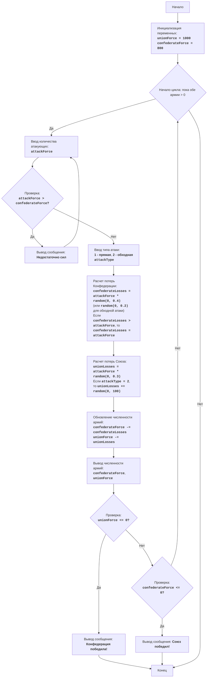

# CIVILW

## סקירה כללית

משחק "מלחמת האזרחים" הוא סימולציה של קרב בין שני צבאות: הקונפדרציה והאיחוד. השחקן שולט בקונפדרציה ומקבל החלטות על גודל הכוחות שלו וסוגי ההתקפות (התקפה ישירה או תמרון עוקף). מטרת המשחק היא להביס את צבא האיחוד תוך מזעור ההפסדים שלך. המשחק לוקח בחשבון גורמים אקראיים המשפיעים על תוצאות הקרב, מה שהופך כל קרב לייחודי.

## תוכן עניינים

- [סקירה כללית](#סקירה-כללית)
- [חוקי המשחק](#חוקי-המשחק)
- [אלגוריתם](#אלגוריתם)
- [תרשים זרימה](#תרשים-זרימה)
- [מקרא](#מקרא)

## חוקי המשחק

1. השחקן שולט בצבא הקונפדרציה ועליו להביס את צבא האיחוד.
2. השחקן מזין את מספר החיילים להתקפה.
3. השחקן בוחר את סוג ההתקפה: ישירה (1) או עוקפת (2).
4. בהתאם לבחירת השחקן ולגורמים אקראיים, מחושבים ההפסדים לשני הצדדים.
5. לאחר כל קרב, המשחק מציג את המספר הנוכחי של חיילי שני הצדדים.
6. המשחק מסתיים בניצחון אחד מהצדדים, כאשר מספר חיילי היריב הופך שווה או קטן מ-0.

## אלגוריתם

1. הגדר את המספר ההתחלתי של צבא האיחוד (UnionForce) ל-1000 ואת צבא הקונפדרציה (ConfederateForce) ל-800.
2. התחל לולאה "כל עוד לשני הצבאות יש יותר מ-0 חיילים":
    2.1. בקש מהשחקן את מספר החיילים שהוא רוצה לשלוח להתקפה (AttackForce).
        2.1.1. אם AttackForce גדול יותר מהכוחות הקיימים של הקונפדרציה (ConfederateForce), הצג את ההודעה "אין מספיק כוח" וחזור לתחילת שלב 2.1.
    2.2. בקש מהשחקן את סוג ההתקפה: ישירה (1) או עוקפת (2) (AttackType).
    2.3. חשב את אבדות הקונפדרציה (ConfederateLosses) באופן אקראי, על ידי הכפלת AttackForce במספר אקראי בין 0 ל-0.4 (עבור התקפה ישירה) או במספר אקראי בין 0 ל-0.2 (עבור תמרון עוקף).
        2.3.1. אם ConfederateLosses גדול מ-AttackForce, הגדר את ConfederateLosses שווה ל-AttackForce.
    2.4. חשב את אבדות האיחוד (UnionLosses) באופן אקראי, על ידי הכפלת AttackForce במספר אקראי בין 0 ל-0.3.
        2.4.1. אם AttackType שווה ל-2, הגדל את UnionLosses במספר אקראי בין 0 ל-100.
    2.5. עדכן את מספר הצבאות:
        ConfederateForce = ConfederateForce - ConfederateLosses
        UnionForce = UnionForce - UnionLosses
    2.6. הצג את המספר הנוכחי של חיילי שני הצדדים.
    2.7. בדוק את תנאי הניצחון:
        2.7.1. אם UnionForce קטן או שווה ל-0, הצג את ההודעה "הקונפדרציה ניצחה!" וסיים את המשחק.
        2.7.2. אם ConfederateForce קטן או שווה ל-0, הצג את ההודעה "האיחוד ניצח!" וסיים את המשחק.
3. סוף המשחק.

## תרשים זרימה

## מקרא

*  **Start** - תחילת התוכנית.
*   **InitializeForces** - אתחול המספר ההתחלתי של חיילי האיחוד (unionForce = 1000) והקונפדרציה (confederateForce = 800).
*   **LoopStart** - תחילת לולאה, שנמשכת כל עוד לשני הצבאות יש יותר מ-0 חיילים.
*   **InputAttackForce** - בקשה מהשחקן להזין את מספר החיילים להתקפה (attackForce).
*   **CheckForce** - בדיקה אם לקונפדרציה יש מספיק כוחות להתקפה (attackForce > confederateForce).
*   **OutputInsufficient** - הצגת ההודעה "אין מספיק כוח", אם יש יותר תוקפים מהכוחות הזמינים.
*   **InputAttackType** - בקשה מהשחקן לבחור סוג התקפה: ישירה (1) או עוקפת (2).
*   **CalculateConfederateLosses** - חישוב אבדות הקונפדרציה (confederateLosses) בהתבסס על attackForce וסוג ההתקפה, תוך התחשבות בגורם אקראי. אם ההפסדים גדולים מ-attackForce, ההפסדים מוגדרים כ-attackForce.
*   **CalculateUnionLosses** - חישוב אבדות האיחוד (unionLosses) בהתבסס על attackForce וסוג ההתקפה, תוך התחשבות בגורם אקראי. בהתקפה עוקפת, אבדות האיחוד גדלות בנוסף במספר אקראי.
*   **UpdateForces** - עדכון מספר החיילים של שני הצבאות לאחר הקרב.
*   **OutputForces** - הצגת המספר הנוכחי של חיילי הקונפדרציה והאיחוד.
*  **CheckUnionWin** - בדיקה אם הקונפדרציה ניצחה (מספר חיילי האיחוד <= 0).
*   **OutputConfederateWin** - הצגת ההודעה על ניצחון הקונפדרציה.
*   **CheckConfederateWin** - בדיקה אם האיחוד ניצח (מספר חיילי הקונפדרציה <= 0).
*   **OutputUnionWin** - הצגת ההודעה על ניצחון האיחוד.
*   **End** - סוף התוכנית.