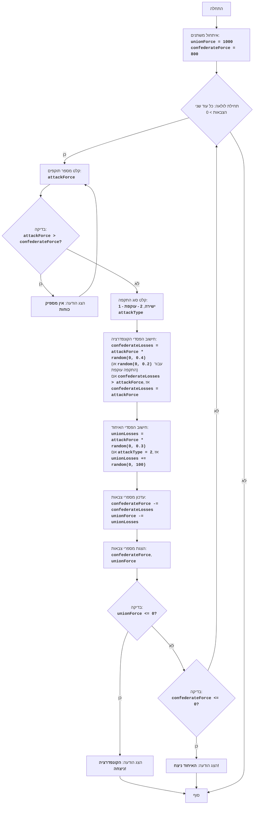

# CIVILW

## סקירה כללית

המשחק "מלחמת האזרחים" הוא סימולציה של קרב בין שני צבאות: הקונפדרציה והאיחוד. השחקן שולט בקונפדרציה ומקבל החלטות לגבי גודל הכוחות שלו וסוג ההתקפות (התקפה ישירה או תמרון עוקף). מטרת המשחק היא להביס את צבא האיחוד תוך מזעור ההפסדים. המשחק לוקח בחשבון גורמים אקראיים המשפיעים על תוצאות הקרב, מה שהופך כל קרב לייחודי.

## תוכן עניינים

1. [סקירה כללית](#סקירה-כללית)
2. [חוקי משחק](#חוקי-משחק)
3. [אלגוריתם](#אלגוריתם)
4. [תרשים זרימה](#תרשים-זרימה)
5. [מקרא](#מקרא)

## חוקי משחק

1. השחקן שולט בצבא הקונפדרציה ועליו להביס את צבא האיחוד.
2. השחקן מזין את מספר החיילים להתקפה.
3. השחקן בוחר סוג התקפה: ישירה (1) או עוקפת (2).
4. בהתאם לבחירת השחקן ולגורמים אקראיים, מחושבים ההפסדים של שני הצדדים.
5. לאחר כל קרב, המשחק מציג את מספר הכוחות הנוכחי של שני הצדדים.
6. המשחק מסתיים בניצחון של אחד הצדדים כאשר מספר הכוחות של היריב הופך שווה או קטן מ-0.

## אלגוריתם

1. הגדר את מספר הכוחות ההתחלתי של צבא האיחוד (UnionForce) ל-1000 ושל צבא הקונפדרציה (ConfederateForce) ל-800.
2. התחל לולאה "כל עוד לשני הצבאות יש מספר כוחות גדול מ-0":
    2.1. בקש מהשחקן את מספר החיילים שהוא רוצה לשלוח להתקפה (AttackForce).
        2.1.1. אם AttackForce גדול יותר מהכוחות הקיימים של הקונפדרציה (ConfederateForce), הצג הודעה "אין מספיק כוחות" וחזור לתחילת שלב 2.1.
    2.2. בקש מהשחקן סוג התקפה: ישירה (1) או עוקפת (2) (AttackType).
    2.3. חשב את הפסדי הקונפדרציה (ConfederateLosses) באופן אקראי, על ידי הכפלת AttackForce במספר אקראי בין 0 ל-0.4 (עבור התקפה ישירה) או במספר אקראי בין 0 ל-0.2 (עבור תמרון עוקף).
        2.3.1. אם ConfederateLosses גדול מ-AttackForce, הגדר את ConfederateLosses שווה ל-AttackForce.
    2.4. חשב את הפסדי האיחוד (UnionLosses) באופן אקראי, על ידי הכפלת AttackForce במספר אקראי בין 0 ל-0.3.
        2.4.1. אם AttackType שווה ל-2, הגדל את UnionLosses במספר אקראי בין 0 ל-100.
    2.5. עדכן את מספר הכוחות של הצבאות:
        ConfederateForce = ConfederateForce - ConfederateLosses
        UnionForce = UnionForce - UnionLosses
    2.6. הצג את מספר הכוחות הנוכחי של שני הצדדים.
    2.7. בדוק את תנאי הניצחון:
        2.7.1. אם UnionForce קטן או שווה ל-0, הצג הודעה "הקונפדרציה ניצחה!" וסיים את המשחק.
        2.7.2. אם ConfederateForce קטן או שווה ל-0, הצג הודעה "האיחוד ניצח!" וסיים את המשחק.
3. סוף המשחק.

## תרשים זרימה

## מקרא

    Start - תחילת התוכנית.
    InitializeForces - אתחול המספר ההתחלתי של צבאות האיחוד (unionForce = 1000) והקונפדרציה (confederateForce = 800).
    LoopStart - תחילת לולאה שמתמשכת כל עוד לשני הצבאות יש מספר כוחות גדול מ-0.
    InputAttackForce - בקשה מהשחקן את מספר החיילים להתקפה (attackForce).
    CheckForce - בדיקה האם לקונפדרציה יש מספיק כוחות לתקוף (attackForce > confederateForce).
    OutputInsufficient - הצגת הודעה "אין מספיק כוחות" אם מספר התוקפים גדול ממספר הכוחות הקיימים.
    InputAttackType - בקשה מהשחקן לבחור סוג התקפה: ישירה (1) או עוקפת (2).
    CalculateConfederateLosses - חישוב הפסדי הקונפדרציה (confederateLosses) על בסיס attackForce וסוג ההתקפה, תוך התחשבות בפקטור אקראי. אם ההפסדים עולים על attackForce, ההפסדים יוגדרו כשווים ל-attackForce.
    CalculateUnionLosses - חישוב הפסדי האיחוד (unionLosses) על בסיס attackForce וסוג ההתקפה, תוך התחשבות בפקטור אקראי. בהתקפה עוקפת, הפסדי האיחוד יוגדלו בנוסף על ידי מספר אקראי.
    UpdateForces - עדכון מספרי כוחות שני הצבאות לאחר הקרב.
    OutputForces - הצגת המספרים הנוכחיים של צבאות הקונפדרציה והאיחוד.
    CheckUnionWin - בדיקה האם הקונפדרציה ניצחה (מספר הכוחות של צבא האיחוד <= 0).
    OutputConfederateWin - הצגת הודעה על ניצחון הקונפדרציה.
    CheckConfederateWin - בדיקה האם האיחוד ניצח (מספר הכוחות של צבא הקונפדרציה <= 0).
    OutputUnionWin - הצגת הודעה על ניצחון האיחוד.
    End - סוף התוכנית.