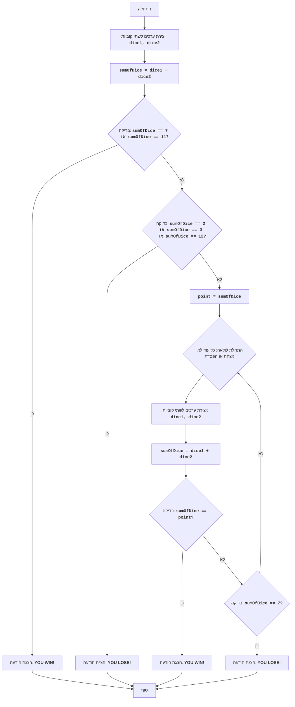

# CRAPS

## סקירה כללית

המשחק "קראפס" הוא משחק קוביות מזל בו המהמרים מהמרים על תוצאת הטלת שתי קוביות. בסיבוב הראשון, השחקן מנצח אם סכום הנקודות על הקוביות הוא 7 או 11, ומפסיד אם הסכום הוא 2, 3 או 12. אם סכום הנקודות הוא 4, 5, 6, 8, 9 או 10, אז זה הופך ל"מספר מטרה" של השחקן, והוא ממשיך לזרוק את הקוביות עד שהוא מקבל שוב את המספר הזה (במקרה הזה השחקן מנצח) או שהוא מקבל 7 (במקרה הזה השחקן מפסיד).

## חוקי המשחק

1. בתחילת המשחק השחקן מטיל שתי קוביות.
2. אם סכום הנקודות על הקוביות הוא 7 או 11, השחקן מנצח.
3. אם סכום הנקודות הוא 2, 3 או 12, השחקן מפסיד.
4. אם סכום הנקודות הוא 4, 5, 6, 8, 9 או 10, אז המספר הזה הופך ל"מספר מטרה" (point).
5. לאחר קביעת "מספר המטרה", השחקן ממשיך לזרוק את הקוביות עד:
   -   שיקבל את "מספר המטרה", ואז השחקן מנצח.
   -  שיקבל 7, ואז השחקן מפסיד.

## אלגוריתם

1. ליצור ערכים אקראיים עבור שתי קוביות (מ-1 עד 6).
2. לחשב את סכום הערכים שהתקבלו.
3. אם הסכום שווה ל-7 או 11, להציג הודעה על ניצחון ולעבור לשלב 7.
4. אם הסכום שווה ל-2, 3 או 12, להציג הודעה על הפסד ולעבור לשלב 7.
5. לשמור את הסכום כ"מספר מטרה" (point).
6. להתחיל לולאה:
    6.1 ליצור ערכים אקראיים עבור שתי קוביות.
    6.2 לחשב את סכום הערכים שהתקבלו.
    6.3 אם הסכום שווה ל"מספר המטרה", להציג הודעה על ניצחון ולעבור לשלב 7.
    6.4 אם הסכום שווה ל-7, להציג הודעה על הפסד ולעבור לשלב 7.
    6.5 אחרת, לחזור על הלולאה משלב 6.
7. סוף המשחק.

## תרשים זרימה

## מקרא

   - Start - תחילת המשחק.
   - RollDice1 - יצירת ערכים אקראיים עבור שתי קוביות (dice1, dice2) בהטלה הראשונה.
   - CalculateSum1 - חישוב סכום ערכי הקוביות dice1 ו-dice2 ושמירת התוצאה במשתנה sumOfDice.
   - CheckWin1 - בדיקה האם הסכום sumOfDice שווה ל-7 או 11. אם כן, השחקן ניצח.
   - OutputWin1 - הצגת הודעה "YOU WIN!" וסיום המשחק.
   - CheckLose1 - בדיקה האם הסכום sumOfDice שווה ל-2, 3 או 12. אם כן, השחקן הפסיד.
   - OutputLose1 - הצגת הודעה "YOU LOSE!" וסיום המשחק.
   - SetPoint - אם לא ניצח ולא הפסיד בהטלה הראשונה, הסכום sumOfDice נשמר במשתנה point, שהופך ל"מספר מטרה".
   - LoopStart - תחילת לולאה, אשר ממשיכה כל עוד השחקן לא ניצח או הפסיד.
   - RollDice2 - יצירת ערכים אקראיים עבור שתי קוביות (dice1, dice2) בהטלות הבאות.
   - CalculateSum2 - חישוב סכום ערכי הקוביות dice1 ו-dice2 ושמירת התוצאה במשתנה sumOfDice.
   - CheckWin2 - בדיקה האם הסכום sumOfDice שווה ל"מספר המטרה" point. אם כן, השחקן ניצח.
   - OutputWin2 - הצגת הודעה "YOU WIN!" וסיום המשחק.
   - CheckLose2 - בדיקה האם הסכום sumOfDice שווה ל-7. אם כן, השחקן הפסיד.
   - OutputLose2 - הצגת הודעה "YOU LOSE!" וסיום המשחק.
   - End - סוף המשחק.