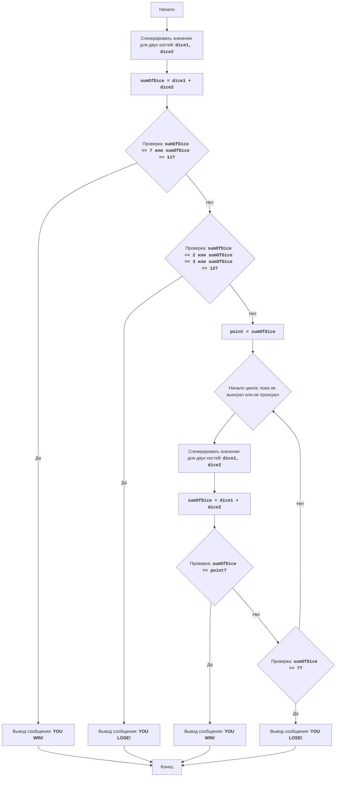

# CRAPS

## סקירה כללית

קובץ זה מתעד את משחק הקרפס, משחק קוביות מזל שבו השחקן מהמר על תוצאות גלגולי שתי קוביות. המשחק מחולק לשני שלבים עיקריים: גלגול ראשוני וגלגולים לאחר קביעת ה"נקודה". התיעוד מספק תיאור של המשחק, חוקים, אלגוריתם ודיאגרמת זרימה.

## תוכן עניינים

1. [סקירה כללית](#סקירה-כללית)
2. [חוקי המשחק](#חוקי-המשחק)
3. [אלגוריתם](#אלגוריתם)
4. [דיאגרמת זרימה](#דיאגרמת-זרימה)
5. [מקרא](#מקרא)

## חוקי המשחק

1. בתחילת המשחק, השחקן מטיל שתי קוביות.
2. אם סכום הנקודות על הקוביות הוא 7 או 11, השחקן מנצח.
3. אם סכום הנקודות הוא 2, 3 או 12, השחקן מפסיד.
4. אם סכום הנקודות הוא 4, 5, 6, 8, 9 או 10, המספר הזה הופך ל"נקודה".
5. לאחר קביעת ה"נקודה", השחקן ממשיך להטיל את הקוביות עד:
   - אם הוא מטיל את ה"נקודה" שוב, השחקן מנצח.
   - אם הוא מטיל 7, השחקן מפסיד.

## אלגוריתם

1. הגרל ערכים אקראיים לשתי קוביות (בין 1 ל-6).
2. חשב את סכום הערכים שהתקבלו.
3. אם הסכום שווה ל-7 או 11, הצג הודעת ניצחון ועבור לשלב 7.
4. אם הסכום שווה ל-2, 3 או 12, הצג הודעת הפסד ועבור לשלב 7.
5. שמור את הסכום כ"נקודה".
6. התחל לולאה:
    6.1 הגרל ערכים אקראיים לשתי קוביות.
    6.2 חשב את סכום הערכים שהתקבלו.
    6.3 אם הסכום שווה ל"נקודה", הצג הודעת ניצחון ועבור לשלב 7.
    6.4 אם הסכום שווה ל-7, הצג הודעת הפסד ועבור לשלב 7.
    6.5 אחרת, חזור על הלולאה משלב 6.
7. סוף המשחק.

## דיאגרמת זרימה

## מקרא

    Start - תחילת המשחק.
    RollDice1 - יצירת ערכים אקראיים לשתי קוביות (dice1, dice2) בגלגול הראשון.
    CalculateSum1 - חישוב סכום הערכים של הקוביות dice1 ו-dice2 ושמירת התוצאה במשתנה sumOfDice.
    CheckWin1 - בדיקה אם סכום sumOfDice שווה ל-7 או 11. אם כן, השחקן ניצח.
    OutputWin1 - הצגת הודעה "YOU WIN!" וסיום המשחק.
    CheckLose1 - בדיקה אם סכום sumOfDice שווה ל-2, 3 או 12. אם כן, השחקן הפסיד.
    OutputLose1 - הצגת הודעה "YOU LOSE!" וסיום המשחק.
    SetPoint - אם לא ניצח ולא הפסיד בגלגול הראשון, סכום sumOfDice נשמר במשתנה point, אשר הופך ל"נקודה".
    LoopStart - תחילת לולאה, אשר ממשיכה עד שהשחקן מנצח או מפסיד.
    RollDice2 - יצירת ערכים אקראיים לשתי קוביות (dice1, dice2) בגלגולים הבאים.
    CalculateSum2 - חישוב סכום הערכים של הקוביות dice1 ו-dice2 ושמירת התוצאה במשתנה sumOfDice.
    CheckWin2 - בדיקה אם סכום sumOfDice שווה ל"נקודה" point. אם כן, השחקן ניצח.
    OutputWin2 - הצגת הודעה "YOU WIN!" וסיום המשחק.
    CheckLose2 - בדיקה אם סכום sumOfDice שווה ל-7. אם כן, השחקן הפסיד.
    OutputLose2 - הצגת הודעה "YOU LOSE!" וסיום המשחק.
    End - סוף המשחק.