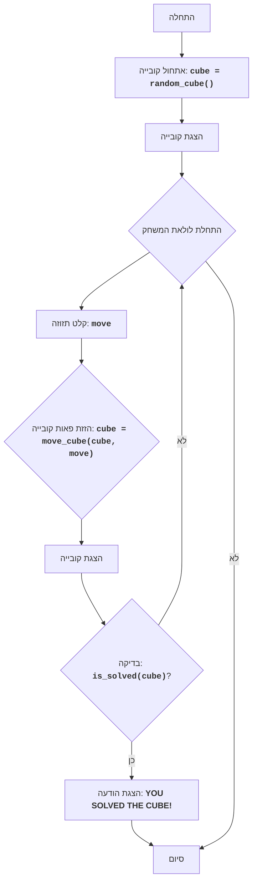

# Игра "Куб"

## סקירה כללית

משחק "קובייה" הוא משחק פאזל שבו השחקן צריך להרכיב קובייה על ידי הזזת הפאות שלה. הקובייה מיוצגת כמטריצה ​​3x3, כאשר כל תא מייצג פאה של הקובייה. השחקן יכול להזיז את פאות הקובייה למעלה, למטה, שמאלה וימינה. מטרת המשחק היא להרכיב את הקובייה על ידי סידור הפאות בסדר הנכון.

## תוכן עניינים

1. [סקירה כללית](#סקירה-כללית)
2. [חוקי המשחק](#חוקי-המשחק)
3. [אלגוריתם](#אלגוריתם)
4. [תרשים זרימה](#תרשים-זרימה)
5. [מקרא](#מקרא)

## חוקי המשחק

1. הקובייה מיוצגת כמטריצה ​​3x3.
2. השחקן יכול להזיז את פאות הקובייה על ידי הזנת פקודות: U (למעלה), D (למטה), L (שמאלה), R (ימינה).
3. מטרת המשחק היא להרכיב את הקובייה על ידי סידור הפאות בסדר הנכון.
4. מיקום ההתחלה של הקובייה נוצר באופן אקראי.
5. המשחק מסתיים כאשר הקובייה מורכבת, כלומר, כאשר כל הפאות ממוקמות בסדר הנכון.

## אלגוריתם

1. אתחל את הקובייה עם ערכים אקראיים מ-1 עד 9 כמטריצה ​​3x3.
2. הצג את הקובייה על המסך.
3. התחל את לולאת המשחק:
    3.1. בקש מהשחקן להזין פקודה להזזת פאת הקובייה (U, D, L, R).
    3.2. בצע את הזזת הפאה בהתאם לפקודה:
       - אם הפקודה היא "U", הזז את כל השורות למעלה.
       - אם הפקודה היא "D", הזז את כל השורות למטה.
       - אם הפקודה היא "L", הזז את כל העמודות שמאלה.
       - אם הפקודה היא "R", הזז את כל העמודות ימינה.
    3.3. הצג את הקובייה על המסך.
    3.4. בדוק אם הקובייה מורכבת.
    3.5. אם הקובייה מורכבת, הצג הודעה על ניצחון וסיים את המשחק.
    3.6. אם הקובייה לא מורכבת, חזור לשלב 3.1.

## תרשים זרימה

## מקרא

    Start - תחילת התוכנית.
    InitializeCube - אתחול הקובייה, יצירת מטריצה ​​3x3 עם ערכים אקראיים מ-1 עד 9.
    DisplayCube - הצגת המצב הנוכחי של הקובייה על המסך.
    GameLoopStart - תחילת לולאת המשחק, שנמשכת עד שהקובייה מורכבת.
    InputMove - בקשת קלט מהמשתמש להזזת פאות הקובייה (U, D, L, R).
    MoveCube - הזזת פאות הקובייה בהתאם לפקודה שהוזנה.
    DisplayCubeAgain - הצגת הקובייה לאחר ביצוע התזוזה.
    CheckSolved - בדיקה האם הקובייה מורכבת.
    OutputWin - הצגת הודעה על ניצחון אם הקובייה מורכבת.
    End - סיום התוכנית.