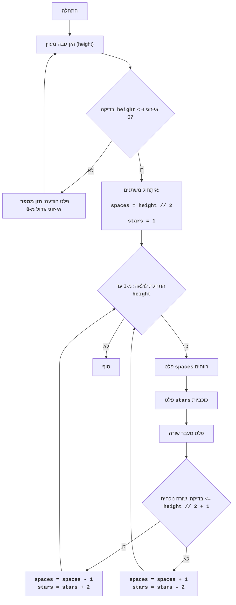

# DIAMND

## סקירה כללית

המשחק DIAMND הוא משחק טקסט שבו השחקן מנסה לצייר מעוין מכוכביות על ידי הגדרת הגובה שלו.
המשחק תחילה מבקש מהמשתמש גובה אי-זוגי למעוין. לאחר מכן, אם המספר שהוזן הוא אי-זוגי, המשחק בונה מעוין מכוכביות, תוך שימוש ברווחים כדי ליצור את הגיאומטריה הנכונה של הצורה. אם המספר שהוזן הוא זוגי או קטן מ-1, מוצגת הודעת שגיאה.

## תוכן עניינים

1.  [סקירה כללית](#סקירה-כללית)
2.  [חוקי המשחק](#חוקי-המשחק)
3.  [אלגוריתם](#אלגוריתם)
4.  [תרשים זרימה](#תרשים-זרימה)
5.  [מקרא](#מקרא)

## חוקי המשחק

1. השחקן מזין מספר אי-זוגי הקובע את גובה המעוין.
2. אם מוזן מספר זוגי או מספר קטן מ-1, המשחק מציג הודעת שגיאה.
3. אם מוזן מספר תקין (אי-זוגי וגדול מ-0), המשחק מציג על המסך מעוין מכוכביות בגובה שצוין.

## אלגוריתם

1. לבקש מהמשתמש להזין את גובה המעוין (H).
2. לבדוק אם H זוגי או קטן מ-1. אם כן, להציג הודעת שגיאה ולעבור לשלב 1.
3. אם H אי-זוגי וגדול מ-0, אז:
    3.1. להגדיר משתנה `space` ל-H // 2 (חלוקה בשלמים).
    3.2. להגדיר משתנה `stars` ל-1.
    3.3. להתחיל לולאה מ-1 עד H כולל:
        3.3.1. להציג `space` רווחים.
        3.3.2. להציג `stars` כוכביות.
        3.3.3. להציג מעבר שורה.
        3.3.4. אם המספר הנוכחי של השורה קטן מ-H // 2 + 1:
            3.3.4.1. להקטין את `space` ב-1.
            3.3.4.2. להגדיל את `stars` ב-2.
       3.3.5. אחרת:
           3.3.5.1. להגדיל את `space` ב-1.
           3.3.5.2. להקטין את `stars` ב-2.
4. סוף המשחק.

## תרשים זרימה

## מקרא

*   **התחלה** - תחילת התוכנית.
*   **הזן גובה מעוין** - בקשה מהמשתמש להזין את גובה המעוין ושמירת הערך במשתנה `height`.
*   **בדיקת גובה** - בדיקה האם הגובה שהוזן הוא מספר אי-זוגי הגדול מ-0.
*   **פלט שגיאה** - פלט הודעת שגיאה אם הגובה אינו תואם את התנאי.
*   **איִתְחוּל משתנים** - איִתְחוּל המשתנים: `spaces` (מספר הרווחים) מוגדר ל-`height // 2`, ו-`stars` (מספר הכוכביות) מוגדר ל-1.
*   **התחלת לולאה** - תחילת לולאה שחוזרת על עצמה `height` פעמים.
*   **פלט רווחים** - פלט `spaces` רווחים.
*   **פלט כוכביות** - פלט `stars` כוכביות.
*   **פלט שורה חדשה** - פלט תו של שורה חדשה.
*   **בדיקת שורה** - בדיקה האם השורה הנוכחית קטנה או שווה לחצי המעוין (`height // 2 + 1`).
*   **הקטנת רווח והגדלת כוכבית** - הקטנת מספר הרווחים `spaces` ב-1 והגדלת מספר הכוכביות `stars` ב-2.
*   **הגדלת רווח והקטנת כוכבית** - הגדלת מספר הרווחים `spaces` ב-1 והקטנת מספר הכוכביות `stars` ב-2.
*  **סוף** - סיום התוכנית.