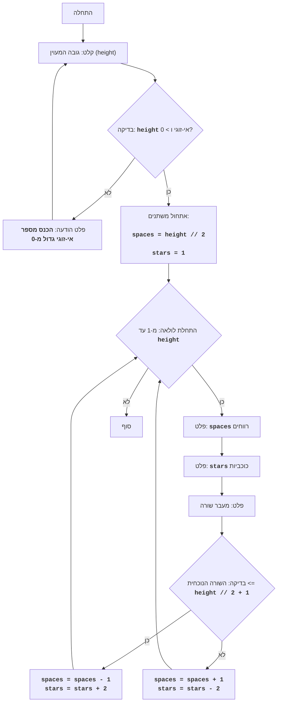

# DIAMND

## סקירה כללית

משחק DIAMND הוא משחק טקסט שבו השחקן מנסה לצייר מעוין מכוכביות על ידי הגדרת גובהו.
המשחק תחילה מבקש מהמשתמש גובה אי-זוגי למעוין. לאחר מכן, אם המספר שהוזן הוא אי-זוגי, המשחק בונה מעוין מכוכביות תוך שימוש ברווחים ליצירת הגיאומטריה הנכונה של הצורה. אם המספר שהוזן הוא זוגי או קטן מ-1, מוצגת הודעת שגיאה.

## תוכן עניינים

- [סקירה כללית](#סקירה-כללית)
- [חוקי המשחק](#חוקי-המשחק)
- [אלגוריתם](#אלגוריתם)
- [תרשים זרימה](#תרשים-זרימה)
- [מקרא](#מקרא)

## חוקי המשחק

1. השחקן מזין מספר אי-זוגי, הקובע את גובה המעוין.
2. אם מוזן מספר זוגי או מספר קטן מ-1, המשחק מציג הודעת שגיאה.
3. אם מוזן מספר תקין (אי-זוגי וגדול מ-0), המשחק מציג על המסך מעוין מכוכביות בגובה שצוין.

## אלגוריתם

1. בקש מהמשתמש להזין את גובה המעוין (H).
2. בדוק אם H זוגי או קטן מ-1. אם כן, הצג הודעת שגיאה וחזור לשלב 1.
3. אם H אי-זוגי וגדול מ-0, אז:
   3.1. הגדר משתנה `space` ל-H // 2 (חלוקה שלמה).
   3.2. הגדר משתנה `stars` ל-1.
   3.3. התחל לולאה מ-1 עד H כולל:
      3.3.1. הצג `space` רווחים.
      3.3.2. הצג `stars` כוכביות.
      3.3.3. הצג מעבר שורה.
      3.3.4. אם מספר השורה הנוכחי קטן מ-H // 2 + 1:
          3.3.4.1. הפחת את `space` ב-1.
          3.3.4.2. הגדל את `stars` ב-2.
      3.3.5. אחרת:
          3.3.5.1. הגדל את `space` ב-1.
          3.3.5.2. הפחת את `stars` ב-2.
4. סוף המשחק.

## תרשים זרימה

## מקרא

*   `Start` - תחילת התוכנית.
*   `InputHeight` - בקשת קלט מהמשתמש לגובה המעוין ושמירת הערך במשתנה `height`.
*   `CheckHeight` - בדיקה האם הגובה שהוכנס הוא מספר אי-זוגי גדול מ-0.
*   `OutputError` - פלט הודעת שגיאה אם הגובה לא עומד בתנאי.
*   `InitializeVars` - אתחול משתנים: `spaces` (מספר הרווחים) מוגדר ל-`height // 2`, ו-`stars` (מספר הכוכביות) מוגדר ל-1.
*   `LoopStart` - תחילת לולאה שחוזרת על עצמה `height` פעמים.
*   `OutputSpaces` - פלט של `spaces` רווחים.
*   `OutputStars` - פלט של `stars` כוכביות.
*   `OutputNewline` - פלט של תו שורה חדשה.
*   `CheckRow` - בדיקה האם השורה הנוכחית קטנה או שווה לאמצע המעוין (`height // 2 + 1`).
*   `DecreaseSpaceIncreaseStars` - הקטנת מספר הרווחים `spaces` ב-1 והגדלת מספר הכוכביות `stars` ב-2.
*   `IncreaseSpaceDecreaseStars` - הגדלת מספר הרווחים `spaces` ב-1 והקטנת מספר הכוכביות `stars` ב-2.
*   `End` - סוף התוכנית.