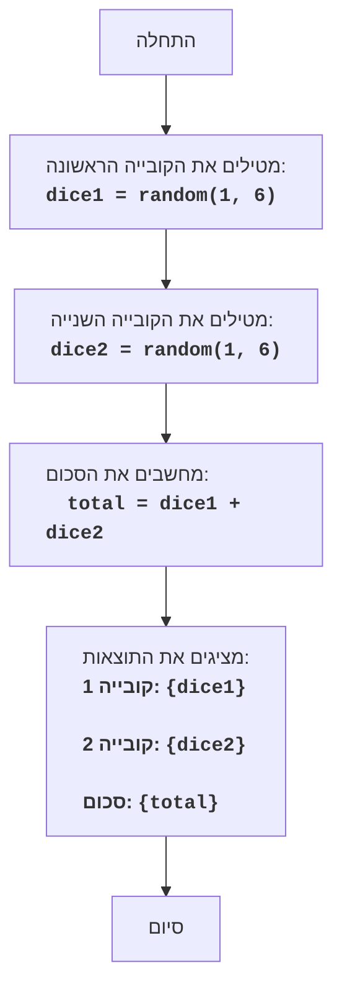

# DICE

## סקירה כללית

משחק ה"קוביות" הוא משחק פשוט שבו השחקן מטיל שתי קוביות משחק, והמחשב מציג את סכום הערכים שנפלו.

## תוכן עניינים

- [סקירה כללית](#סקירה-כללית)
- [חוקי המשחק](#חוקי-המשחק)
- [אלגוריתם](#אלגוריתם)
- [תרשים זרימה](#תרשים-זרימה)
- [מקרא](#מקרא)

## חוקי המשחק

1. המחשב מדמה הטלת שתי קוביות בעלות שישה צדדים.
2. המחשב מציג על המסך את הערכים של כל קובייה ואת סכומם.

## אלגוריתם

1. יצירת מספר אקראי בין 1 ל-6 עבור הקובייה הראשונה.
2. יצירת מספר אקראי בין 1 ל-6 עבור הקובייה השנייה.
3. חישוב סכום הערכים של שתי הקוביות.
4. הצגת ערך הקובייה הראשונה, ערך הקובייה השנייה והסכום שלהם על המסך.

## תרשים זרימה

## מקרא

    Start - תחילת התוכנית.
    RollDice1 -  נוצר מספר אקראי בין 1 ל-6, המייצג את תוצאת הטלת הקובייה הראשונה, ונשמר במשתנה dice1.
    RollDice2 - נוצר מספר אקראי בין 1 ל-6, המייצג את תוצאת הטלת הקובייה השנייה, ונשמר במשתנה dice2.
    CalculateSum - מחושב סכום הערכים dice1 ו-dice2, והתוצאה נשמרת במשתנה total.
    OutputResults - הערכים dice1, dice2 והסכום שלהם total מוצגים על המסך.
    End - סיום התוכנית.