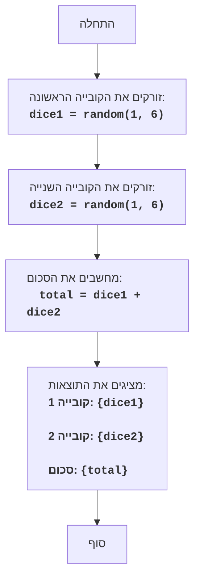

# DICE

## תוכן עניינים
1. [סקירה כללית](#סקירה-כללית)
2. [חוקי המשחק](#חוקי-המשחק)
3. [אלגוריתם](#אלגוריתם)
4. [תרשים זרימה](#תרשים-זרימה)
5. [מקרא](#מקרא)

## סקירה כללית
משחק "קוביות" הוא משחק פשוט שבו השחקן זורק שתי קוביות משחק, והמחשב מציג את סכום הערכים שנפלו.

## חוקי המשחק
1. המחשב מדמה הטלת שתי קוביות משחק בעלות שש פאות.
2. המחשב מציג על המסך את הערכים של כל קובייה ואת סכומם.

## אלגוריתם
1. צור מספר אקראי בין 1 ל-6 עבור הקובייה הראשונה.
2. צור מספר אקראי בין 1 ל-6 עבור הקובייה השנייה.
3. חשב את סכום הערכים של שתי הקוביות.
4. הצג על המסך את הערך של הקובייה הראשונה, את הערך של הקובייה השנייה ואת סכומם.

## תרשים זרימה

## מקרא
*   `Start` - תחילת התוכנית.
*   `RollDice1` - נוצר מספר אקראי בין 1 ל-6, המייצג את תוצאת זריקת הקובייה הראשונה, ונשמר במשתנה dice1.
*   `RollDice2` - נוצר מספר אקראי בין 1 ל-6, המייצג את תוצאת זריקת הקובייה השנייה, ונשמר במשתנה dice2.
*   `CalculateSum` - מחושב סכום הערכים של dice1 ו- dice2, והתוצאה נשמרת במשתנה total.
*  `OutputResults` - מוצגים הערכים של dice1, dice2 וסכומם total על המסך.
*   `End` - סוף התוכנית.