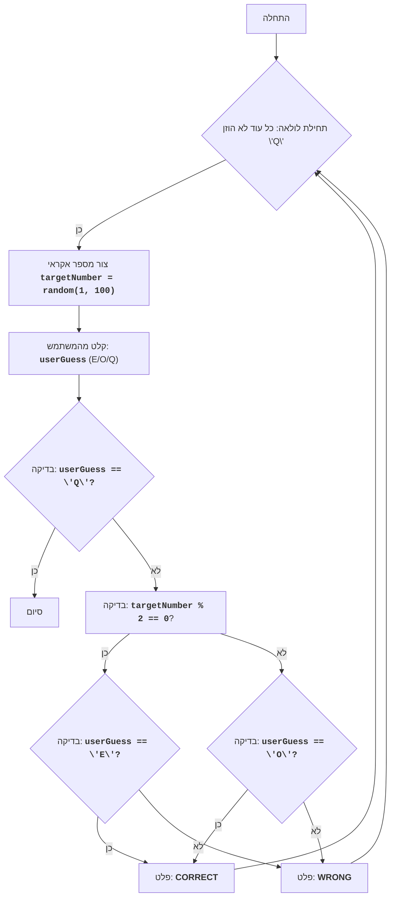

# EVEN

## סקירה כללית

משחק "מספר זוגי" הוא משחק פשוט שבו המחשב מייצר מספר אקראי בין 1 ל-100, והשחקן צריך לנחש האם המספר הזה זוגי או אי-זוגי. השחקן מזין 'E' עבור זוגי או 'O' עבור אי-זוגי. לאחר ההזנה, המחשב מודיע האם השחקן צדק. המשחק נמשך עד שהשחקן מחליט לצאת.

## תוכן עניינים

- [סקירה כללית](#סקירה-כללית)
- [תיאור המשחק](#תיאור-המשחק)
- [אלגוריתם](#אלגוריתם)
- [תרשים זרימה](#תרשים-זרימה)
- [הסבר קוד](#הסבר-קוד)

## תיאור המשחק

1. המחשב מייצר מספר שלם אקראי בין 1 ל-100.
2. השחקן צריך להזין 'E' אם הוא חושב שהמספר זוגי, או 'O' אם הוא חושב שהמספר אי-זוגי.
3. המחשב בודק האם המספר שנוצר זוגי או אי-זוגי.
4. המחשב מודיע לשחקן האם תשובתו הייתה נכונה.
5. המשחק נמשך עד שהשחקן מזין 'Q' כדי לצאת.

## אלגוריתם

1. התחל לולאה "כל עוד השחקן לא הזין 'Q'":
    1.1 צור מספר שלם אקראי בין 1 ל-100.
    1.2 בקש מהשחקן להזין 'E' עבור זוגי או 'O' עבור אי-זוגי.
    1.3 אם קלט השחקן הוא 'Q', סיים את התוכנית.
    1.4 אם המספר שנוצר זוגי והשחקן הזין 'E', או אם המספר שנוצר אי-זוגי והשחקן הזין 'O', הצג "CORRECT".
    1.5 אחרת, הצג "WRONG".
    1.6 חזור לתחילת הלולאה.

## תרשים זרימה

**מקרא**:
    Start - תחילת התוכנית.
    LoopStart - תחילת לולאה, שמתמשכת עד שהמשתמש מזין 'Q'.
    GenerateNumber - יצירת מספר שלם אקראי בין 1 ל-100.
    InputGuess - בקשה מהמשתמש להזין 'E' (זוגי), 'O' (אי-זוגי) או 'Q' (יציאה).
    CheckQuit - בדיקה האם המשתמש הזין 'Q' ליציאה מהמשחק.
    End - סיום התוכנית.
    CheckEven - בדיקה האם המספר שנוצר זוגי.
    CheckUserEven - בדיקה האם המשתמש הזין 'E' (זוגי) כאשר המספר זוגי.
    CheckUserOdd - בדיקה האם המשתמש הזין 'O' (אי-זוגי) כאשר המספר אי-זוגי.
    OutputCorrect - פלט ההודעה "CORRECT" אם המשתמש ניחש נכונה את זוגיות המספר.
    OutputWrong - פלט ההודעה "WRONG" אם המשתמש לא ניחש נכונה את זוגיות המספר.

## הסבר קוד

1.  **ייבוא מודול `random`**:
   - `import random`: מייבא את המודול `random`, שמשמש ליצירת מספרים אקראיים.

2.  **לולאה ראשית `while True:`**:
    -   `while True:`: לולאה אינסופית שמתמשכת עד שהשחקן מחליט לצאת.
    -   **יצירת מספר אקראי**:
        -   `targetNumber = random.randint(1, 100)`: יוצר מספר שלם אקראי בין 1 ל-100 ושומר אותו במשתנה `targetNumber`.
    -   **קליטת קלט**:
        -   `userGuess = input("הכנס \'E\' לזוגי, \'O\' לאי-זוגי, \'Q\' ליציאה: ").upper()`: מבקש מהמשתמש להכניס תו (E, O או Q). נעשה שימוש במתודה `upper()` כדי להמיר את הקלט לאותיות גדולות לצורך השוואה תקינה.
    -   **תנאי יציאה**:
        -   `if userGuess == 'Q'`: בודק האם המשתמש הזין 'Q' ליציאה מהמשחק.
        -   `print("יציאה מהמשחק.")`: מציג הודעה על יציאה.
        -   `break`: מסיים את הלולאה אם המשתמש רוצה לצאת.
    -   **בדיקת זוגיות**:
        -   `(targetNumber % 2 == 0 and userGuess == 'E') or (targetNumber % 2 != 0 and userGuess == 'O')`: בודק האם המשתמש ניחש את זוגיות המספר. אם המספר זוגי והמשתמש הזין 'E', או שהמספר אי-זוגי והמשתמש הזין 'O', התנאי יחזיר אמת.
        -   `print("CORRECT")`: מציג הודעה שהמשתמש ניחש נכונה אם התנאי מתקיים.
        -   `else:`: אחרת, המשתמש לא ניחש את זוגיות המספר.
        -   `print("WRONG")`: מציג הודעה שהמשתמש לא ניחש נכונה.