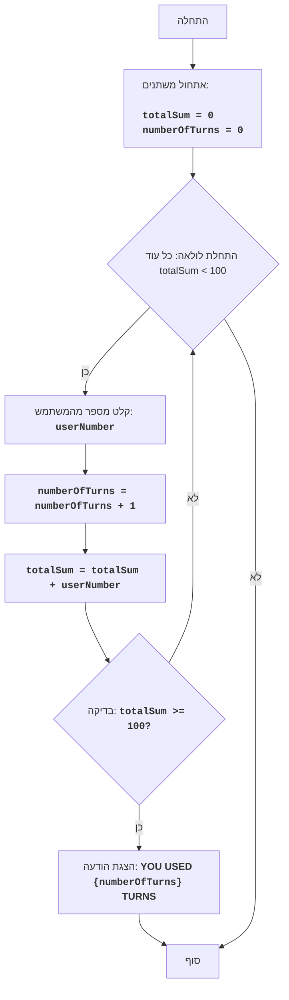

# FIPFOP

## סקירה כללית

משחק FIPFOP הוא משחק פאזל בו השחקן צריך להזין מספרים ברצף. מטרת המשחק היא להגיע לסכום של 100 מכל המספרים שהוזנו על ידי המשתמש. המשחק מסתיים כאשר סכום כל המספרים שהוזנו מגיע ל-100.

## תוכן עניינים

1. [סקירה כללית](#סקירה-כללית)
2. [חוקי המשחק](#חוקי-המשחק)
3. [אלגוריתם](#אלגוריתם)
4. [תרשים זרימה](#תרשים-זרימה)
5. [קוד](#קוד)
6. [הסבר קוד](#הסבר-קוד)

## חוקי המשחק

1. השחקן מזין מספרים שלמים, אחד בכל פעם.
2. כל מספר שהוזן מתווסף לסכום הכולל.
3. המשחק מסתיים כאשר הסכום הכולל מגיע ל-100.
4. לאחר סיום המשחק, מוצג מספר הכולל של המספרים שהוזנו (מהלכים).

## אלגוריתם

1. הגדר את הסכום ל-0.
2. הגדר את מונה המהלכים ל-0.
3. התחל לולאה "כל עוד הסכום קטן מ-100":
    3.1. בקש מהשחקן להזין מספר.
    3.2. הגדל את מונה המהלכים ב-1.
    3.3. הוסף את המספר שהוזן לסכום הכולל.
4. הצג הודעה "השתמשת ב-{מספר מהלכים} מהלכים".
5. סוף המשחק.

## תרשים זרימה



**מקרא:**

*   התחלה - תחילת התוכנית.
*   InitializeVariables - אתחול משתנים: totalSum (סכום המספרים שהוזנו) מוגדר ל-0, ו-numberOfTurns (מספר המהלכים) מוגדר ל-0.
*   LoopStart - תחילת לולאה, שנמשכת כל עוד totalSum קטן מ-100.
*   InputNumber - בקשת קלט מספר מהמשתמש ושמירתו במשתנה userNumber.
*   IncreaseTurns - הגדלת מונה מספר המהלכים ב-1.
*   AddNumber - הוספת המספר שהוזן userNumber לסכום הכולל totalSum.
*   CheckSum - בדיקה אם הסכום הכולל totalSum גדול או שווה ל-100.
*   OutputTurns - הצגת הודעה על מספר המהלכים שהשתמש בהם המשתמש.
*   סוף - סוף התוכנית.

## קוד

```python
# אתחול הסכום ומונה המהלכים
totalSum = 0  # סכום המספרים שהוזנו
numberOfTurns = 0  # מספר המהלכים

# לולאה ראשית של המשחק
while totalSum < 100:
    # בקשת קלט מספר מהמשתמש
    try:
        userNumber = int(input("הזן מספר: "))
    except ValueError:
        print("אנא הזן מספר שלם.")
        continue

    # הגדלת מונה המהלכים
    numberOfTurns += 1
    # הוספת המספר שהוזן לסכום הכולל
    totalSum += userNumber

# הצגת הודעה על מספר המהלכים
print(f"השתמשת ב {numberOfTurns} מהלכים")
```

## הסבר קוד

1.  **אתחול משתנים:**
    *   `totalSum = 0`: מאתחל את המשתנה `totalSum` לאחסון סכום המספרים שהוזנו, מתחיל מ-0.
    *   `numberOfTurns = 0`: מאתחל את המשתנה `numberOfTurns` לספירת מספר המהלכים, גם מתחיל מ-0.
2.  **לולאה ראשית `while totalSum < 100`:**
    *   הלולאה נמשכת כל עוד סכום המספרים שהוזנו (`totalSum`) קטן מ-100.
3.  **קלט מהמשתמש:**
    *   `try...except ValueError`: בלוק try-except מטפל בשגיאות אפשריות. אם המשתמש מזין מספר לא שלם, תוצג הודעת שגיאה.
    *   `userNumber = int(input("הזן מספר: "))`: מבקש מהמשתמש להזין מספר והופך אותו למספר שלם, ושומר את התוצאה במשתנה `userNumber`.
4.  **הגדלת מונה המהלכים:**
    *   `numberOfTurns += 1`: מגדיל את מונה המהלכים ב-1 בכל איטרציה של הלולאה.
5.  **הוספת המספר לסכום:**
    *   `totalSum += userNumber`: מוסיף את המספר שהוזן (`userNumber`) לסכום הכולל (`totalSum`).
6.  **הצגת תוצאה:**
    *   `print(f"השתמשת ב {numberOfTurns} מהלכים")`: מציג הודעה על המסך על מספר המהלכים שבוצעו כאשר סכום המספרים הגיע ל-100 או יותר.