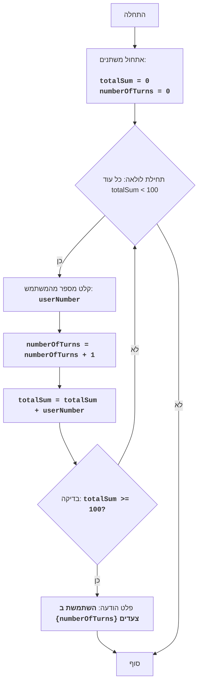

# FIPFOP

## סקירה כללית

משחק FIPFOP הוא משחק פאזל שבו השחקן צריך להזין מספרים ברצף. מטרת המשחק היא להגיע לסכום כולל של 100 על ידי סכום כל המספרים שהוזנו על ידי המשתמש. המשחק מסתיים כאשר סכום כל המספרים שהוזנו מגיע ל-100.

## תוכן עניינים

1. [חוקי המשחק](#חוקי-המשחק)
2. [אלגוריתם](#אלגוריתם)
3. [תרשים זרימה](#תרשים-זרימה)
4. [קוד](#קוד)
5. [הסבר קוד](#הסבר-קוד)

## חוקי המשחק

1. השחקן מזין מספרים שלמים, אחד בכל פעם.
2. כל מספר שהוזן מתווסף לסכום הכולל.
3. המשחק מסתיים כאשר הסכום הכולל מגיע ל-100.
4. לאחר סיום המשחק, מוצג מספר ההזנות הכולל (צעדים).

## אלגוריתם

1. הגדר סכום ל-0.
2. הגדר מונה צעדים ל-0.
3. התחל לולאה "כל עוד הסכום קטן מ-100":
    3.1 בקש מהשחקן להזין מספר.
    3.2 הגדל את מונה הצעדים ב-1.
    3.3 הוסף את המספר שהוזן לסכום הכולל.
4. הצג הודעה "השתמשת ב- {מספר צעדים} צעדים".
5. סוף המשחק.

## תרשים זרימה



**מקרא:**
    
*   התחלה - תחילת התוכנית.
*   אתחול משתנים - אתחול משתנים: totalSum (סכום המספרים שהוזנו) מוגדר ל-0, ו-numberOfTurns (מספר צעדים) מוגדר ל-0.
*   תחילת לולאה - תחילת לולאה, שממשיכה כל עוד totalSum קטן מ-100.
*   קלט מספר - בקשה מהמשתמש להזין מספר ושמירתו במשתנה userNumber.
*   הגדלת צעדים - הגדלת מונה הצעדים ב-1.
*   הוספת מספר - הוספת המספר שהוזן userNumber לסכום הכולל totalSum.
*   בדיקת סכום - בדיקה, האם הסכום הכולל totalSum גדול או שווה ל-100.
*   פלט צעדים - פלט הודעה על מספר הצעדים שהמשתמש ביצע.
*   סוף - סוף התוכנית.

## קוד

```python
"""
FIPFOP:
=================
Сложность: 5
-----------------
Игра FIPFOP - это игра-головоломка, где игрок должен, поочерёдно, вводить числа. 
Цель игры - добиться того, чтобы все числа введенные пользователем, в сумме, дали число 100. 
Игра заканчивается, когда сумма всех введенных чисел достигнет 100.

Правила игры:
1. Игрок вводит целые числа, по одному за раз.
2. Каждое введенное число добавляется к общей сумме.
3. Игра заканчивается, когда общая сумма достигает 100.
4. После завершения игры, выводится общее количество введенных чисел (ходы).
-----------------
Алгоритм:
1. Установить сумму в 0.
2. Установить счетчик ходов в 0.
3. Начать цикл "пока сумма меньше 100":
    3.1 Запросить у игрока ввод числа.
    3.2 Увеличить счетчик ходов на 1.
    3.3 Прибавить введенное число к общей сумме.
4. Вывести сообщение "ТЫ ИСПОЛЬЗОВАЛ {количество ходов} ХОДОВ"
5. Конец игры.
-----------------
Блок-схема:
```mermaid
flowchart TD
    Start["Начало"] --> InitializeVariables["<p align='left'>Инициализация переменных:\n    <code><b>\n    totalSum = 0\n    numberOfTurns = 0\n    </b></code></p>"]
    InitializeVariables --> LoopStart{"Начало цикла: пока totalSum < 100"}\n
    LoopStart -- Да --> InputNumber["Ввод числа пользователем: <code><b>userNumber</b></code>"]\n
    InputNumber --> IncreaseTurns["<code><b>numberOfTurns = numberOfTurns + 1</b></code>"]\n
     IncreaseTurns --> AddNumber["<code><b>totalSum = totalSum + userNumber</b></code>"]\n
    AddNumber --> CheckSum{"Проверка: <code><b>totalSum >= 100?</b></code>"}\n
    CheckSum -- Да --> OutputTurns["Вывод сообщения: <b>YOU USED <code>{numberOfTurns}</code> TURNS</b>"]\n
    OutputTurns --> End["Конец"]\n
     CheckSum -- Нет --> LoopStart\n
    LoopStart -- Нет --> End\n
```

**Legenda:**\n
    Start - Начало программы.\n
    InitializeVariables - Инициализация переменных: totalSum (сумма введенных чисел) устанавливается в 0, а numberOfTurns (количество ходов) устанавливается в 0.\n
    LoopStart - Начало цикла, который продолжается, пока totalSum меньше 100.\n
    InputNumber - Запрос у пользователя ввода числа и сохранение его в переменной userNumber.\n
    IncreaseTurns - Увеличение счетчика количества ходов на 1.\n
    AddNumber - Прибавление введенного числа userNumber к общей сумме totalSum.\n
    CheckSum - Проверка, больше или равна ли общая сумма totalSum 100.\n
    OutputTurns - Вывод сообщения о количестве ходов, использованных пользователем.\n
    End - Конец программы.\n
"""


# Инициализация суммы и счетчика ходов
totalSum = 0 # Сумма введенных чисел
numberOfTurns = 0 # Количество ходов

# Основной игровой цикл
while totalSum < 100:
    # Запрашиваем ввод числа у пользователя
    try:
        userNumber = int(input("Введите число: "))
    except ValueError:
         print("Пожалуйста, введите целое число.")
         continue
    
    # Увеличиваем счетчик ходов
    numberOfTurns += 1
    # Добавляем введенное число к общей сумме
    totalSum += userNumber

# Выводим сообщение о количестве ходов
print(f"ТЫ ИСПОЛЬЗОВАЛ {numberOfTurns} ХОДОВ")


"""
Объяснение кода:
1. **Инициализация переменных:**
   - `totalSum = 0`: Инициализирует переменную `totalSum` для хранения суммы введенных чисел, начинаем с 0.
   - `numberOfTurns = 0`: Инициализирует переменную `numberOfTurns` для подсчета количества ходов, также начинаем с 0.
2. **Основной цикл `while totalSum < 100`:**
   -  Цикл продолжается, пока сумма введенных чисел (`totalSum`) меньше 100.
3. **Ввод данных от пользователя:**
    - `try...except ValueError`: Блок try-except обрабатывает возможные ошибки ввода. Если пользователь введет не целое число, то будет выведено сообщение об ошибке.
   - `userNumber = int(input("Введите число: "))`: Запрашивает у пользователя ввод числа и преобразует его в целое число, сохраняя результат в переменной `userNumber`.
4. **Увеличение счетчика ходов:**
   - `numberOfTurns += 1`: Увеличивает счетчик ходов на 1 при каждом витке цикла.
5.  **Добавление числа к сумме:**
   -  `totalSum += userNumber`: Прибавляет введенное число (`userNumber`) к общей сумме (`totalSum`).
6.  **Вывод результата:**
    - `print(f"ТЫ ИСПОЛЬЗОВАЛ {numberOfTurns} ХОДОВ")`: Выводит на экран сообщение о том, сколько ходов было сделано, когда сумма чисел достигла 100 или больше.
"""
```

## הסבר קוד

1.  **אתחול משתנים:**
    *   `totalSum = 0`: מאתחל את המשתנה `totalSum` לאחסון סכום המספרים שהוזנו, מתחיל ב-0.
    *   `numberOfTurns = 0`: מאתחל את המשתנה `numberOfTurns` לספירת מספר הצעדים, מתחיל גם ב-0.
2.  **לולאה ראשית `while totalSum < 100`:**
    *   הלולאה ממשיכה כל עוד סכום המספרים שהוזנו (`totalSum`) קטן מ-100.
3.  **קליטת קלט מהמשתמש:**
    *   `try...ex` `cept ValueError`: בלוק try-ex`cept` מטפל בשגיאות קלט אפשריות. אם המשתמש מזין מספר שאינו שלם, תוצג הודעת שגיאה.
    *   `userNumber = int(input("הכנס מספר: "))`: מבקש מהמשתמש להזין מספר וממיר אותו למספר שלם, תוך שמירת התוצאה במשתנה `userNumber`.
4.  **הגדלת מונה צעדים:**
    *   `numberOfTurns += 1`: מגדיל את מונה הצעדים ב-1 בכל איטרציה של הלולאה.
5.  **הוספת מספר לסכום:**
    *   `totalSum += userNumber`: מוסיף את המספר שהוזן (`userNumber`) לסכום הכולל (`totalSum`).
6.  **פלט תוצאה:**
    *   `print(f"השתמשת ב-{numberOfTurns} צעדים")`: מציג על המסך הודעה על מספר הצעדים שבוצעו כאשר סכום המספרים הגיע ל-100 או יותר.