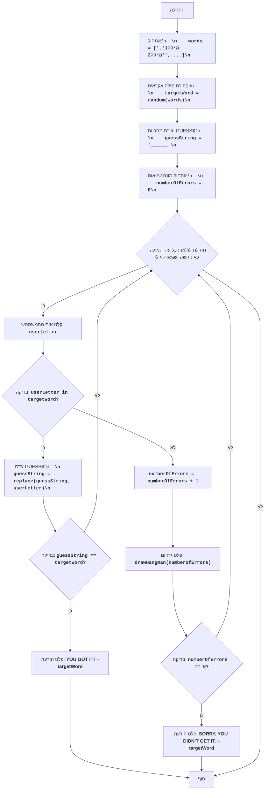

# HANG

## סקירה כללית

המשחק "תלייה" הוא משחק מילים שבו שחקן אחד (או המחשב) חושב על מילה, והשחקן השני מנסה לנחש אותה על ידי ניחוש אותיות. על כל אות לא נכונה השחקן מקבל עונש, בדרך כלל בצורה של ציור חלק מהגרדום. אם הציור מסתיים, השחקן מפסיד.

## תוכן עניינים

1. [סקירה כללית](#סקירה-כללית)
2. [חוקי המשחק](#חוקי-המשחק)
3. [אלגוריתם](#אלגוריתם)
4. [תרשים זרימה](#תרשים-זרימה)
5. [מקרא](#מקרא)

## חוקי המשחק

1. המחשב בוחר מילה אקראית מרשימה מוגדרת מראש.
2. השחקן רואה את המילה מיוצגת על ידי קווים תחתונים (אחד לכל אות).
3. השחקן מנסה לנחש את המילה על ידי הזנת אותיות.
4. אם האות שהוזנה נמצאת במילה, היא מוצגת במקומות הנכונים.
5. אם האות שהוזנה אינה נמצאת במילה, השחקן מקבל עונש.
6. המשחק נמשך עד שהשחקן מנחש את המילה או ממצה את מכסת העונשים.

## אלגוריתם

1. אתחול מערך של מילים שהמחשב יכול לנחש.
2. בחירת מילה אקראית מהמערך.
3. יצירת מחרוזת `GUESS$`, המורכבת מקווים תחתונים, באורך המילה המנוחשת.
4. אתחול מספר השגיאות ל-0.
5. התחלת לולאה "כל עוד המילה לא נוחשה ומספר השגיאות קטן מ-6":
    5.1 בקשת קלט של אות מהשחקן.
    5.2 אם האות שהוזנה נמצאת במילה המנוחשת:
       5.2.1 עדכון המחרוזת `GUESS$`, תוך הצגת האות בכל מיקומה במילה.
       5.2.2 אם כל האותיות נוחשו, מעבר לשלב 6.
    5.3 אחרת:
       5.3.1 הגדלת מספר השגיאות ב-1.
       5.3.2 הצגת ציור הגרדום המתאים למספר השגיאות הנוכחי.
    5.4 אם מספר השגיאות שווה ל-6, מעבר לשלב 7.
6. הצגת הודעה "YOU GOT IT!", לאחר מכן את המילה המנוחשת, ומעבר לשלב 8.
7. הצגת הודעה "SORRY, YOU DIDN'T GET IT.", לאחר מכן את המילה המנוחשת, ומעבר לשלב 8.
8. סיום המשחק.

## תרשים זרימה

## מקרא

- Start - תחילת המשחק.
- InitializeWords - אתחול רשימת מילים לבחירה.
- ChooseWord - בחירת מילה אקראית מהרשימה.
- CreateGuessString - יצירת מחרוזת `guessString` מקווים תחתונים, התואמת לאורך המילה המנוחשת.
- InitializeErrors - אתחול מונה השגיאות `numberOfErrors` ל-0.
- LoopStart - תחילת לולאה, שנמשכת כל עוד המילה לא נוחשה ומספר השגיאות קטן מ-6.
- InputLetter - בקשת קלט אות מהמשתמש ושמירתה ב-`userLetter`.
- CheckLetter - בדיקה האם האות שהוזנה `userLetter` נמצאת במילה המנוחשת `targetWord`.
- UpdateGuessString - עדכון המחרוזת `guessString`, תוך הצגת האות שהוזנה במקומותיה.
- CheckWin - בדיקה האם המילה נוחשה (כלומר, `guessString` שווה ל-`targetWord`).
- OutputWin - פלט הודעה על ניצחון "YOU GOT IT!" והמילה המנוחשת.
- End - סוף המשחק.
- IncreaseErrors - הגדלת מונה השגיאות `numberOfErrors` ב-1.
- DrawHangman - הצגת מצב הגרדום הנוכחי בהתאם למספר השגיאות.
- CheckLose - בדיקה האם מספר השגיאות `numberOfErrors` הגיע לערך 6.
- OutputLose - פלט הודעה על הפסד "SORRY, YOU DIDN'T GET IT." והמילה המנוחשת.