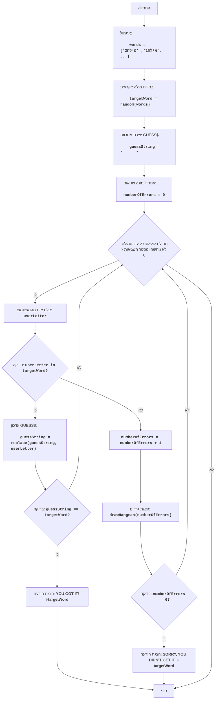

# משחק התלייה

## סקירה כללית

משחק התלייה הוא משחק מילים שבו שחקן אחד (או המחשב) בוחר מילה, והשחקן השני מנסה לנחש אותה לפי אותיות. על כל אות שגויה השחקן מקבל קנס, בדרך כלל בצורה של חלק מציור הגרדום. אם הציור הושלם, השחקן מפסיד.

## חוקי המשחק

1. המחשב בוחר מילה אקראית מרשימה שהוגדרה מראש.
2. השחקן רואה את המילה מיוצגת באמצעות קווים תחתונים (אחד לכל אות).
3. השחקן מנסה לנחש את המילה על ידי הזנת אותיות.
4. אם האות שהוזנה קיימת במילה, היא מוצגת במקומות שלה.
5. אם האות שהוזנה אינה קיימת במילה, השחקן מקבל קנס.
6. המשחק נמשך עד שהשחקן מנחש את המילה או שמספר הקנסות שלו מגיע למגבלה.

## אלגוריתם

1. אתחול מערך של מילים שהמחשב יכול לנחש.
2. בחירת מילה אקראית מהמערך.
3. יצירת מחרוזת `GUESS$`, המורכבת מקווים תחתונים, בהתאם לאורך המילה שנבחרה.
4. אתחול מספר השגיאות ל-0.
5. התחלת לולאה "כל עוד המילה לא נוחשה ומספר השגיאות קטן מ-6":
    5.1 בקשת קלט של אות מהשחקן.
    5.2 אם האות שהוזנה קיימת במילה שנבחרה:
        5.2.1 עדכון המחרוזת `GUESS$` על ידי הצגת האות בכל המקומות שלה במילה.
        5.2.2 אם כל האותיות נוחשו, יש לעבור לשלב 6.
    5.3 אחרת:
        5.3.1 הגדלת מספר השגיאות ב-1.
        5.3.2 הצגת תמונה של גרדום בהתאם למספר השגיאות הנוכחי.
    5.4 אם מספר השגיאות שווה ל-6, יש לעבור לשלב 7.
6. הצגת ההודעה "YOU GOT IT!", ולאחר מכן המילה שנבחרה, ולעבור לשלב 8.
7. הצגת ההודעה "SORRY, YOU DIDN'T GET IT.", ולאחר מכן המילה שנבחרה, ולעבור לשלב 8.
8. סוף המשחק.

## תרשים זרימה

-----
**מקרא**:

  - Start - תחילת המשחק.
  - InitializeWords - אתחול רשימת המילים לבחירה.
  - ChooseWord - בחירת מילה אקראית מהרשימה.
  - CreateGuessString - יצירת מחרוזת `guessString` מקווים תחתונים, בהתאם לאורך המילה שנבחרה.
  - InitializeErrors - אתחול מונה השגיאות `numberOfErrors` ל-0.
  - LoopStart - תחילת לולאה שמתמשכת כל עוד המילה לא נוחשה ומספר השגיאות קטן מ-6.
  - InputLetter - בקשת אות מהמשתמש ושמירתה ב-`userLetter`.
  - CheckLetter - בדיקה האם האות שהוזנה `userLetter` קיימת במילה שנבחרה `targetWord`.
  - UpdateGuessString - עדכון המחרוזת `guessString`, הצגת האות שהוזנה במקומות שלה.
  - CheckWin - בדיקה האם המילה נוחשה (כלומר, האם `guessString` שווה ל-`targetWord`).
  - OutputWin - הצגת הודעת ניצחון "YOU GOT IT!" והמילה שנבחרה.
  - End - סוף המשחק.
  - IncreaseErrors - הגדלת מונה השגיאות `numberOfErrors` ב-1.
  - DrawHangman - הצגת מצב הגרדום הנוכחי בהתאם למספר השגיאות.
  - CheckLose - בדיקה האם מספר השגיאות `numberOfErrors` הגיע ל-6.
  - OutputLose - הצגת הודעת הפסד "SORRY, YOU DIDN'T GET IT." והמילה שנבחרה.