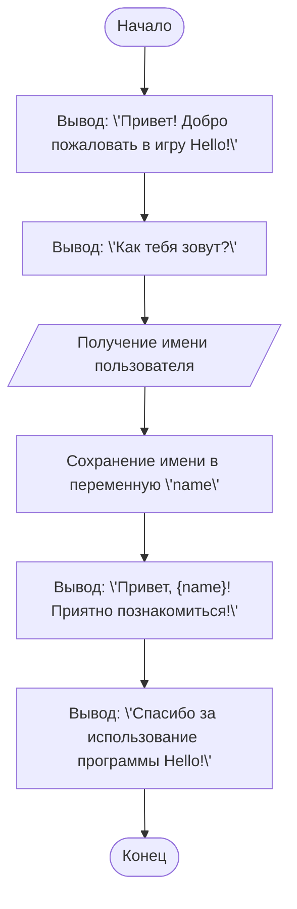

# Игра Hello

## סקירה כללית

הקוד הזה מדגים משחק פשוט שבו המחשב מברך את המשתמש.

## תוכן עניינים

1.  [סקירה כללית](#סקירה-כללית)
2.  [הסבר קוד](#הסבר-קוד)
3.  [איך התוכנית עובדת](#איך-התוכנית-עובדת)
4.  [דוגמה לריצה](#דוגמה-לריצה)
5.  [תרשים זרימה](#תרשים-זרימה)
6.  [הפעלת הקוד ב-Google Colab](#הפעלת-הקוד-ב-google-colab)
7.  [גרסה מודרנית של Hello, World!](#גרסה-מודרנית-של-hello-world)

## הסבר קוד

קוד Python זה מברך את המשתמש ומבקש ממנו להזין את שמו, ולאחר מכן מספק הודעת ברכה מותאמת אישית.
```python
# Игра Hello
# Эта программа выводит приветствие пользователю.
# Это одна из самых простых программ, которая демонстрирует базовые команды Python.

# Вывод приветствия на экран
print("Привет! Добро пожаловать в игру Hello!")  # Используем функцию print для вывода текста

# Запрос имени пользователя
name = input("Как тебя зовут? ")  # Используем функцию input для получения данных от пользователя

# Вывод персонализированного приветствия
print(f"Привет, {name}! Приятно познакомиться!")  # Используем f-строку для подстановки имени в текст

# Дополнительное сообщение
print("Спасибо за использование программы Hello!")
```
1.  **`print()`** – הפונקציה המשמשת להדפסת טקסט על המסך. במקרה זה, היא משמשת לברך את המשתמש.
2.  **`input()`** – הפונקציה המשמשת לקבלת נתונים מהמשתמש. במקרה זה, היא משמשת לבקש את השם של המשתמש.
3.  **f-strings** – משמשות להכניס משתנים לתוך מחרוזת. לדוגמה, `{name}` מחליף את ערך המשתנה `name`.
4.  **`name`** – משתנה המאחסן את השם שהזין המשתמש.

## איך התוכנית עובדת

1.  התוכנית מציגה הודעת ברכה למשתמש.
2.  התוכנית מבקשת מהמשתמש להזין את שמו.
3.  התוכנית מציגה הודעת ברכה מותאמת אישית תוך שימוש בשם שהוזן.
4.  התוכנית מסיימת את הפעולה עם הודעה נוספת.

## דוגמה לריצה

```
Привет! Добро пожаловать в игру Hello!
Как тебя зовут? Иван
Привет, Иван! Приятно познакомиться!
Спасибо за использование программы Hello!
```

## תרשים זרימה



**אגדה:**

1.  **`Start`** – תחילת התוכנית.
2.  **`DisplayWelcome`** – הצגת הודעת ברכה למשתמש.
3.  **`AskName`** – הצגת בקשה להזין שם משתמש.
4.  **`GetUserName`** – קבלת שם משתמש מהמשתמש.
5.  **`StoreName`** – אחסון השם במשתנה `name`.
6.  **`DisplayGreeting`** – הצגת הודעת ברכה אישית תוך שימוש במשתנה `name`.
7.  **`DisplayThanks`** – הצגת הודעת סיום תוכנית.
8.  **`End`** – סיום התוכנית.

## הפעלת הקוד ב-Google Colab
ניתן להפעיל את הקוד ב [google colab](https://colab.research.google.com/github/hypo69/101_python_computer_games_ru/blob/master/GAMES/HELLO/101bcg_ru_hello.ipynb)

## גרסה מודרנית של Hello, World!

הפוסט הקודם הציג פתרונות פשוטים למתחילים בלימוד Python, והתחיל עם הדוגמה הקלאסית של "Hello, World!". הדגש ניתן על ההערות ולא על הקוד. חשוב להקפיד על כתיבת הערות, שכן עם הזמן נשכח מה עשינו בעבר. קוד מתועד היטב נהפך לקל לקריאה וקל להבנה.

בנוסף, בעידן ה-AI, הקוד צריך להתאים את עצמו לזמן הנוכחי. דוגמה לכך היא גרסה מודרנית של "Hello, World!" – דוגמה אינטראקטיבית שמאפשרת אינטראקציה עם מודל הבינה המלאכותית של Google, Gemini.
דוגמה זו מדגימה כיצד ניתן להשתמש ב-Python לתקשורת עם AI ולקבלת מענה לשאלות.
```