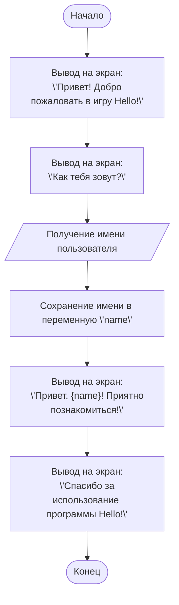

# מודול HELLO

## סקירה כללית

מודול זה מדגים תרשים זרימה פשוט של משחק "שלום" בסיסי. הוא מציג הודעת פתיחה, מבקש מהמשתמש את שמו, מברך אותו בשמו ומציג הודעת סיום.

## תוכן עניינים

1. [סקירה כללית](#סקירה-כללית)
2. [תרשים זרימה](#תרשים-זרימה)

## תרשים זרימה

**תיאור:**

תרשים הזרימה מתאר את השלבים הבסיסיים של תוכנית "שלום":

1.  **התחלה:** התהליך מתחיל.
2.  **הצגת הודעת פתיחה:** מוצגת הודעה המברכת את המשתמש למשחק.
3.  **בקשת שם:** מוצגת בקשה למשתמש להזין את שמו.
4.  **קבלת שם משתמש:** השם שהזין המשתמש נלקח כקלט.
5.  **שמירת שם:** השם מאוחסן במשתנה `name`.
6.  **הצגת ברכה:** מוצגת ברכה אישית המכילה את שם המשתמש.
7.  **הצגת תודה:** מוצגת הודעה המודה למשתמש על השימוש בתוכנית.
8.  **סיום:** התהליך מסתיים.