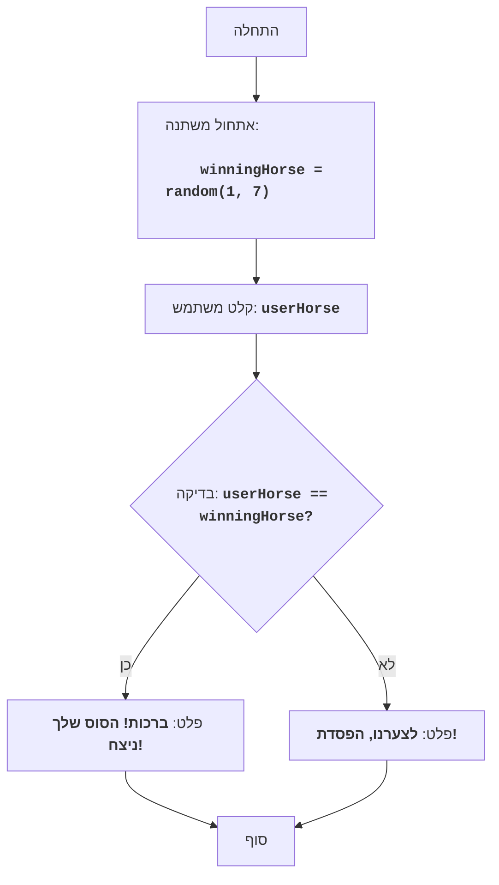

# HORSES

## סקירה כללית

משחק "מרוצי סוסים" הוא משחק פשוט בו השחקן בוחר סוס, ואז המחשב קובע באופן אקראי איזה מהסוסים ינצח. השחקן מנצח או מפסיד בהתאם לבחירתו.

## תוכן עניינים

1. [סקירה כללית](#סקירה-כללית)
2. [כללי המשחק](#כללי-המשחק)
3. [אלגוריתם](#אלגוריתם)
4. [תרשים זרימה](#תרשים-זרימה)
5. [קוד Python](#קוד-python)
6. [הסבר קוד](#הסבר-קוד)

## כללי המשחק

1. המחשב יוצר מספר אקראי בין 1 ל-7 (מספר הסוס המנצח).
2. השחקן מזין מספר סוס (מ-1 עד 7) אותו הוא רוצה לעודד.
3. המשחק מודיע האם הסוס שנבחר על ידי השחקן ניצח.

## אלגוריתם

1.  צור מספר שלם אקראי בין 1 ל-7 (מספר הסוס המנצח) ושמור אותו במשתנה `winningHorse`.
2.  בקש מהמשתמש להזין מספר בין 1 ל-7 (מספר הסוס שהוא מהמר עליו) ושמור אותו במשתנה `userHorse`.
3.  אם `userHorse` שווה ל-`winningHorse`, הדפס הודעה "ברכות! הסוס שלך ניצח!".
4.  אחרת, הדפס הודעה "לצערנו, הפסדת!".
5. סוף המשחק.

## תרשים זרימה


מקרא:
    Start - תחילת התוכנית.
    InitializeWinningHorse - אתחול משתנה winningHorse (מספר הסוס המנצח), נוצר מספר אקראי בין 1 ל-7.
    InputUserHorse - בקשת קלט מהמשתמש (מספר סוס) ושמירה במשתנה userHorse.
    CheckWinner - בדיקה האם המספר שהוזן על ידי המשתמש userHorse שווה למספר המנצח winningHorse.
    OutputWin - פלט הודעה על ניצחון, אם המספרים שווים.
    OutputLose - פלט הודעה על הפסד, אם המספרים לא שווים.
    End - סוף התוכנית.

## קוד Python

```python
import random

# генерируем случайное число от 1 до 7 (номер лошади-победителя)
winningHorse = random.randint(1, 7)

# Запрашиваем у пользователя ввод числа (номер лошади, за которую он играет)
try:
    userHorse = int(input("בחר מספר סוס בין 1 ל-7: "))
    if userHorse < 1 or userHorse > 7:
      print("אנא בחר מספר סוס בין 1 ל-7.")
      exit()
except ValueError:
    print("אנא הזן מספר שלם בין 1 ל-7.")
    exit()


# проверяем, выиграл ли пользователь
if userHorse == winningHorse:
    print("ברכות! הסוס שלך ניצח!") # Вывод сообщения о победе
else:
    print("לצערנו, הפסדת!") # Вывод сообщения о проигрыше
```

## הסבר קוד

1.  **ייבוא מודול `random`**:
    -   `import random`: מייבא את המודול `random`, המשמש ליצירת מספר אקראי.
2.  **יצירת מספר סוס מנצח**:
    -   `winningHorse = random.randint(1, 7)`: יוצר מספר שלם אקראי בטווח מ-1 עד 7 ושומר אותו במשתנה `winningHorse`.
3.  **בקשת מספר סוס מהמשתמש**:
    -   `try...ex ValueEx`: בלוק try-ex מטפל בשגיאות קלט אפשריות. אם המשתמש מזין מספר שאינו שלם, תוצג הודעת שגיאה.
    -   `userHorse = int(input("בחר מספר סוס בין 1 ל-7: "))`: מבקש מהמשתמש מספר וממיר אותו למספר שלם, ושומר את התוצאה ב-`userHorse`.
    -   `if userHorse < 1 or userHorse > 7:`: בודק אם המספר שהוזן נמצא בטווח המותר (1-7).
    -   `print("אנא בחר מספר סוס בין 1 ל-7.")`: מציג הודעת שגיאה אם המספר שהוזן אינו תקין.
    -   `exit()`: מסיים את התוכנית אם הקלט אינו תקין.
4.  **בדיקת תוצאה והדפסת הודעה**:
    -   `if userHorse == winningHorse:`: בודק אם המספר שהוזן על ידי המשתמש שווה למספר המנצח.
    -   `print("ברכות! הסוס שלך ניצח!")`: מדפיס הודעה על ניצחון אם המספרים שווים.
    -   `else:`: אם המספר לא נוחש.
    -   `print("לצערנו, הפסדת!")`: מדפיס הודעה על הפסד.