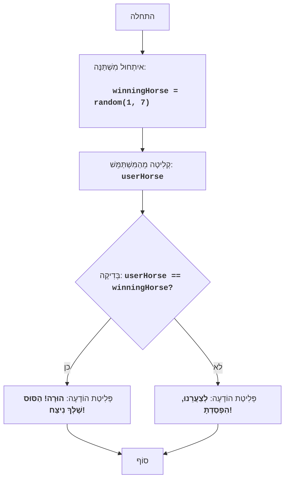

# HORSES

## סקירה כללית

המשחק "מרוצי סוסים" הוא משחק פשוט שבו השחקן בוחר סוס, והמחשב קובע באופן אקראי איזה סוס ינצח. השחקן מנצח או מפסיד בהתאם לבחירתו.

## תוכן עניינים

- [סקירה כללית](#סקירה-כללית)
- [הוראות משחק](#הוראות-משחק)
- [אלגוריתם](#אלגוריתם)
- [תרשים זרימה](#תרשים-זרימה)
- [הסבר הקוד](#הסבר-הקוד)

## הוראות משחק

1. המחשב מייצר מספר אקראי בין 1 ל-7 (מספר הסוס המנצח).
2. השחקן מזין מספר סוס (מ-1 עד 7) שאותו הוא רוצה לעודד.
3. המשחק מודיע אם הסוס שבחר השחקן ניצח.

## אלגוריתם

1. צור מספר אקראי שלם בין 1 ל-7 (מספר הסוס המנצח) ושמור אותו במשתנה `winningHorse`.
2. בקש מהמשתמש להזין מספר בין 1 ל-7 (מספר הסוס שהוא משחק בו) ושמור אותו במשתנה `userHorse`.
3. אם `userHorse` שווה ל-`winningHorse`, הצג הודעה "הוּרָה! הַסּוּס שֶׁלְּךָ נִיצַּח!".
4. אחרת, הצג הודעה "לְצַעֲרֵנוּ, הִפְסַדְתָּ!".
5. סוף המשחק.

## תרשים זרימה

**מקרא:**
* Start - תחילת התוכנית.
* InitializeWinningHorse - איִתְחוּל המשתנה winningHorse (מספר הסוס המנצח), נוצר מספר אקראי מ-1 עד 7.
* InputUserHorse - בקשת קלט מהמשתמש (מספר הסוס) ושמירה שלו במשתנה userHorse.
* CheckWinner - בדיקה האם המספר userHorse שהזין המשתמש שווה למספר winningHorse שנבחר באופן אקראי.
* OutputWin - הצגת הודעת ניצחון, אם המספרים שווים.
* OutputLose - הצגת הודעת הפסד, אם המספרים לא שווים.
* End - סוף התוכנית.

## הסבר הקוד

1.  **ייבוא מודול `random`**:
    -   `import random`: מייבא את המודול `random`, המשמש ליצירת מספרים אקראיים.
2.  **יצירת מספר הסוס המנצח**:
    -   `winningHorse = random.randint(1, 7)`: יוצר מספר שלם אקראי בטווח שבין 1 ל-7 ושומר אותו במשתנה `winningHorse`.
3.  **בקשת קלט מספר הסוס מהמשתמש**:
    -   `try...ex ValueError`: בלוק try-except מטפל בשגיאות קלט אפשריות. אם המשתמש מזין מספר לא שלם, תוצג הודעת שגיאה.
    -   `userHorse = int(input("בחר מספר סוס מ-1 עד 7: "))`: מבקש מהמשתמש מספר והופך אותו למספר שלם, תוך שמירת התוצאה ב-`userHorse`.
    -   `if userHorse < 1 or userHorse > 7:`: בודק האם המספר שהוזן נמצא בטווח המותר (1-7).
    -   `print("אנא בחר מספר סוס בין 1 ל-7.")`: מציג הודעת שגיאה אם המספר שהוזן לא נכון.
    -   `exit()`: מסיים את התוכנית אם הקלט לא נכון.
4.  **בדיקת התוצאה והצגת ההודעה**:
    -   `if userHorse == winningHorse:`: בודק האם המספר שהזין המשתמש שווה למספר האקראי.
    -   `print("הוּרָה! הַסּוּס שֶׁלְּךָ נִיצַּח!")`: מציג הודעת ניצחון אם המספרים שווים.
    -   `else:`: אם המספר לא נוחש.
    -   `print("לְצַעֲרֵנוּ, הִפְסַדְתָּ!")`: מציג הודעת הפסד.