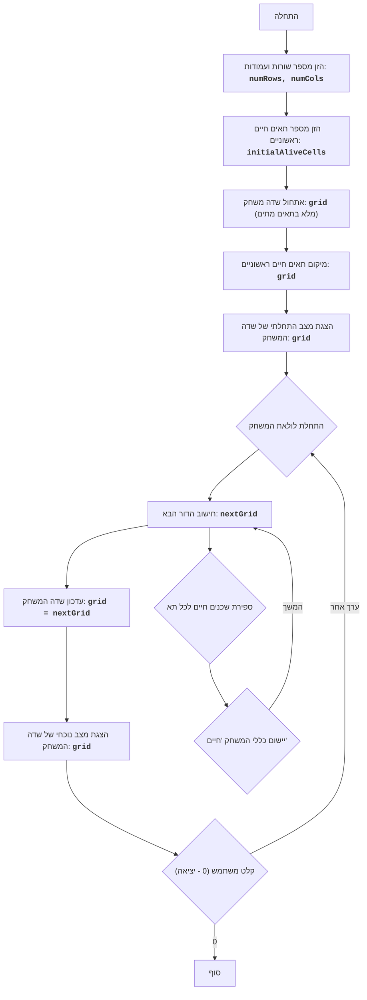

# LIFE 2

## סקירה כללית

משחק "חיים 2" הוא סימולציה של אוטומט סלולרי שפותחה על ידי ג'ון קונווי. הוא מייצג שדה תאים, שכל אחד מהם יכול להיות חי או מת. מצב התא בדור הבא תלוי במספר השכנים החיים בדור הנוכחי. המשחק מדגים כיצד כללים פשוטים יכולים להוביל להיווצרות דפוסים מורכבים ומעניינים. השחקן יכול להגדיר תצורה ראשונית של תאים חיים, ולצפות באבולוציה של תצורה זו לאורך זמן.

## תוכן עניינים

- [כללי המשחק](#כללי-המשחק)
- [אלגוריתם](#אלגוריתם)
- [תרשים זרימה](#תרשים-זרימה)

## כללי המשחק

1. שדה המשחק מוצג כרשת, כאשר כל תא יכול להיות חי (מסומן כ-'*') או מת (מסומן כרווח ' ').
2. בתחילת המשחק, השחקן מתבקש להזין את מספר השורות והעמודות עבור שדה המשחק, כמו גם את מספר התאים החיים.
3. לאחר הזנת הפרמטרים ההתחלתיים, השדה מתמלא בתאים מתים, ולאחר מכן ממוקמים באופן אקראי התאים החיים, שמספרם ציין השחקן.
4. לאחר אתחול השדה, התוכנית מציגה את המצב ההתחלתי של השדה.
5. האיטרציות נמשכות עד שהמשתמש מזין "0".
6. עבור כל דור חדש:
   - כל תא חי עם 2 או 3 שכנים חיים נשאר חי בדור הבא.
   - כל תא חי עם פחות מ-2 שכנים חיים מת בדור הבא.
   - כל תא חי עם יותר מ-3 שכנים חיים מת בדור הבא.
   - כל תא מת נולד בדור הבא אם יש לו בדיוק 3 שכנים חיים.
7. השדה מוצג לאחר כל איטרציה.

## אלגוריתם

1. בקש מהמשתמש את מספר השורות והעמודות עבור שדה המשחק.
2. בקש מהמשתמש את מספר התאים החיים הראשוניים.
3. אתחל את שדה המשחק כמטריצה ​​שממולאת בתאים מתים (' ').
4. מקם באופן אקראי את מספר התאים החיים שצוין על ידי המשתמש ('*') בשדה המשחק.
5. הצג את המצב ההתחלתי של שדה המשחק.
6. הפעל לולאה אינסופית:
    6.1. חישוב הדור הבא של התאים:
        6.1.1. צור שדה חדש על ידי העתקת השדה הנוכחי.
        6.1.2. עבור כל תא בשדה הנוכחי:
            6.1.2.1. ספור את מספר השכנים החיים.
            6.1.2.2. החל את כללי "החיים" כדי לקבוע את מצב התא בשדה החדש.
        6.1.3. החלף את השדה הנוכחי בשדה החדש.
    6.2. הצג את המצב הנוכחי של שדה המשחק.
    6.3. בקש מהמשתמש להזין קלט. אם הקלט הוא "0", סיים את המשחק, אחרת המשך.

## תרשים זרימה

מקרא:
    Start - תחילת התוכנית.
    InputRowsCols - בקשה מהמשתמש להזין את מספר השורות והעמודות עבור שדה המשחק.
    InputAliveCells - בקשה מהמשתמש להזין את מספר התאים החיים ההתחלתיים.
    InitializeGrid - אתחול שדה המשחק כמטריצה ​​שממולאת בתאים מתים (רווחים).
    PlaceAliveCells - מיקום מספר נתון של תאים חיים (כוכביות) בשדה המשחק במיקומים אקראיים.
    OutputGrid - הצגת המצב ההתחלתי של שדה המשחק על המסך.
    GameLoopStart - תחילת לולאת המשחק הראשית.
    ComputeNextGeneration - חישוב הדור הבא של תאים על בסיס המצב הנוכחי של השדה וכללי המשחק "חיים".
    CalculateNeighbors - ספירת מספר השכנים החיים עבור כל תא.
    ApplyRules - יישום כללי המשחק "חיים" כדי לקבוע את מצב התא בדור הבא.
    UpdateGrid - עדכון שדה המשחק הנוכחי, החלפתו בדור החדש.
    OutputCurrentGrid - הצגת המצב הנוכחי של שדה המשחק על המסך.
    InputUserContinue - בקשה מהמשתמש להמשיך את המשחק (כל ערך מלבד "0") או לצאת מהמשחק ("0").
    End - סיום התוכנית.