# LIFE

## סקירה כללית

משחק "החיים" הוא סימולציית אוטומט תאי שפותחה על ידי ג'ון קונוויי. שדה המשחק הוא רשת של תאים, שכל אחד מהם יכול להיות באחד משני מצבים: "חי" או "מת". מצבו של כל תא בדור הבא תלוי במצב שכניו בדור הנוכחי. מטרת המשחק היא לצפות באבולוציה של תצורה ראשונית של תאים ולחקור דפוסים מעניינים שמתעוררים בתהליך הסימולציה.

## תוכן עניינים

1.  [סקירה כללית](#סקירה-כללית)
2.  [חוקי המשחק](#חוקי-המשחק)
3.  [אלגוריתם](#אלגוריתם)
4.  [תרשים זרימה](#תרשים-זרימה)
5.  [מקרא](#מקרא)

## חוקי המשחק

1.  שדה המשחק מורכב מתאים, שכל אחד מהם יכול להיות "חי" (מסומן על ידי "*") או "מת" (מסומן על ידי רווח).
2.  בתחילה, השדה מתמלא באופן אקראי או מוגדרת תצורה מסוימת של תאים.
3.  המעבר לדור הבא מתבצע לפי הכללים הבאים:
    * תא חי עם פחות משני שכנים חיים מת מבדידות.
    * תא חי עם שניים או שלושה שכנים חיים שורד בדור הבא.
    * תא חי עם יותר משלושה שכנים חיים מת מצפיפות יתר.
    * תא מת עם בדיוק שלושה שכנים חיים קם לתחייה.
4.  המשחק נמשך מספר דורות מוגדר.

## אלגוריתם

1.  בקש מהמשתמש את מידות השדה (מספר שורות ועמודות).
2.  בקש מהמשתמש את מספר הדורות לסימולציה.
3.  צור את הדור הראשוני:
    * אם המשתמש הזין נתונים ראשוניים, השתמש בהם.
    * אם לא, מלא את השדה באופן אקראי בתאים חיים ומתים.
4.  עבור כל דור מ-1 עד מספר הדורות שצוין:
    4.1 הצג על המסך את הדור הנוכחי (מצב השדה).
    4.2 צור שדה חדש (הדור הבא) על ידי החלת חוקי המשחק:
        * עבור כל תא בשדה הנוכחי:
            * ספור את מספר השכנים החיים.
            * בהתאם למצב התא ומספר השכנים בדור הנוכחי, קבע את מצבו בשדה החדש לפי חוקי המשחק.
    4.3 עדכן את השדה הנוכחי עם השדה החדש.
5.  בסיום הסימולציה, הצג על המסך את מצב השדה הסופי.

## תרשים זרימה

```mermaid
flowchart TD
    Start["התחלה"] --> InputGridSize["קלט מידות רשת: <code><b>rows, cols</b></code>"]
    InputGridSize --> InputGenerations["קלט מספר דורות: <code><b>generations</b></code>"]
    InputGenerations --> InputInitialConfig{"קלט תצורה התחלתית: <code><b>initial_config</b></code>"}
    InputInitialConfig --> CreateInitialGrid{"יצירת רשת התחלתית: <code><b>grid</b></code>"}
    CreateInitialGrid --> LoopStart{"התחלת לולאת דורות: <code><b>for generation in range(generations)</b></code>"}
    LoopStart -- כן --> OutputCurrentGrid["פלט רשת נוכחית: <code><b>grid</b></code>"]
    OutputCurrentGrid --> CreateNextGenerationGrid["יצירת רשת הבאה: <code><b>next_grid</b></code>"]
    CreateNextGenerationGrid --> LoopCellsStart{"התחלת לולאה על תאים: <code><b>for row in range(rows): for col in range(cols)</b></code>"}
    LoopCellsStart --> CountLiveNeighbours["ספירת שכנים חיים: <code><b>live_neighbours</b></code>"]
    CountLiveNeighbours --> ApplyRules["יישום חוקי המשחק לקביעת מצב תא ב <code><b>next_grid</b></code>"]
    ApplyRules --> LoopCellsEnd{"סוף לולאה על תאים"}
    LoopCellsEnd --> UpdateCurrentGrid{"עדכון רשת נוכחית: <code><b>grid = next_grid</b></code>"}
    UpdateCurrentGrid --> LoopEnd{"סוף לולאת דורות"}
    LoopEnd -- כן --> LoopStart
    LoopEnd -- לא --> OutputFinalGrid["פלט רשת סופית: <code><b>grid</b></code>"]
    OutputFinalGrid --> End["סוף"]

```

## מקרא

    Start - תחילת התוכנית.
    InputGridSize - קליטת מידות הרשת (מספר שורות ועמודות) מהמשתמש.
    InputGenerations - קליטת מספר הדורות לסימולציה מהמשתמש.
    InputInitialConfig - קליטת תצורה התחלתית של תאים מהמשתמש.
    CreateInitialGrid - יצירת רשת התחלתית (grid) בהתבסס על המידות והתצורה ההתחלתית. אם לא סופקה תצורה התחלתית, השדה יתמלא באופן אקראי.
    LoopStart - תחילת לולאה המתבצעת כמספר הדורות שצוין.
    OutputCurrentGrid - פלט של מצב הרשת הנוכחי (grid) למסך.
    CreateNextGenerationGrid - יצירת רשת חדשה (next_grid), שתייצג את הדור הבא.
    LoopCellsStart - תחילת לולאה על כל תא ברשת.
    CountLiveNeighbours - ספירת מספר השכנים החיים לתא הנוכחי.
    ApplyRules - יישום חוקי המשחק (Conway's Game of Life) לקביעת מצב התא בדור הבא (next_grid) על בסיס מספר השכנים החיים ומצב התא הנוכחי.
    LoopCellsEnd - סוף לולאה על כל תא ברשת.
    UpdateCurrentGrid - עדכון הרשת הנוכחית (grid) עם הרשת החדשה (next_grid).
    LoopEnd - סוף לולאת הדורות. אם יש עוד דורות, הלולאה חוזרת על עצמה.
    OutputFinalGrid - פלט של מצב הרשת הסופי (grid) למסך לאחר סיום כל הדורות.
    End - סוף התוכנית.