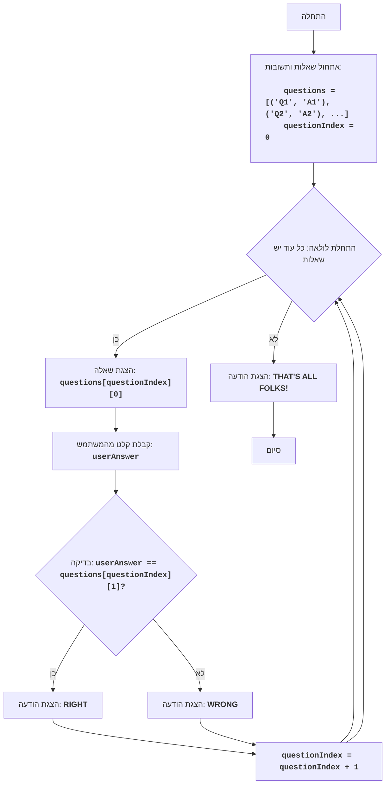

# LIT QZ

## סקירה כללית

משחק "LIT QZ" הוא חידון שבו המחשב שואל שאלות והשחקן צריך לענות עליהן.
גרסה זו של המשחק אינטראקטיבית וניתנת להרחבה, מה שמאפשר להוסיף בקלות שאלות ותשובות חדשות.

## תוכן עניינים

1. [סקירה כללית](#סקירה-כללית)
2. [חוקי המשחק](#חוקי-המשחק)
3. [אלגוריתם](#אלגוריתם)
4. [תרשים זרימה](#תרשים-זרימה)
5. [מקרא](#מקרא)

## חוקי המשחק

1. המחשב מציג שאלה.
2. השחקן מזין את תשובתו.
3. המחשב בודק את התשובה ומדווח אם היא נכונה או לא.
4. המשחק ממשיך עד שנגמרות כל השאלות.
5. בסוף המשחק מוצגת הודעה על סיומו.

## אלגוריתם

1. אתחל רשימה של שאלות ותשובות.
2. אתחל מונה שאלות ל-0.
3. התחל לולאה "כל עוד יש שאלות":
   3.1. הצג את השאלה הנוכחית.
   3.2. בקש מהשחקן להזין תשובה.
   3.3. השווה את התשובה שהוזנה עם התשובה הנכונה.
   3.4. אם התשובה נכונה, הצג הודעה "RIGHT".
   3.5. אם התשובה לא נכונה, הצג הודעה "WRONG".
   3.6. הגדל את מונה השאלות ב-1.
4. הצג הודעה "THAT'S ALL FOLKS!".
5. סוף המשחק.

## תרשים זרימה

## מקרא

-   **Start** - תחילת התוכנית.
-   **InitializeQuestions** - אתחול רשימת השאלות והתשובות והגדרת אינדקס השאלה ההתחלתי ל-0.
-   **LoopStart** - תחילת הלולאה, אשר נמשכת כל עוד יש שאלות ברשימה.
-   **DisplayQuestion** - הצגת השאלה הנוכחית על המסך.
-   **InputAnswer** - בקשת קלט תשובה מהמשתמש ושמירתה במשתנה userAnswer.
-   **CheckAnswer** - בדיקה האם התשובה שהוזנה userAnswer שווה לתשובה הנכונה מהרשימה.
-   **OutputRight** - הצגת הודעה "RIGHT" אם התשובה נכונה.
-   **IncreaseIndex** - הגדלת האינדקס של השאלה הנוכחית ב-1.
-   **OutputWrong** - הצגת הודעה "WRONG" אם התשובה אינה נכונה.
-   **OutputEnd** - הצגת הודעה "THAT'S ALL FOLKS!" לאחר סיום כל השאלות.
-   **End** - סיום התוכנית.