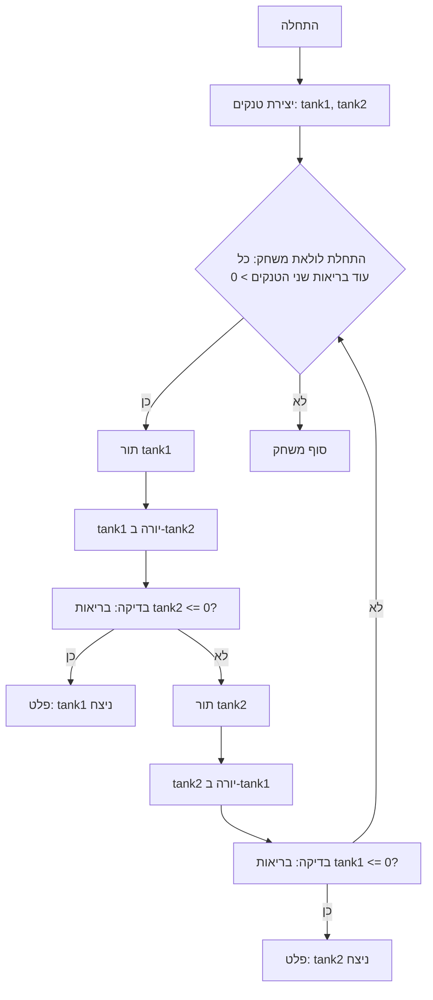

# תיעוד משחק טנקים (גרסת קונסולה)

## תוכן עניינים
1. [סקירה כללית](#סקירה-כללית)
2. [חוקי המשחק](#חוקי-המשחק)
3. [אלגוריתם](#אלגוריתם)
4. [תרשים זרימה](#תרשים-זרימה)
5. [דוגמה להרצה](#דוגמה-להרצה)
6. [מגבלות אפשריות](#מגבלות-אפשריות)

## סקירה כללית

משחק טקסט פשוט בו שני טנקים יורים זה בזה עד שאחד מהם מושמד.
המשחק מספק דוגמה פשוטה ליישום משחק טקסט עם מספר קטן של חוקים ומכניקות.

## חוקי המשחק

1. שני טנקים בעלי מאפיינים: בריאות, נזק ושריון.
2. הטנקים יורים זה בזה בתורות.
3. נזק נגרם באופן אקראי בטווח נתון.
4. לטנק סופר יש בריאות ושריון מוגברים.
5. המשחק מסתיים כאשר לאחד הטנקים הבריאות מגיעה ל-0.

## אלגוריתם

1. צור מחלקות עבור `Tank` ו-`SuperTank` בעלות מאפיינים `model`, `armor`, `min_damage`, `max_damage` ו-`health`.
2. יישם את המתודה `health_down` כדי להפחית את בריאות הטנק.
3. יישם את המתודה `shot` כדי לגרום נזק ליריב.
4. צור מתודה `calculate_damage` לחישוב נזק אקראי.
5. בחלק העיקרי של התוכנית צור מופעים של טנקים.
6. ארגן לולאה בה טנקים יורים זה בזה בתורות עד שאחד הטנקים מושמד (בריאות 0).
7. הצג הודעת ניצחון כאשר אחד הטנקים מושמד.

## תרשים זרימה


**מקרא**:
  - Start - תחילת המשחק.
  - CreateTanks - יצירת מופעי טנקים (tank1 ו-tank2).
  - GameLoopStart - התחלת לולאת המשחק (כל עוד בריאות שני הטנקים > 0).
  - Tank1Turn - תור הטנק tank1.
  - Tank1Shot - tank1 יורה ב-tank2.
  - CheckTank2Health - בדיקה: בריאות tank2 <= 0?
  - OutputTank1Win - הצגת הודעה על ניצחון tank1.
  - Tank2Turn - תור הטנק tank2.
  - Tank2Shot - tank2 יורה ב-tank1.
  - CheckTank1Health - בדיקה: בריאות tank1 <= 0?
  - OutputTank2Win - הצגת הודעה על ניצחון tank2.
  - End - סוף המשחק.

## דוגמה להרצה

```
מתחיל קרב טנקים!
לטנק טי-34 יש שריון חזית 50 מ"מ עם 100 נקודות בריאות ונזק בטווח שבין 20 ל-30 יחידות
לטנק טיגר יש שריון חזית 80 מ"מ עם 150 נקודות בריאות ונזק בטווח שבין 25 ל-35 יחידות

טי-34:
פגע בול, ליריב טיגר נותרו 120 יחידות בריאות

טיגר:
מפקד, פגעו בצוות של טי-34, נותרו לנו 77 נקודות בריאות

טי-34:
פגע בול, ליריב טיגר נותרו 87 יחידות בריאות

טיגר:
מפקד, פגעו בצוות של טי-34, נותרו לנו 49 נקודות בריאות

טי-34:
צוות הטנק טיגר הושמד

טי-34 ניצח!
```

## מגבלות אפשריות

- ממשק טקסט.
- אינטראקציה מוגבלת עם המשתמש (רק צפייה בתוצאות).
```