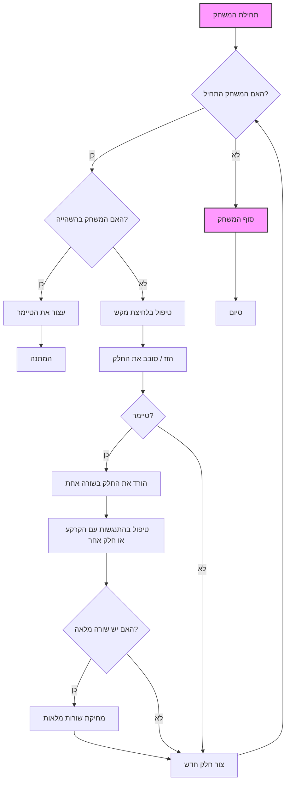

# Tetris

## סקירה כללית

מודול זה מיישם את המשחק הקלאסי טטריס באמצעות PyQt5. המשחק כולל לוח, חלקי טטרימינו שנופלים, סיבוב חלקים וסילוק שורות מלאות.

## תוכן עניינים

- [מחלקות](#מחלקות)
  - [`Tetris`](#tetris)
  - [`Board`](#board)
  - [`Tetrominoe`](#tetrominoe)
  - [`Shape`](#shape)
- [פונקציות](#פונקציות)
- [תיאור הקוד](#תיאור-הקוד)
- [תרשים זרימה](#תרשים-זרימה)

## מחלקות

### `Tetris`

**תיאור**: חלון האפליקציה הראשי עבור משחק הטטריס.

**שיטות**:

- `__init__`
  
  **תיאור**: מאתחל את חלון הטטריס.
-   `initUI`
    
  **תיאור**:  מאתחל את ממשק המשתמש, כולל הגדרת לוח המשחק.
-   `center`
   
  **תיאור**: ממקם את החלון במרכז המסך.

### `Board`

**תיאור**: מייצג את לוח המשחק של טטריס, כולל לוגיקת המשחק.

**שיטות**:

- `__init__`
  
    **תיאור**: מאתחל את לוח המשחק.
   
    **פרמטרים**:
      - `parent` (QMainWindow): חלון האב.
- `initBoard`
  
    **תיאור**: מאתחל את הלוח ומשתני המשחק.
- `shapeAt`
    
   **תיאור**: מחזיר את צורת החלק במיקום נתון.
    
    **פרמטרים**:
       - `x` (int): קואורדינטת x.
       - `y` (int): קואורדינטת y.
    
    **Returns**:
      - `int`: צורת הטטרימינו במיקום.
- `setShapeAt`
   
    **תיאור**: מגדיר את צורת החלק במיקום נתון.
    
    **פרמטרים**:
       - `x` (int): קואורדינטת x.
       - `y` (int): קואורדינטת y.
       - `shape` (int): צורת הטטרימינו.
- `squareWidth`
   
    **תיאור**: מחזיר את הרוחב של ריבוע אחד.
    
    **Returns**:
       - `int`: רוחב הריבוע.
- `squareHeight`
   
    **תיאור**: מחזיר את הגובה של ריבוע אחד.
    
    **Returns**:
        - `int`: גובה הריבוע.
- `start`
  
   **תיאור**: מתחיל את המשחק.
- `pause`
   
    **תיאור**: משהה או מחדש את המשחק.
- `paintEvent`
   
    **תיאור**: מצייר את לוח המשחק והחלק הנוכחי.
    
    **פרמטרים**:
       - `event` (object): אירוע הציור.
- `keyPressEvent`
   
    **תיאור**: מטפל בלחיצות המקשים.
    
    **פרמטרים**:
        - `event` (object): אירוע לחיצת המקשים.
- `timerEvent`
   
    **תיאור**: מטפל באירועי הטיימר.
    
    **פרמטרים**:
       - `event` (object): אירוע הטיימר.
- `clearBoard`
   
    **תיאור**: מנקה את לוח המשחק.
- `dropDown`
   
    **תיאור**: מפיל את החלק הנוכחי עד הסוף.
- `oneLineDown`
   
    **תיאור**: מזיז את החלק הנוכחי שורה אחת למטה.
- `pieceDropped`
   
    **תיאור**: מקבע את החלק שנפל על הלוח.
- `removeFullLines`
   
    **תיאור**: מסיר שורות מלאות ומעדכן את הניקוד.
- `newPiece`
   
    **תיאור**: יוצר חלק חדש למשחק.
- `tryMove`
   
    **תיאור**: מנסה להזיז את החלק לקואורדינטות חדשות.
    
    **פרמטרים**:
       - `newPiece` (object): צורה חדשה של החלק.
       - `newX` (int): קואורדינטת x חדשה.
       - `newY` (int): קואורדינטת y חדשה.
    
    **Returns**:
        - `bool`: `True` אם המעבר הצליח, `False` אחרת.
- `drawSquare`
  
   **תיאור**: מצייר ריבוע בלוח המשחק.
    
    **פרמטרים**:
       - `painter` (QPainter): אובייקט QPainter.
       - `x` (int): קואורדינטת x.
       - `y` (int): קואורדינטת y.
       - `shape` (int): צורת הטטרימינו.

### `Tetrominoe`

**תיאור**: מונה את כל צורות הטטרימינו האפשריות.

### `Shape`

**תיאור**: מייצג צורת טטרימינו יחידה.

**שיטות**:

- `__init__`
   
    **תיאור**: מאתחל את צורת הטטרימינו.
- `shape`
    
    **תיאור**: מחזיר את צורת החלק.
    
    **Returns**:
        - `int`: צורת החלק.
- `setShape`
   
    **תיאור**: מגדיר את צורת החלק.
    
    **פרמטרים**:
        - `shape` (int): צורת הטטרימינו.
- `setRandomShape`
   
    **תיאור**: מגדיר צורה אקראית לחלק.
- `x`
  
    **תיאור**: מחזיר את קואורדינטת x עבור נקודה נתונה בחלק.
    
    **פרמטרים**:
        - `index` (int): אינדקס נקודת החלק.
   
    **Returns**:
       - `int`: קואורדינטת x.
- `y`
   
    **תיאור**: מחזיר את קואורדינטת y עבור נקודה נתונה בחלק.
    
    **פרמטרים**:
        - `index` (int): אינדקס נקודת החלק.
    
    **Returns**:
        - `int`: קואורדינטת y.
- `setX`
   
    **תיאור**: מגדיר את קואורדינטת x עבור נקודה נתונה בחלק.
    
    **פרמטרים**:
        - `index` (int): אינדקס נקודת החלק.
        - `x` (int): קואורדינטת x החדשה.
- `setY`
    
    **תיאור**: מגדיר את קואורדינטת y עבור נקודה נתונה בחלק.
    
    **פרמטרים**:
        - `index` (int): אינדקס נקודת החלק.
        - `y` (int): קואורדינטת y החדשה.
- `minX`
  
   **תיאור**: מחזיר את קואורדינטת x המינימלית של החלק.
    
    **Returns**:
        - `int`: קואורדינטת x המינימלית.
- `maxX`
   
    **תיאור**: מחזיר את קואורדינטת x המקסימלית של החלק.
    
    **Returns**:
        - `int`: קואורדינטת x המקסימלית.
- `minY`
    
    **תיאור**: מחזיר את קואורדינטת y המינימלית של החלק.
    
    **Returns**:
       - `int`: קואורדינטת y המינימלית.
- `maxY`
   
    **תיאור**: מחזיר את קואורדינטת y המקסימלית של החלק.
   
    **Returns**:
        - `int`: קואורדינטת y המקסימלית.
- `rotateLeft`
   
    **תיאור**: מסובב את החלק 90 מעלות שמאלה.
   
    **Returns**:
        - `object`: צורה חדשה לאחר הסיבוב.
- `rotateRight`
  
   **תיאור**: מסובב את החלק 90 מעלות ימינה.
    
    **Returns**:
        - `object`: צורה חדשה לאחר הסיבוב.

## פונקציות

אין פונקציות מוגדרות ברמה הראשית במודול זה.

## תיאור הקוד

-   **מחלקה `Tetris`:**
    *   יוצרת את חלון האפליקציה הראשי.
    *   `initUI()`: מאתחלת את הממשק, יוצרת את לוח המשחק.
-   **מחלקה `Board`:**
    *   `initBoard()`: מאתחלת את לוח המשחק, הטיימר, החלק הנוכחי.
    *   `start()`: מתחילה את המשחק, מייצרת חלק חדש.
    *   `pause()`: משהה את המשחק.
    *   `paintEvent()`: מציירת את לוח המשחק והחלק הנופל.
    *   `keyPressEvent()`: מטפלת בלחיצות המקשים.
    *   `timerEvent()`: קוראת למתודה `oneLineDown` עם הטיימר.
    *   `clearBoard()`: מנקה את לוח המשחק.
    *   `dropDown()`: מורידה את החלק עד הסוף.
    *   `oneLineDown()`: מורידה את החלק שורה אחת.
    *   `pieceDropped()`: מקבעת את החלק על הלוח.
    *   `removeFullLines()`: מסירה שורות מלאות.
    *   `newPiece()`: יוצרת חלק חדש.
    *   `tryMove()`: מנסה להזיז את החלק.
    *   `drawSquare()`: מציירת ריבוע יחיד.
-   **מחלקה `Tetrominoe`:**
    *   מגדירה את כל הצורות האפשריות של החלקים.
-   **מחלקה `Shape`:**
    *   מייצגת צורה אחת של טטרימינו.
    *   `setShape()`: מגדירה את צורת החלק.
    *   `setRandomShape()`: בוחרת צורה אקראית.
    *   `x()`/`y()`: מחזירה קואורדינטות של החלק.
    *   `rotateLeft()`/`rotateRight()`: מסובבת את החלק.

## תרשים זרימה

