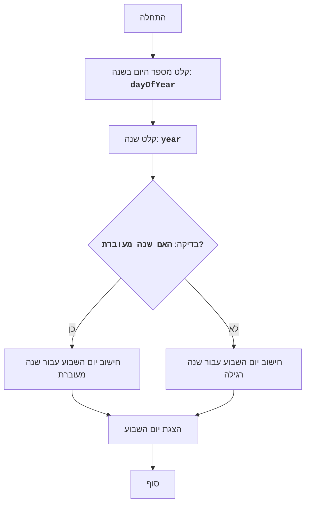

# WEKDAY

## סקירה כללית

המשחק "איזה יום בשבוע?" הוא משחק שבו המחשב מבקש מהמשתמש להזין מספר יום בשנה (מ-1 עד 366), ולאחר מכן מודיע איזה יום בשבוע זה. המשחק לוקח בחשבון שנים מעוברות.

## תוכן עניינים

1. [סקירה כללית](#סקירה-כללית)
2. [אלגוריתם](#אלגוריתם)
3. [תרשים זרימה](#תרשים-זרימה)
4. [קוד](#קוד)
5. [הסבר קוד](#הסבר-קוד)

## אלגוריתם

1. הצג הודעה למשתמש להזין יום בשנה.
2. קבל את קלט המשתמש והמר אותו למספר שלם.
3. הצג הודעה למשתמש להזין שנה.
4. קבל את קלט המשתמש והמר אותו למספר שלם.
5. חשב האם השנה היא שנה מעוברת.
6. חשב את יום השבוע באמצעות השארית מחלוקת מספר הימים ב-7. (1 - ראשון, 2 - שני, ..., 7 - שבת)
7. הצג את יום השבוע.

## תרשים זרימה


**מקרא**:

    Start - תחילת התוכנית.
    InputDay - קבלת קלט מהמשתמש עבור מספר היום בשנה ושמירה במשתנה `dayOfYear`.
    InputYear - קבלת קלט מהמשתמש עבור השנה ושמירה במשתנה `year`.
    IsLeapYear - בדיקה אם השנה שהוזנה היא שנה מעוברת.
    CalculateDayOfWeekLeap - חישוב יום השבוע עבור שנה מעוברת.
    CalculateDayOfWeekNonLeap - חישוב יום השבוע עבור שנה רגילה.
    OutputDayOfWeek - הצגת יום השבוע על המסך.
    End - סוף התוכנית.

## קוד

```python
# Запрашиваем у пользователя номер дня в году
try:
    dayOfYear = int(input("Введите номер дня в году (1-366): "))
    if not 1 <= dayOfYear <= 366:
         print("Пожалуйста, введите число от 1 до 366.")
         exit()
except ValueError:
    print("Пожалуйста, введите целое число.")
    exit()


# Запрашиваем у пользователя год
try:
    year = int(input("Введите год: "))
except ValueError:
    print("Пожалуйста, введите целое число.")
    exit()


# Определяем, является ли год високосным
isLeapYear = (year % 4 == 0 and year % 100 != 0) or (year % 400 == 0)

# Вычисляем день недели 
if isLeapYear:
    dayOfWeek = (dayOfYear + 2) % 7 # 1 января високосного года - понедельник (второй день недели), поэтому добавляем 2
else:
    dayOfWeek = (dayOfYear + 1) % 7 # 1 января обычного года - воскресенье (первый день недели), поэтому добавляем 1

# Сопоставляем число дня недели со строковым представлением
days = ["Воскресенье", "Понедельник", "Вторник", "Среда", "Четверг", "Пятница", "Суббота"]
dayOfWeekStr = days[dayOfWeek] if dayOfWeek > 0 else days[6]  # Если 0, то это суббота


# Выводим результат
print(f"Это {dayOfWeekStr}.")

"""
Объяснение кода:
1.  **Ввод данных**:
    -   `try...except ValueError`: Блоки `try...except` используются для обработки возможных ошибок при вводе данных пользователем. Если пользователь вводит что-то, что нельзя преобразовать в целое число, программа выведет сообщение об ошибке и завершится.
    -   `dayOfYear = int(input("Введите номер дня в году (1-366): "))`: Запрашивает у пользователя ввод номера дня в году и преобразует ввод в целое число.
    -    `if not 1 <= dayOfYear <= 366`: Проверяет, является ли введенное число допустимым днем в году (1-366). Если нет, выводит сообщение об ошибке и завершает программу.
    -   `year = int(input("Введите год: "))`: Запрашивает у пользователя ввод года и преобразует ввод в целое число.
2.  **Определение високосного года**:
    -   `isLeapYear = (year % 4 == 0 and year % 100 != 0) or (year % 400 == 0)`: Определяет, является ли введенный год високосным. Год является високосным, если он делится на 4, но не делится на 100, или если он делится на 400.
3.  **Вычисление дня недели**:
    -   `if isLeapYear:`: Проверяет, является ли год високосным.
        - `dayOfWeek = (dayOfYear + 2) % 7`: Если год високосный, добавляем 2 к номеру дня, так как 1 января високосного года - понедельник. Вычисляем остаток от деления на 7, что дает нам день недели (0 - воскресенье, 1 - понедельник, ..., 6 - суббота).
    -   `else:`: Если год не високосный.
        -   `dayOfWeek = (dayOfYear + 1) % 7`:  Если год не високосный, добавляем 1 к номеру дня, так как 1 января обычного года - воскресенье. Также вычисляем остаток от деления на 7.
4.  **Преобразование числа дня недели в строку**:
     -   `days = ["Воскресенье", "Понедельник", "Вторник", "Среда", "Четверг", "Пятница", "Суббота"]`: Список названий дней недели.
     - `dayOfWeekStr = days[dayOfWeek] if dayOfWeek > 0 else days[6]`: Преобразуем число дня недели в строку, используя список `days`.  Если `dayOfWeek` равен 0, устанавливаем день недели как "Суббота".
5.  **Вывод результата**:
    -   `print(f"Это {dayOfWeekStr}.")`: Выводит сообщение с днем недели на экран.
"""
```

## הסבר קוד

1.  **קלט נתונים**:
    -   `try...except ValueError`: בלוקי `try...except` משמשים לטיפול בשגיאות אפשריות בעת קלט נתונים מהמשתמש. אם המשתמש מזין משהו שלא ניתן להמיר למספר שלם, התוכנית תציג הודעת שגיאה ותסתיים.
    -   `dayOfYear = int(input("Введите номер дня в году (1-366): "))`: מבקש מהמשתמש להזין את מספר היום בשנה וממיר את הקלט למספר שלם.
    -    `if not 1 <= dayOfYear <= 366`: בודק האם המספר שהוזן הוא יום חוקי בשנה (1-366). אם לא, מוצגת הודעת שגיאה והתוכנית מסתיימת.
    -   `year = int(input("Введите год: "))`: מבקש מהמשתמש להזין את השנה וממיר את הקלט למספר שלם.
2.  **קביעת שנה מעוברת**:
    -   `isLeapYear = (year % 4 == 0 and year % 100 != 0) or (year % 400 == 0)`: קובע האם השנה שהוזנה היא שנה מעוברת. שנה היא מעוברת אם היא מתחלקת ב-4, אך לא ב-100, אלא אם היא מתחלקת ב-400.
3.  **חישוב יום השבוע**:
    -   `if isLeapYear:`: בודק האם השנה היא מעוברת.
        - `dayOfWeek = (dayOfYear + 2) % 7`: אם השנה מעוברת, מוסיפים 2 למספר היום, מכיוון ש-1 בינואר בשנה מעוברת הוא יום שני. מחשבים את השארית מחלוקה ב-7, שנותן לנו את יום השבוע (0 - ראשון, 1 - שני, ..., 6 - שבת).
    -   `else:`: אם השנה אינה מעוברת.
        -   `dayOfWeek = (dayOfYear + 1) % 7`: אם השנה אינה מעוברת, מוסיפים 1 למספר היום, מכיוון ש-1 בינואר בשנה רגילה הוא יום ראשון. מחשבים גם את השארית מחלוקה ב-7.
4.  **המרת מספר יום השבוע למחרוזת**:
     -   `days = ["Воскресенье", "Понедельник", "Вторник", "Среда", "Четверг", "Пятница", "Суббота"]`: רשימת שמות הימים בשבוע.
     - `dayOfWeekStr = days[dayOfWeek] if dayOfWeek > 0 else days[6]`: ממירים את מספר יום השבוע למחרוזת, תוך שימוש ברשימה `days`. אם `dayOfWeek` שווה ל-0, מגדירים את יום השבוע כ"שבת".
5.  **הצגת התוצאה**:
    -   `print(f"Это {dayOfWeekStr}.")`: מציג הודעה עם יום השבוע על המסך.