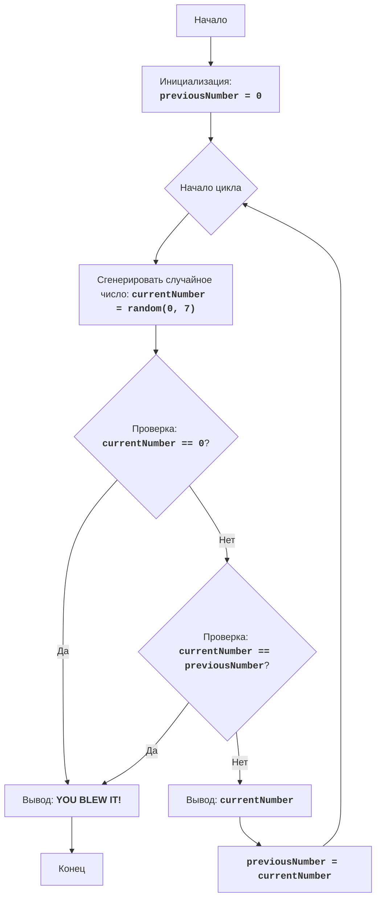

# ZOOP

## סקירה כללית

משחק "ZOOP" הוא משחק טקסט פשוט שבו השחקן מנסה ליצור רצף של מספרים אקראיים שבו אין שני מספרים זהים ברצף. המשחק נמשך עד שהשחקן יוצר רצף שמפר את הכלל הזה או מחליט להפסיק את המשחק.

## תוכן עניינים

- [סקירה כללית](#סקירה-כללית)
- [קוד](#קוד)
- [הסבר קוד](#הסבר-קוד)

## קוד

```python
"""
ZOOP:
=================
Сложность: 5
-----------------
Игра "ZOOP" - это простая текстовая игра, в которой игрок пытается сгенерировать последовательность случайных чисел, в которой не будет двух одинаковых чисел подряд. Игра продолжается до тех пор, пока игрок не сгенерирует последовательность, нарушающую это правило, или не решит прекратить игру.

Правила игры:
1. Компьютер генерирует случайное число от 1 до 7.
2. Если сгенерированное число совпадает с предыдущим сгенерированным числом, игра заканчивается.
3. Игра продолжается до тех пор, пока игрок не нарушит правило или не введет '0', чтобы завершить игру.
4. После каждого хода выводится текущее сгенерированное число.
-----------------
Алгоритм:
1.  Установить предыдущее число (previousNumber) в 0.
2.  Начать цикл:
    2.1 Сгенерировать случайное число от 1 до 7 (currentNumber).
    2.2 Если сгенерированное число равно 0, перейти к шагу 4.
    2.3 Если сгенерированное число равно предыдущему числу, перейти к шагу 4.
    2.4 Вывести текущее сгенерированное число.
    2.5 Установить предыдущее число равным текущему числу.
3. Повторять шаги с 2.1 по 2.5
4. Вывести сообщение "YOU BLEW IT!".
5. Конец игры.
-----------------
Блок-схема:


Legenda:
    Start - Начало программы.
    InitializePreviousNumber - Инициализация переменной previousNumber (предыдущее число) значением 0.
    LoopStart - Начало основного цикла игры.
    GenerateRandomNumber - Генерация случайного числа currentNumber в диапазоне от 0 до 7.
    CheckQuit - Проверка, равно ли сгенерированное число currentNumber 0.
    OutputBlowIt - Вывод сообщения "YOU BLEW IT!", если игрок проиграл.
    End - Конец программы.
    CheckSame - Проверка, равно ли сгенерированное число currentNumber предыдущему числу previousNumber.
    OutputCurrentNumber - Вывод текущего сгенерированного числа currentNumber.
    SetPreviousNumber - Установка значения переменной previousNumber равным значению переменной currentNumber.
"""
import random

# Инициализируем переменную для хранения предыдущего числа.
previousNumber = 0

# Запускаем основной цикл игры.
while True:
    # Генерируем случайное число от 0 до 7.
    currentNumber = random.randint(0, 7)

    # Проверяем, ввел ли пользователь 0 для завершения игры.
    if currentNumber == 0:
        print("YOU BLEW IT!") # Сообщаем о завершении игры.
        break  # Выходим из цикла.

    # Проверяем, равно ли текущее число предыдущему числу.
    if currentNumber == previousNumber:
        print("YOU BLEW IT!") # Сообщаем о завершении игры.
        break  # Выходим из цикла.

    # Выводим текущее сгенерированное число.
    print(currentNumber)
    # Сохраняем текущее число как предыдущее для следующей итерации.
    previousNumber = currentNumber

"""
Объяснение кода:
1.  **Импорт модуля `random`**:
    -   `import random`: Импортирует модуль `random`, который используется для генерации случайных чисел.
2. **Инициализация `previousNumber`**:
    -   `previousNumber = 0`: Инициализирует переменную `previousNumber` нулем. Эта переменная будет хранить предыдущее сгенерированное число.
3. **Бесконечный цикл `while True:`**:
    -  Этот цикл продолжается, пока не будет выполнена команда `break` внутри цикла.
4. **Генерация случайного числа**:
    - `currentNumber = random.randint(0, 7)`: Генерирует случайное целое число в диапазоне от 0 до 7 (включительно) и сохраняет его в переменной `currentNumber`.
5.  **Проверка на окончание игры**:
    - `if currentNumber == 0:`: Проверяет, равно ли сгенерированное число 0. Если да, это означает, что игрок захотел закончить игру.
    - `print("YOU BLEW IT!")`: Выводит сообщение, что игра закончилась.
    - `break`: Выходит из цикла, завершая игру.
6.  **Проверка на повтор**:
    - `if currentNumber == previousNumber:`: Проверяет, равно ли текущее сгенерированное число предыдущему сгенерированному числу.
    - `print("YOU BLEW IT!")`: Выводит сообщение, что игра закончилась.
    - `break`: Выходит из цикла, завершая игру.
7.  **Вывод текущего числа**:
    -   `print(currentNumber)`: Выводит сгенерированное число на экран.
8.  **Обновление `previousNumber`**:
    - `previousNumber = currentNumber`: Сохраняет текущее сгенерированное число в переменной `previousNumber`, чтобы оно могло быть проверено на следующей итерации цикла.
"""
```

## הסבר קוד

### סקירה כללית

הקוד מדמה משחק בשם "ZOOP", שבו המחשב מייצר מספרים אקראיים בין 0 ל-7, והמשחק מסתיים אם:

1. השחקן מכניס 0 (מה שמסיים את המשחק).
2. שני מספרים רצופים זהים.

### משתנים

- `previousNumber`: מאחסן את המספר שנוצר בפעם הקודמת, במטרה לבדוק אם יש שני מספרים רצופים זהים.
- `currentNumber`: מאחסן את המספר האקראי שנוצר בכל סיבוב.

### לולאה ראשית

הלולאה הראשית ( `while True:` ) ממשיכה עד שמתקיימים אחד מתנאי היציאה:
1. השחקן מכניס 0.
2. שני מספרים אקראיים זהים ברצף.

### פעולות עיקריות

1. **יצירת מספר אקראי**: בכל סיבוב נוצר מספר אקראי בין 0 ל-7 ומוכנס למשתנה `currentNumber`.
2. **בדיקת סיום**:
    - אם `currentNumber` שווה ל-0, המשחק מסתיים עם הודעה "YOU BLEW IT!"
    - אם `currentNumber` שווה ל-`previousNumber`, המשחק מסתיים עם הודעה "YOU BLEW IT!"
3. **הצגת המספר הנוכחי**: אם לא מתקיים אחד מתנאי הסיום, מוצג המספר הנוכחי.
4. **עדכון המספר הקודם**: המשתנה `previousNumber` מקבל את ערכו של `currentNumber` על מנת שניתן יהיה לבדוק אותו בסיבוב הבא.

### הסבר נוסף

1. **ייבוא המודול `random`**
    - `import random`: מייבא את המודול `random`, המשמש ליצירת מספרים אקראיים.

2. **אתחול `previousNumber`**
    - `previousNumber = 0`: מאתחל את המשתנה `previousNumber` לאפס. משתנה זה ישמש לאחסון המספר האקראי שנוצר בסיבוב הקודם.

3. **לולאת `while True:` אינסופית**
    - הלולאה ממשיכה עד לפקודת `break`.

4. **יצירת מספר אקראי**
    - `currentNumber = random.randint(0, 7)`: יוצר מספר שלם אקראי בין 0 ל-7 (כולל) ושומר אותו במשתנה `currentNumber`.

5. **בדיקה לסיום המשחק**
    - `if currentNumber == 0:`: בודק האם המספר שנוצר הוא 0, ואם כן, המשחק מסתיים.
    - `print("YOU BLEW IT!")`: מדפיס את הודעת סיום המשחק.
    - `break`: יוצא מהלולאה ומסיים את המשחק.

6. **בדיקה למספרים זהים ברצף**
    - `if currentNumber == previousNumber:`: בודק האם המספר הנוכחי שנוצר זהה למספר הקודם.
    - `print("YOU BLEW IT!")`: אם המספרים זהים, המשחק מסתיים ומוצגת הודעת סיום.
    - `break`: יוצא מהלולאה ומסיים את המשחק.

7. **הצגת המספר הנוכחי**
    - `print(currentNumber)`: מדפיס את המספר האקראי שנוצר.

8. **עדכון `previousNumber`**
    - `previousNumber = currentNumber`: שומר את המספר הנוכחי שנוצר כ-`previousNumber` כדי להשתמש בו בסיבוב הבא.