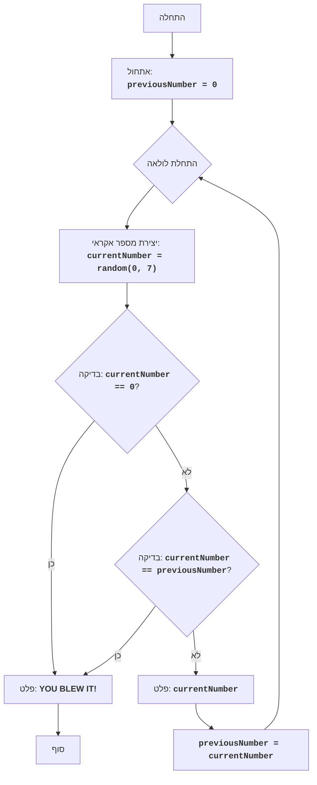

# ZOOP

## סקירה כללית

משחק "ZOOP" הוא משחק טקסט פשוט שבו השחקן מנסה ליצור רצף של מספרים אקראיים ללא שני מספרים זהים ברציפות. המשחק נמשך עד שהשחקן יוצר רצף ששובר את הכלל הזה או מחליט להפסיק את המשחק.

## תוכן עניינים

- [סקירה כללית](#סקירה-כללית)
- [חוקי המשחק](#חוקי-המשחק)
- [אלגוריתם](#אלגוריתם)
- [תרשים זרימה](#תרשים-זרימה)
- [הסבר קוד](#הסבר-קוד)
- [פונקציות](#פונקציות)

## חוקי המשחק

1. המחשב מייצר מספר אקראי בין 1 ל-7.
2. אם המספר שנוצר זהה למספר שנוצר קודם, המשחק מסתיים.
3. המשחק נמשך עד שהשחקן מפר את הכלל או מזין '0' כדי לסיים את המשחק.
4. אחרי כל מהלך, המספר הנוכחי שנוצר מוצג.

## אלגוריתם

1. הגדר את המספר הקודם (previousNumber) ל-0.
2. התחל לולאה:
    2.1. צור מספר אקראי בין 1 ל-7 (currentNumber).
    2.2. אם המספר שנוצר שווה ל-0, עבור לשלב 4.
    2.3. אם המספר שנוצר שווה למספר הקודם, עבור לשלב 4.
    2.4. הצג את המספר הנוכחי שנוצר.
    2.5. הגדר את המספר הקודם שיהיה שווה למספר הנוכחי.
3. חזור על שלבים 2.1 עד 2.5.
4. הצג הודעה "YOU BLEW IT!".
5. סוף המשחק.

## תרשים זרימה

אגדה:
    Start - תחילת התוכנית.
    InitializePreviousNumber - אתחול משתנה previousNumber (מספר קודם) לערך 0.
    LoopStart - תחילת לולאת המשחק העיקרית.
    GenerateRandomNumber - יצירת מספר אקראי currentNumber בטווח שבין 0 ל-7.
    CheckQuit - בדיקה האם המספר שנוצר currentNumber שווה ל-0.
    OutputBlowIt - פלט הודעה "YOU BLEW IT!", אם השחקן הפסיד.
    End - סוף התוכנית.
    CheckSame - בדיקה האם המספר שנוצר currentNumber שווה למספר הקודם previousNumber.
    OutputCurrentNumber - פלט המספר הנוכחי שנוצר currentNumber.
    SetPreviousNumber - הגדרת הערך של המשתנה previousNumber שיהיה שווה לערך של המשתנה currentNumber.

## הסבר קוד

1.  **ייבוא מודול `random`**:
    -   `import random`: מייבא את המודול `random`, אשר משמש ליצירת מספרים אקראיים.
2.  **אתחול `previousNumber`**:
    -   `previousNumber = 0`: מאתחל את המשתנה `previousNumber` לאפס. משתנה זה ישמור את המספר האקראי שנוצר בעבר.
3.  **לולאה אינסופית `while True:`**:
    -   לולאה זו תמשיך עד שפקודה `break` תבוצע בתוך הלולאה.
4.  **יצירת מספר אקראי**:
    -   `currentNumber = random.randint(0, 7)`: יוצר מספר שלם אקראי בטווח שבין 0 ל-7 (כולל) ושומר אותו במשתנה `currentNumber`.
5.  **בדיקה לסיום המשחק**:
    -   `if currentNumber == 0:`: בודק אם המספר שנוצר הוא 0. אם כן, זה אומר שהשחקן רוצה לסיים את המשחק.
    -   `print("YOU BLEW IT!")`: מציג הודעה שהמשחק הסתיים.
    -   `break`: יוצא מהלולאה ומסיים את המשחק.
6.  **בדיקה לטעות**:
    -   `if currentNumber == previousNumber:`: בודק אם המספר הנוכחי שנוצר שווה למספר הקודם שנוצר.
    -   `print("YOU BLEW IT!")`: מציג הודעה שהמשחק הסתיים.
    -   `break`: יוצא מהלולאה ומסיים את המשחק.
7.  **הצגת המספר הנוכחי**:
    -   `print(currentNumber)`: מציג את המספר שנוצר על המסך.
8.  **עדכון `previousNumber`**:
    -   `previousNumber = currentNumber`: שומר את המספר שנוצר במשתנה `previousNumber` כדי שאפשר יהיה לבדוק אותו באיטרציה הבאה של הלולאה.

## פונקציות

אין פונקציות מוגדרות במודול זה.