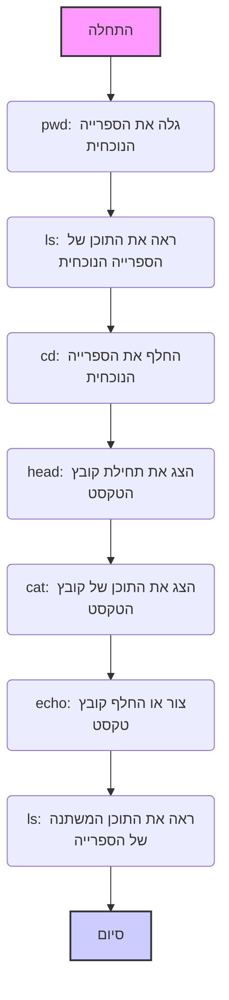

# Google Colab

## סקירה כללית

Google Colab היא פלטפורמת ענן שנוצרה על ידי גוגל לעבודה עם מחברות Jupyter Notebook אינטראקטיביות. היא מספקת כלים חזקים לכתיבה וביצוע של קוד Python, ניתוח נתונים, אימון מודלים של למידת מכונה ושיתוף פעולה בפרויקטים.

Colab מספקת גישה למשאבי מחשוב חזקים, כולל מעבדים גרפיים (GPU) ומעבדי טנסור (TPU). זה מאפשר לפתור משימות מורכבות כמו עיבוד כמויות גדולות של נתונים או אימון רשתות נוירונים, מבלי לרכוש ציוד יקר. Colab בנויה על בסיס Jupyter Notebook, ומספקת ממשק נוח לעבודה עם קוד, טקסט והדמיות. ניתן לבצע תאי קוד, להוסיף טקסט הסבר, ליצור גרפים והדמיות ישירות בדפדפן. ניתן להשתמש ב-Colab מיד לאחר הפתיחה. אין צורך להתקין תוכניות נוספות, ספריות או מנהלי התקנים. הכל כבר מוגדר לעבודה. ניתן לחבר את Google Drive שלך, מה שמאפשר להעלות נתונים, לשמור פרויקטים ולספק גישה לקבצים מכל מקום. Colab תומכת בשיתוף פעולה. ניתן לשתף את הפרויקטים עם עמיתים, לערוך מחברות בו-זמנית ולדון בשינויים בזמן אמת.

### איך Google Colab עובד?

- מריצים מחברת Jupyter בדפדפן, מה שמונע את הצורך בהתקנת סביבה מקומית.
- הקוד מבוצע על שרתי גוגל מרוחקים, והתוצאות מוצגות במחברת.
- ניתן להעלות נתונים מהמכשיר המקומי או מהענן, כגון Google Drive.
- ניתן להשתמש ב-Colab לכתיבת קוד Python, עבודה עם ספריות ללמידת מכונה (לדוגמה, TensorFlow, PyTorch), ניתוח נתונים באמצעות Pandas או יצירת הדמיות באמצעות Matplotlib ו-Seaborn.

### איך נראה Google Colab?

הממשק של Colab מורכב מכמה חלקים עיקריים:

שורות קוד: אלו תאים שבהם תכתוב ותבצע את קוד ה-Python שלך.

תאי טקסט: כאן ניתן להוסיף תיאורים, הסברים והערות לקוד.

תפריט: בחלק העליון יש תפריט עם אפשרויות שונות לעבודה עם המחברת (קובץ, עריכה, תצוגה, כלים וכו').

מנהל קבצים: בצד שמאל יש לוח של מנהל קבצים, שבו ניתן לראות קבצים ותיקיות בסביבת Colab.

ב-Google Colab, עובדים בסביבת ענן, כאשר מערכת הקבצים מאורגנת כמו במחשב רגיל עם תיקיות וקבצים. Colab מספקת כלים לניווט, יצירה, צפייה ועריכה של קבצים. ניתן לקיים אינטראקציה עם מערכת הקבצים באמצעות **פקודות קסם** של Jupyter (מתחילות ב-`%`) ו**פקודות bash** (מתחילות ב-`!`).

**רשימה של פקודות עיקריות:**

1.  **`%pwd`** (print working directory):
    *   **תיאור**: מציג את ספריית העבודה הנוכחית (היכן אתה נמצא כרגע במערכת הקבצים).
    *   **דוגמה**: `%pwd`
    *   **תוצאה**: `/content` (או ספרייה נוכחית אחרת)

2.  **`%ls`** (list):
    *   **תיאור**: מציג רשימה של קבצים ותיקיות בספרייה הנוכחית.
    *   **דוגמה**: `%ls`
    *   **תוצאה**: רשימת קבצים ותיקיות, למשל: `sample_data/  my_file.txt`

3.  **`%cd <נתיב>`** (change directory):
    *   **תיאור**: עובר לספרייה שצוינה.
    *   **דוגמה**: `%cd sample_data`
    *   **תוצאה**: ספריית העבודה הנוכחית משתנה ל-`/content/sample_data`

4.  **`!head -<מספר שורות> <שם קובץ>`**:
    *   **תיאור**: מציג את השורות הראשונות של קובץ טקסט שצוין.
    *   **דוגמה**: `!head -5 README.md`
    *   **תוצאה**: 5 השורות הראשונות של הקובץ `README.md`.

5.  **`!cat <שם קובץ>`**:
    *   **תיאור**: מציג את התוכן של קובץ טקסט שצוין.
    *   **דוגמה**: `!cat sample_file.txt`
    *   **תוצאה**: כל התוכן של הקובץ `sample_file.txt`.

6.   **`!echo "<טקסט>" > <שם קובץ>`**
    *   **תיאור:** יוצר קובץ חדש עם השם שצוין ורושם לתוכו טקסט. אם הקובץ כבר קיים, הוא יוחלף.
    *   **דוגמה:** `!echo "זה הקובץ החדש שלי!" > new_file.txt`
    *   **תוצאה:** יוצר קובץ `new_file.txt` עם התוכן `זה הקובץ החדש שלי!`.

**נקודות עיקריות:**

*   **פקודות קסם** (`%`) - הן פקודות מיוחדות של Jupyter לעבודה עם סביבת Colab.
*   **פקודות bash** (`!`) - הן פקודות שמופעלות בשורת הפקודה של Linux.
*   **נתיב לקובץ**: נתיב לקובץ מציין היכן בדיוק הקובץ נמצא במערכת הקבצים (לדוגמה, `/content/sample_data/my_file.txt`).
*   **ספרייה נוכחית**: המיקום שלך במערכת הקבצים (משתנה באמצעות הפקודה `%cd`).

**דיאגרמה הממחישה את רצף הפקודות:**



**העלאת קבצים ל-Google Colab**

ישנן מספר דרכים להעלות קבצים ל-Colab, ואנחנו נבחן את הנפוצות ביותר מביניהן.

1.  **העלאה דרך מנהל הקבצים (GUI)**
    *   **תיאור:** הדרך הפשוטה ביותר להעלות קבצים, במיוחד קטנים, היא להשתמש בממשק הגרפי של מנהל הקבצים של Colab.
    *   **איך לעשות זאת:**
        1.  פתח את לוח מנהל הקבצים בצד שמאל (סמל התיקייה).
        2.  לחץ על סמל ההעלאה (בדרך כלל זה סמל עם פלוס או חץ למעלה).
        3.  בחלון שנפתח, בחר את הקבצים במחשב שלך שברצונך להעלות.
        4.  לחץ על "פתח" או "העלה".
    *   **יתרונות:** פשטות, בהירות, לא דורש כתיבת קוד.
    *   **חסרונות:** מתאים לקבצים קטנים, צריך לעשות באופן ידני.

2.  **העלאה באמצעות קוד Python (`google.colab.files.upload()`)**
    *   **תיאור**: דרך זו מאפשרת להעלות קבצים באמצעות קוד Python, מה שנותן יותר גמישות.
    *   **איך לעשות זאת:**
        1.  ייבא את המודול `files` מהספרייה `google.colab`.
           ```python
           from google.colab import files
           ```
        2.  הפעל את הפונקציה `files.upload()`
             ```python
             uploaded = files.upload()
             ```
        3.  כשמפעילים את הקוד הזה, יופיע חלון דיאלוג שבו ניתן לבחור קבצים להעלאה.
    *   **יתרונות:** ניתן להשתמש בקוד, מאפשר עיבוד תוכנתי של קבצים שהועלו.
    *   **חסרונות:** דורש כתיבת קוד, קצת פחות אינטואיטיבי ממנהל הקבצים.

    לאחר ביצוע קוד זה, הקבצים שהועלו יהיו זמינים כמילון `uploaded`, כאשר המפתחות הם שמות הקבצים והערכים הם התוכן שלהם כמחרוזות בתים.
    ```python
    # דוגמה לשימוש בקבצים שהועלו
    for file_name, file_data in uploaded.items():
       print(f"קובץ: {file_name}")
       # עיבוד נתוני קובץ
       # לדוגמה:
       # import pandas as pd
       # df = pd.read_csv(io.BytesIO(file_data))
       # print(df.head())
    ```

3.  **שיבוט מאגר GitHub (`git clone`)**
    *   **תיאור**: אם הקבצים שלך נמצאים במאגר GitHub, תוכל להעלות אותם על ידי שיבוט המאגר ב-Colab.
    *   **איך לעשות זאת:**
        1.  השתמש בפקודה `git clone` עם כתובת ה-URL של המאגר.
            ```python
            !git clone <URL_של_המאגר>
            ```
            לדוגמה:
           ```python
           !git clone https://github.com/username/my_repository.git
           ```
        2. לאחר שיבוט המאגר, התוכן יהיה זמין בתיקייה ששמה כשם המאגר.
    *   **יתרונות:** קל להעלות את כל הקבצים מהמאגר, דרך נוחה לפרויקטים עם בקרת גרסאות.
    *   **חסרונות:** מתאים רק לקבצים במאגרי GitHub.

```html
<div align="center">
  
  <p><em>שיבוט מאגר GitHub ב-Colab</em></p>
</div>
```

4.  **הורדת קובץ בודד מ-GitHub**
     *   **תיאור**: אם אתה צריך רק קובץ אחד או כמה קבצים ממאגר GitHub, תוכל להוריד אותם באמצעות קישור ישיר.
     *   **איך לעשות זאת:**
         1.  פתח את הקובץ הרצוי במאגר GitHub.
         2.  לחץ על הכפתור "View raw" (או "תצוגה לא מעובדת").
         3.  העתק את כתובת ה-URL של הקובץ הזה.
        4.  השתמש ב-`wget` או `curl` להורדת הקובץ.
            ```python
            !wget <URL_של_הקובץ>
            ```
           או
             ```python
            !curl <URL_של_הקובץ> -o <שם_קובץ_ב_colab>
             ```
    *   **יתרונות**: קל להוריד רק את הקבצים הדרושים, בלי לשבט את כל המאגר.
    *   **חסרונות**: צריך לדעת את הקישור הישיר לקובץ.

**איזו דרך לבחור?**

*   עבור קבצים קטנים שצריך להעלות במהירות ובאופן ידני, יתאים **מנהל הקבצים**.
*   אם צריך לעבד את הקבצים שהועלו באופן תוכנתי, השתמש ב-  **`files.upload()`**.
*   להעלאת פרויקטים שלמים, השתמש ב- **`git clone`**.
*  להורדת קבצים בודדים, השתמש ב- **`wget` או `curl`**