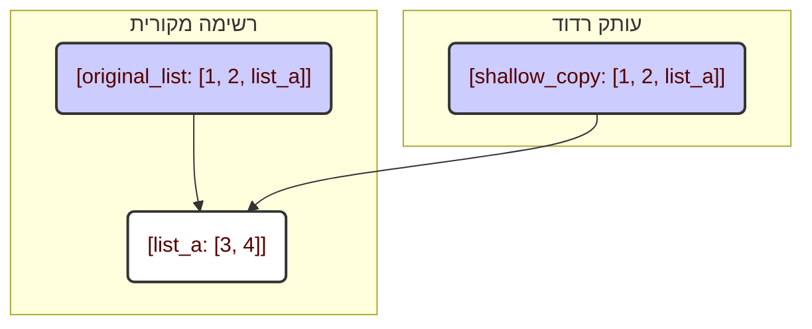
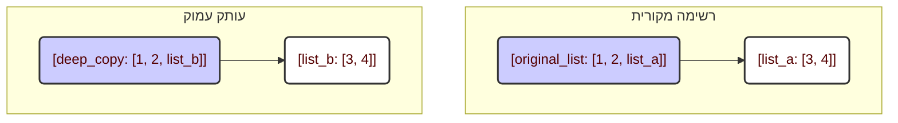

# מודול `copy`

## סקירה כללית

מודול `copy` מספק פונקציות ליצירת עותקים של אובייקטים, כולל עותקים רדודים ועמוקים. זה חשוב מכיוון שהקצאת משתנה למשתנה אחר לא יוצרת עותק חדש; במקום זאת, שניהם מצביעים לאותו אובייקט בזיכרון. כדי למנוע שינויים באובייקט אחד שישפיעו על השני, יש ליצור עותקים.

## תוכן עניינים

1. [סקירה כללית](#סקירה-כללית)
2. [סוגי העתקה](#סוגי-העתקה)
    - [`copy.copy()`](#copycopy)
    - [`copy.deepcopy()`](#copydeepcopy)
3. [מתי להשתמש באיזה סוג העתקה](#מתי-להשתמש-באיזה-סוג-העתקה)
4. [דיאגרמות](#דיאגרמות)
    - [העתקה רדודה](#העתקה-רדודה)
    - [העתקה עמוקה](#העתקה-עמוקה)

## סוגי העתקה

המודול `copy` מספק שתי פונקציות עיקריות:

1.  `copy.copy()`: יוצרת עותק רדוד.
2.  `copy.deepcopy()`: יוצרת עותק עמוק.

ההבדל ביניהם טמון באופן שבו הם מטפלים באובייקטים מקוננים (לדוגמה, רשימות בתוך רשימות).

### `copy.copy()`

**תיאור**: יוצרת עותק רדוד.

עותק רדוד יוצר אובייקט חדש, אך מעתיק רק *הפניות* לאובייקטים מקוננים. המשמעות היא שאם לאובייקט המקורי שלך יש, למשל, רשימה, העותק יכיל *הפניה* לאותה רשימה ולא עותק שלה.

```python
import copy

# רשימה מקורית
original_list = [1, 2, [3, 4]]

# עותק רדוד
shallow_copy = copy.copy(original_list)

print(f"רשימה מקורית: {original_list}")
print(f"עותק רדוד: {shallow_copy}")

# שינוי הרשימה המקוננת באובייקט המקורי
original_list[2][0] = 5

print(f"רשימה מקורית לאחר שינוי: {original_list}")
print(f"עותק רדוד לאחר שינוי: {shallow_copy}")
```

כפי שניתן לראות, בעת שינוי הרשימה המקוננת ב-`original_list`, השינוי הזה בא לידי ביטוי גם ב-`shallow_copy`. הסיבה לכך היא ששתי הרשימות מכילות *הפניה* לאותה רשימה מקוננת `[3, 4]`.

### `copy.deepcopy()`

**תיאור**: יוצרת עותק עמוק.

עותק עמוק, בניגוד לעותק רדוד, יוצר באופן רקורסיבי עותקים חדשים של כל האובייקטים המקוננים. המשמעות היא שאם יש לך רשימה בתוך רשימה, `deepcopy()` תיצור עותק עצמאי לחלוטין, כולל כל האלמנטים המקוננים.

```python
import copy

# רשימה מקורית
original_list = [1, 2, [3, 4]]

# עותק עמוק
deep_copy = copy.deepcopy(original_list)

print(f"רשימה מקורית: {original_list}")
print(f"עותק עמוק: {deep_copy}")

# שינוי הרשימה המקוננת באובייקט המקורי
original_list[2][0] = 5

print(f"רשימה מקורית לאחר שינוי: {original_list}")
print(f"עותק עמוק לאחר שינוי: {deep_copy}")
```

במקרה זה, שינוי הרשימה המקוננת ב-`original_list` לא השפיע על `deep_copy`. הסיבה לכך היא ש-`deep_copy` יצרה עותק עצמאי לחלוטין של הרשימה המקוננת.

## מתי להשתמש באיזה סוג העתקה

*   **`copy.copy()`** מתאים כאשר יש צורך להעתיק אובייקט אך אין חשיבות לכך שאובייקטים מקוננים משתנים יהיו משותפים. זה יכול להיות מהיר יותר מ-`deepcopy()`, מכיוון שאין צורך להעתיק באופן רקורסיבי כל אובייקט.
*   **`copy.deepcopy()`** הכרחי כאשר נדרשת עצמאות מוחלטת של העותק מהמקור, במיוחד אם האובייקט מכיל אובייקטים מקוננים משתנים כגון רשימות או מילונים.

## דיאגרמות

### העתקה רדודה



### העתקה עמוקה



בדיאגרמה הראשונה ניתן לראות שגם `original_list` וגם `shallow_copy` מפנים לאותה רשימה מקוננת `list_a`. בדיאגרמה השנייה ל-`deep_copy` יש עותק עצמאי משלה של הרשימה המקוננת, `list_b`.