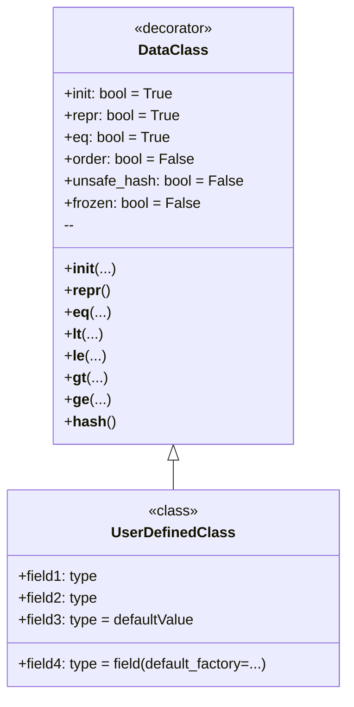

# `dataclass`

## סקירה כללית

`dataclass` הוא דקורטור שהוצג ב-Python 3.7, המייצר אוטומטית מתודות מיוחדות (כגון `__init__`, `__repr__`, `__eq__` ואחרות) עבור מחלקות המשמשות בעיקר כמכולות לנתונים. זה חוסך ממך את הצורך לכתוב קוד שבלוני רב.

## תוכן עניינים

- [מהו `dataclass`?](#מהו-dataclass)
- [למה להשתמש ב-`dataclass`?](#למה-להשתמש-ב-dataclass)
- [כיצד להשתמש ב-`dataclass`?](#כיצד-להשתמש-ב-dataclass)
- [דוגמה לשימוש פשוט](#דוגמה-לשימוש-פשוט)
- [אפשרויות `dataclass`](#אפשרויות-dataclass)
- [דוגמאות לשימוש בפרמטרים](#דוגמאות-לשימוש-בפרמטרים)
- [ערכי ברירת מחדל](#ערכי-ברירת-מחדל)
- [שימוש ב-`dataclass` עם סוגים משתנים](#שימוש-ב-dataclass-עם-סוגים-משתנים)
- [דיאגרמה](#דיאגרמה)

## מהו `dataclass`?

`dataclass` הוא דקורטור, שהוצג ב-Python 3.7, אשר מייצר אוטומטית מתודות מיוחדות (כגון `__init__`, `__repr__`, `__eq__`, ועוד) עבור מחלקות המשמשות בעיקר כמכולות לנתונים. הדבר חוסך ממך את הצורך לכתוב קוד שבלוני רב.

## למה להשתמש ב-`dataclass`?

1.  **קיצור קוד:** במקום להגדיר ידנית מתודות `__init__`, `__repr__`, `__eq__` וכו', אתה פשוט מכריז על שדות נתונים, ו-`dataclass` יעשה את כל השאר.
2.  **שיפור הקריאות:** המחלקות הופכות להיות לקוניות וברורות יותר, שכן הן מתמקדות בנתונים ולא ביישום הטכני.
3.  **הפחתת שגיאות:** קוד שנוצר אוטומטית הוא בדרך כלל אמין יותר מקוד שנכתב באופן ידני.
4.  **האצת הפיתוח:** אתה יכול ליצור מחלקות לעבודה עם נתונים במהירות רבה יותר, מבלי לבזבז זמן על עבודה שגרתית.

## כיצד להשתמש ב-`dataclass`?

כדי להתחיל, עליך לייבא את הדקורטור `dataclass` מהמודול `dataclasses`:

```python
from dataclasses import dataclass
```

לאחר מכן, אתה מציין את המחלקה עם הדקורטור `@dataclass`, ומגדיר את שדות הנתונים כמשתני מחלקה רגילים עם הערות טיפוס:

```python
from dataclasses import dataclass

@dataclass
class Point:
    x: int
    y: int
```

בדוגמה זו, `Point` היא `dataclass` שיש לה שני שדות: `x` ו-`y`, שניהם מסוג שלם. `dataclass` תיצור אוטומטית:

*   בנאי `__init__`, המאפשר יצירת מופעים של המחלקה, למשל `Point(1, 2)`.
*   `__repr__`, המחזיר ייצוג מחרוזתי של האובייקט, למשל `Point(x=1, y=2)`.
*   `__eq__`, המאפשר השוואה בין אובייקטים, למשל `Point(1, 2) == Point(1, 2)`.

## דוגמה לשימוש פשוט

```python
from dataclasses import dataclass

@dataclass
class Point:
    x: int
    y: int

# יצירת מופע של המחלקה
point1 = Point(1, 2)
point2 = Point(1, 2)
point3 = Point(3, 4)

# פלט על המסך
print(point1) # יוציא: Point(x=1, y=2)
print(point1 == point2) # יוציא: True
print(point1 == point3) # יוציא: False
```

## אפשרויות `dataclass`

`dataclass` מספק מספר פרמטרים להגדרת ההתנהגות:

*   `init`: אם `True` (ברירת מחדל), נוצרת מתודת `__init__`. אם `False`, מתודת `__init__` לא נוצרת.
*   `repr`: אם `True` (ברירת מחדל), נוצרת מתודת `__repr__`. אם `False`, מתודת `__repr__` לא נוצרת.
*   `eq`: אם `True` (ברירת מחדל), נוצרת מתודת `__eq__`. אם `False`, מתודת `__eq__` לא נוצרת.
*   `order`: אם `True`, נוצרות מתודות השוואה (`__lt__`, `__le__`, `__gt__`, `__ge__`). ברירת מחדל `False`.
*   `unsafe_hash`: אם `False` (ברירת מחדל), מתודת `__hash__` לא נוצרת. אם `True`, מתודת `__hash__` תיווצר, ו-`dataclass` יהפוך להיות ניתן לגיבוב.
*   `frozen`: אם `True`, מופעי המחלקה יהיו בלתי ניתנים לשינוי (קריאה בלבד). ברירת מחדל `False`.

## דוגמאות לשימוש בפרמטרים

1.  מבטלים את מתודת `__repr__` והופכים את המחלקה לבלתי ניתנת לשינוי.

```python
from dataclasses import dataclass

@dataclass(repr=False, frozen=True)
class Point:
    x: int
    y: int

# יצירת מופע של המחלקה
point1 = Point(1, 2)
# פלט על המסך
print(point1) # יוציא: <__main__.Point object at 0x000001D8322F6770> (מכיוון ש-__repr__ לא מוגדר)

# שינוי המופע יגרום לשגיאה
try:
    point1.x = 10
except Exception as ex:
    print (ex) # יוציא: cannot assign to field 'x'
```

2.  מגדירים סדר, מוסיפים מתודת hash, והופכים את המחלקה לבלתי ניתנת לשינוי

```python
from dataclasses import dataclass

@dataclass(order=True, unsafe_hash=True, frozen=True)
class Point:
    x: int
    y: int

# יצירת מופע של המחלקה
point1 = Point(1, 2)
point2 = Point(3, 4)
point3 = Point(1, 2)
# פלט על המסך
print(point1 < point2) # יוציא: True
print(point1 == point3) # יוציא: True

# כעת ניתן להשתמש במחלקה כמפתח למילון
my_dict = {point1: "first", point2: "second"}
print(my_dict) # יוציא: {Point(x=1, y=2): 'first', Point(x=3, y=4): 'second'}
```

## ערכי ברירת מחדל

ניתן להגדיר ערכי ברירת מחדל עבור השדות:

```python
from dataclasses import dataclass

@dataclass
class Point:
    x: int = 0
    y: int = 0

# יצירת מופע של המחלקה
point1 = Point()
point2 = Point(1, 2)

# פלט על המסך
print(point1) # יוציא: Point(x=0, y=0)
print(point2) # יוציא: Point(x=1, y=2)
```

בעת יצירת מופע של המחלקה, אם ערכים לא מועברים, ישמש ערך ברירת המחדל.

## שימוש ב-`dataclass` עם סוגים משתנים

יש להיזהר בעת שימוש בסוגי נתונים משתנים (רשימות, מילונים) כערכי ברירת מחדל. הם ייווצרו רק פעם אחת וישמשו את כל מופעי המחלקה:

```python
from dataclasses import dataclass
from typing import List

@dataclass
class BadExample:
    items: List[int] = []

bad1 = BadExample()
bad2 = BadExample()

bad1.items.append(1)
print (bad1.items) # יוציא: [1]
print (bad2.items) # יוציא: [1]
```

בדוגמה לעיל, שינויים ב-`bad1.items` מוצגים גם ב-`bad2.items`. זה קורה בגלל ששני מופעי המחלקה משתמשים באותה רשימה ברירת מחדל.

כדי להימנע מכך, השתמש ב-`dataclasses.field` וב-`default_factory`:

```python
from dataclasses import dataclass, field
from typing import List

@dataclass
class GoodExample:
    items: List[int] = field(default_factory=list)

good1 = GoodExample()
good2 = GoodExample()

good1.items.append(1)
print (good1.items) # יוציא: [1]
print (good2.items) # יוציא: []
```

במקרה זה, `default_factory=list` תיצור רשימה ריקה חדשה עבור כל מופע חדש של המחלקה.

## דיאגרמה

הנה דיאגרמה המציגה את העקרונות הבסיסיים של `dataclass`:



בדיאגרמה זו:

*   `DataClass` מייצג את הדקורטור `@dataclass` ואת הפרמטרים שלו.
*   `UserDefinedClass` היא המחלקה שאתה מכריז עליה באמצעות הדקורטור `@dataclass`.
*   החץ מ-`DataClass` אל `UserDefinedClass` מראה ש-`DataClass` מיושם על `UserDefinedClass`.