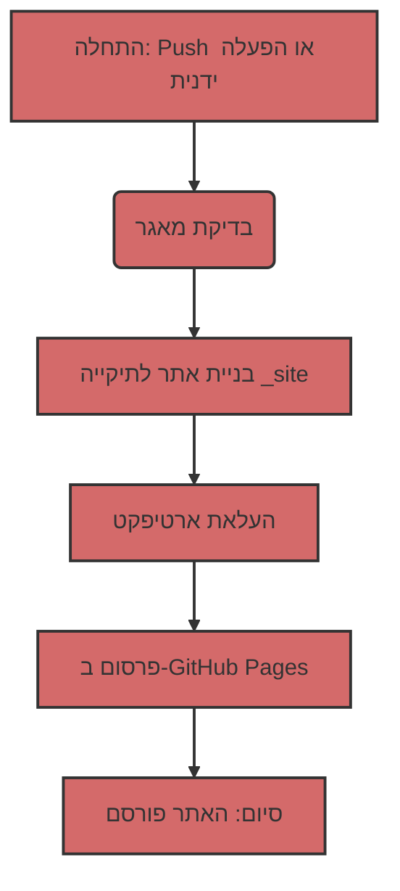

# אוטומציה של פריסת אתר Jekyll ב-GitHub Pages

לצורך אוטומציה של תהליך הפריסה, נשתמש ב-GitHub Actions, המאפשרות לבצע משימות שונות, כולל בנייה ופרסום אתרים, ישירות במאגר שלך.

## תוכן עניינים

- [1: סקירה של קובץ זרימת העבודה](#1-סקירה-של-קובץ-זרימת-העבודה)
- [2: פירוק מבנה זרימת העבודה](#2-פירוק-מבנה-זרימת-העבודה)
    - [2.1: מידע כללי](#21-מידע-כללי)
    - [2.2: סעיף `jobs`](#22-סעיף-jobs)
        - [2.2.1: `build`: בניית האתר](#221-build-בניית-האתר)
        - [2.2.2: `deploy`: פרסום האתר](#222-deploy-פרסום-האתר)
- [3: מה עושים קבצי Markdown?](#3-מה-עושים-קבצי-markdown)
- [4: תרשים זרימה](#4-תרשים-זרימה)
- [5: איך זה עובד](#5-איך-זה-עובד)

## 1: סקירה של קובץ זרימת העבודה

נתחיל בהתבוננות בקובץ זרימת העבודה הראשי, המנהל את תהליך הבנייה והפריסה. קובץ זה כתוב בשפת YAML ונמצא בדרך כלל בספרייה `.github/workflows`. הנה תוכנו:

```yaml
# Sample workflow for building and deploying a Jekyll site to GitHub Pages
name: Deploy Jekyll with GitHub Pages dependencies preinstalled

on:
  # Runs on pushes targeting the default branch
  push:
    branches: ["master"]

  # Allows you to run this workflow manually from the Actions tab
  workflow_dispatch:

# Sets permissions of the GITHUB_TOKEN to allow deployment to GitHub Pages
permissions:
  contents: read
  pages: write
  id-token: write

# Allow only one concurrent deployment, skipping runs queued between the run in-progress and latest queued.
# However, do NOT cancel in-progress runs as we want to allow these production deployments to complete.
concurrency:
  group: "pages"
  cancel-in-progress: false

jobs:
  # Build job
  build:
    runs-on: ubuntu-latest
    steps:
      - name: Checkout
        uses: actions/checkout@v4
      - name: Setup Pages
        uses: actions/configure-pages@v5
      - name: Build with Jekyll
        uses: actions/jekyll-build-pages@v1
        with:
          source: ./docs/gemini/consultant/ru/src
          destination: ./_site
      - name: Upload artifact
        uses: actions/upload-pages-artifact@v3

  # Deployment job
  deploy:
    environment:
      name: github-pages
      url: ${{ steps.deployment.outputs.page_url }}
    runs-on: ubuntu-latest
    needs: build
    steps:
      - name: Deploy to GitHub Pages
        id: deployment
        uses: actions/deploy-pages@v4
```

## 2: פירוק מבנה זרימת העבודה

כעת נפרק כל חלק בקובץ זה:

### 2.1: מידע כללי

-   `name: Deploy Jekyll with GitHub Pages dependencies preinstalled`: שם זרימת העבודה שיוצג ברשימת הפעולות במאגר.
-   `on`: מתאר מתי זרימת העבודה אמורה להתחיל:
    -   `push`: זרימת העבודה מתחילה בכל פעם שמתבצע push לענף `master`.
    -   `workflow_dispatch`: מאפשר לך להפעיל את זרימת העבודה ידנית דרך ממשק GitHub.
-   `permissions`: מגדיר הרשאות לזרימת העבודה:
    -   `contents: read`: הרשאה לקרוא את הקוד מהמאגר.
    -   `pages: write`: הרשאה לפרסם ב-GitHub Pages.
    -   `id-token: write`: הרשאה לקבל אסימון אימות (נדרש עבור GitHub Actions).
-   `concurrency`: מגדיר הפעלה מקבילית של זרימת העבודה:
    -   `group: "pages"`: מבטיח שרק זרימת עבודה אחת עבור GitHub Pages תופעל בכל פעם.
    -   `cancel-in-progress: false`: מונע ביטול של ביצוע זרימת עבודה נוכחית כאשר מתבצעת הפעלה חדשה.

### 2.2: סעיף `jobs`

סעיף זה מתאר אילו משימות יש לבצע. יש לנו שני jobs: `build` ו-`deploy`.

#### 2.2.1: `build`: בניית האתר

-   `runs-on: ubuntu-latest`: מציין שה-job פועל על שרת עם Ubuntu.
-   `steps`: רשימה של צעדים שמתבצעים במהלך הבנייה:
    -   `name: Checkout`: מושך את קוד המקור מהמאגר.
    -   `uses: actions/checkout@v4`: משתמש בפעולה מובנית כדי למשוך את הקוד.
    -   `name: Setup Pages`: מגדיר את הסביבה לעבודה עם GitHub Pages.
    -   `uses: actions/configure-pages@v5`: משתמש בפעולה מובנית להגדרה.
    -   `name: Build with Jekyll`: מפעיל את בניית אתר Jekyll.
    -   `uses: actions/jekyll-build-pages@v1`: משתמש בפעולה מובנית לבנייה.
    -   `with`: מגדיר את פרמטרי הפעולה:
        -   `source: ./docs/gemini/consultant/ru/src`: מציין היכן ממוקמים קבצי המקור של האתר שלך. **שימו לב**: הנתיב לקבצים שלך הוא `docs/gemini/consultant/ru/src`.
        -   `destination: ./_site`: מציין היכן לשמור את הקבצים שנבנו.
    -   `name: Upload artifact`: מעלה את הקבצים שנבנו כדי להעביר אותם ל-job הבא.
    -   `uses: actions/upload-pages-artifact@v3`: משתמש בפעולה מובנית להעלאת ארטיפקטים.

#### 2.2.2: `deploy`: פרסום האתר

-   `environment`: מגדיר את הסביבה לפרסום.
    -   `name: github-pages`: שם הסביבה.
    -   `url: ${{ steps.deployment.outputs.page_url }}`: מקבל את ה-URL של האתר שפורסם.
-   `runs-on: ubuntu-latest`: מציין שה-job פועל על שרת עם Ubuntu.
-   `needs: build`: מציין שה-job `deploy` צריך לפעול לאחר שה-job `build` הסתיים בהצלחה.
-   `steps`: רשימה של צעדים שמתבצעים במהלך הפרסום:
    -   `name: Deploy to GitHub Pages`: מבצע את פרסום האתר ב-GitHub Pages.
    -   `id: deployment`: מגדיר מזהה עבור השלב.
    -   `uses: actions/deploy-pages@v4`: משתמש בפעולה מובנית לפריסה.

## 3: מה עושים קבצי Markdown?

קבצים עם סיומת `.md` (Markdown) הם הבסיס לאתר Jekyll. Markdown היא שפת סימון פשוטה שמאפשרת לך לעצב טקסט.
Jekyll מעבד אוטומטית קבצי `.md`, והופך אותם לדפי HTML. הקבצים שלך צריכים להיות בתיקייה `docs/gemini/consultant/ru/src` שצוינה בזרימת העבודה.

## 4: תרשים זרימה



## 5: איך זה עובד

1.  **שינוי קוד:** אתה מבצע שינויים בקבצי `.md` או `.html` שלך, הנמצאים בתיקייה `docs/gemini/consultant/ru/src`.
2.  **Push:** אתה שולח (push) את השינויים לענף `master` במאגר שלך ב-GitHub.
3.  **הפעלת זרימת עבודה:** GitHub Actions מפעילה אוטומטית את זרימת העבודה המתוארת בקובץ YAML.
4.  **בנייה:** זרימת העבודה תחילה מורידה את הקוד מהמאגר, ולאחר מכן בונה את אתר Jekyll מהקבצים שלך לתיקייה `_site`.
5.  **פרסום:** האתר שנבנה מתפרסם ב-GitHub Pages.
6.  **האתר מוכן:** לאחר מכן האתר שלך זמין ב-URL שצוין בהגדרות GitHub Pages.