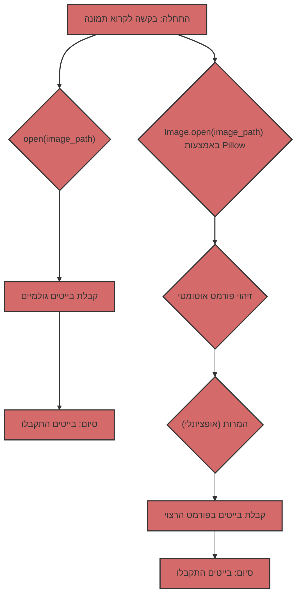

# השוואה בין קריאת תמונות כבייטים גולמיים לעומת שימוש ב-Pillow

## תוכן עניינים

- [סקירה כללית](#סקירה-כללית)
- [קריאת בייטים גולמיים באמצעות `open()`](#קריאת-בייטים-גולמיים-באמצעות-open)
  - [מה זה?](#מה-זה)
  - [איך זה נראה בקוד?](#איך-זה-נראה-בקוד)
  - [מתי זה שימושי?](#מתי-זה-שימושי)
  - [מגבלות](#מגבלות)
- [שימוש ב-Pillow לקריאת תמונות](#שימוש-ב-pillow-לקריאת-תמונות)
  - [מה זה?](#מה-זה-1)
  - [איך זה נראה בקוד?](#איך-זה-נראה-בקוד-1)
  - [מתי זה שימושי?](#מתי-זה-שימושי-1)
  - [יתרונות](#יתרונות)
- [השוואה בטבלה](#השוואה-בטבלה)
- [בהקשר של Gemini](#בהקשר-של-gemini)
- [דיאגרמת השוואה](#דיאגרמת-השוואה)

## סקירה כללית

כשמדובר בעבודה עם תמונות ב-Python, יש לך שתי גישות עיקריות:

1. **קריאת בייטים גולמיים:** שימוש ב-`open()` כדי לקרוא את תוכן קובץ התמונה כרצף של בייטים.
2. **שימוש ב-Pillow:** שימוש בספריית Pillow לפתיחה ועיבוד תמונות.

בואו נבחן כל גישה בפירוט ונברר מה ההבדלים ביניהן ומתי כדאי להשתמש בכל אחת מהן.

## קריאת בייטים גולמיים באמצעות `open()`

### מה זה?

כשאתה פותח קובץ תמונה במצב בינארי (`"rb"`) באמצעות `open()`, אתה מקבל גישה לתוכן הקובץ כרצף של בייטים. המשמעות היא שאתה מקבל נתונים "גולמיים", ללא כל פרשנות או עיבוד.

### איך זה נראה בקוד?

```python
from pathlib import Path

def read_image_bytes_direct(image_path: Path) -> bytes | None:
    """
    קורא תמונה כבייטים ישירות באמצעות open().

    Args:
        image_path: נתיב לקובץ התמונה.

    Returns:
        bytes: בייטים של התמונה.
        None: אם התרחשה שגיאה.
    """
    try:
        with open(image_path, "rb") as image_file:
            image_data = image_file.read()
            return image_data
    except Exception as ex:
        print(f"שגיאת קריאת קובץ: {ex}")
        return None


if __name__ == '__main__':
    image_path = Path("test.jpg")  # החלף בנתיב לתמונה שלך

    if not image_path.is_file():
        print(f"הקובץ {image_path} אינו קיים")
    else:
       image_bytes_direct = read_image_bytes_direct(image_path)

       if image_bytes_direct:
           print(f"התמונה נקראה ישירות, גודל: {len(image_bytes_direct)} בייטים")
           # ניתן להשתמש ב-image_bytes_direct, למשל, לשליחה ברשת
       else:
           print("לא ניתן היה לקרוא את התמונה.")
```

### מתי זה שימושי?

* **העברת נתונים ברשת:** כשאתה צריך רק להעביר נתוני תמונה ברשת, בלי לדאוג לגבי הפורמט.
* **שמירה לדיסק:** כשאתה צריך לשמור את תוכן הקובץ לדיסק ללא שינויים.
* **גישה ברמה נמוכה:** כשאתה צריך גישה ברמה נמוכה לנתוני הקובץ, ואתה עצמך יודע איך לפרש אותם.

### מגבלות

*   **אין עיבוד פורמט:** אתה מקבל רק בייטים, ללא כל מידע על פורמט התמונה (JPEG, PNG, GIF וכו').
*   **אין אימות:** אין בדיקה האם הקובץ הוא באמת תמונה.
*   **אין מטא-נתונים:** אתה לא מקבל גישה למטא-נתונים של התמונה (גודל, מרחב צבע וכו').
*   **אין המרות נוחות:** לא ניתן לשנות גודל, פורמט או להחיל המרות אחרות ללא עיבוד נוסף.

## שימוש ב-Pillow לקריאת תמונות

### מה זה?

Pillow היא ספרייה חזקה לעבודה עם תמונות. היא מאפשרת לפתוח תמונות בפורמטים שונים, לקבל מטא-נתונים, לשנות גודל, להמיר פורמטים ועוד הרבה.

### איך זה נראה בקוד?

```python
from pathlib import Path
from PIL import Image
from io import BytesIO

def read_image_pillow(image_path: Path) -> bytes | None:
    """
    קורא תמונה באמצעות Pillow ומחזיר אותה כבייטים בפורמט JPEG.

    Args:
        image_path: נתיב לקובץ התמונה.

    Returns:
         bytes: בייטים של התמונה בפורמט JPEG.
         None: אם התרחשה שגיאה.
    """
    try:
        img = Image.open(image_path)
        img_byte_arr = BytesIO()
        img.save(img_byte_arr, format="JPEG")
        return img_byte_arr.getvalue()
    except Exception as ex:
        print(f"שגיאת קריאת תמונה באמצעות Pillow: {ex}")
        return None

if __name__ == '__main__':
    image_path = Path("test.jpg") # החלף בנתיב לתמונה שלך

    if not image_path.is_file():
        print(f"הקובץ {image_path} אינו קיים")
    else:
        image_bytes_pillow = read_image_pillow(image_path)
        if image_bytes_pillow:
           print(f"התמונה נקראה באמצעות Pillow, גודל: {len(image_bytes_pillow)} בייטים")
           # ניתן להשתמש ב-image_bytes_pillow, למשל, לשליחה למודל Gemini.
        else:
           print("לא ניתן היה לקרוא את התמונה באמצעות Pillow.")
```

### מתי זה שימושי?

*   **עבודה עם תמונות:** כשאתה צריך לעבוד עם תמונות, ולא רק עם בייטים.
*   **זיהוי פורמט אוטומטי:** Pillow מזהה אוטומטית את פורמט התמונה.
*   **המרת פורמטים:** ניתן להמיר בקלות תמונות בין פורמטים שונים (JPEG, PNG, GIF וכו').
*   **שינוי גודל:** ניתן לשנות את גודל התמונה לפני העיבוד.
*   **מטא-נתונים:** ניתן לקבל גישה למטא-נתונים של התמונה (גודל, פרופיל צבע וכו').
*   **טיפול בשגיאות:** Pillow מטפלת בשגיאות בעת פתיחת קבצים פגומים.

### יתרונות

*   **גמישות:** Pillow מספקת מגוון רחב של אפשרויות לעבודה עם תמונות.
*   **אמינות:** Pillow בודקת האם הקובץ הוא תמונה תקינה.
*   **נוחות:** Pillow מפשטת את תהליך עיבוד התמונות.

## השוואה בטבלה

| מאפיין               | `open(image_path, "rb")`                                    | Pillow                                                      |
| :--------------------- | :---------------------------------------------------------- | :---------------------------------------------------------- |
| **מה עושה**           | קורא את הקובץ כרצף של בייטים                              | פותח ומעבד את התמונה                                      |
| **פורמט**             | לא מזהה פורמט                                             | מזהה אוטומטית את הפורמט                                    |
| **מטא-נתונים**        | אין גישה למטא-נתונים                                       | מספק גישה למטא-נתונים                                     |
| **עיבוד**             | אין אפשרויות עיבוד                                         | שינוי גודל, המרת פורמטים וכו'                                |
| **אימות**            | אין אימות                                                  | בודק האם הקובץ הוא תמונה תקינה                             |
| **מתי להשתמש**        | העברת בייטים פשוטה, גישה ברמה נמוכה                     | עבודה עם תמונות, המרות, טיפול בשגיאות                     |
| **דוגמה**              | העברת בייטים ברשת, שמירה לדיסק                            | הכנת תמונות עבור Gemini, פיתוח אתרים                      |

## בהקשר של Gemini

מודלי Gemini מצפים לנתוני תמונה בפורמט מסוים (בדרך כלל JPEG או PNG). שימוש ב-Pillow מבטיח שאתה מספק תמונות בפורמט הנכון, ולא סתם בייטים "גולמיים". יתר על כן, Pillow מאפשרת לשנות את גודל התמונה במידת הצורך.

## דיאגרמת השוואה



אם אתה צריך רק לקרוא קובץ כבייטים, ללא כל עיבוד, `open(image_path, "rb")` יתאים. עם זאת, לעיבוד תמונות, במיוחד עבור אינטראקציה עם API שמצפים לתמונות בפורמט מסוים, השימוש ב-Pillow הוא פתרון אמין וגמיש יותר.