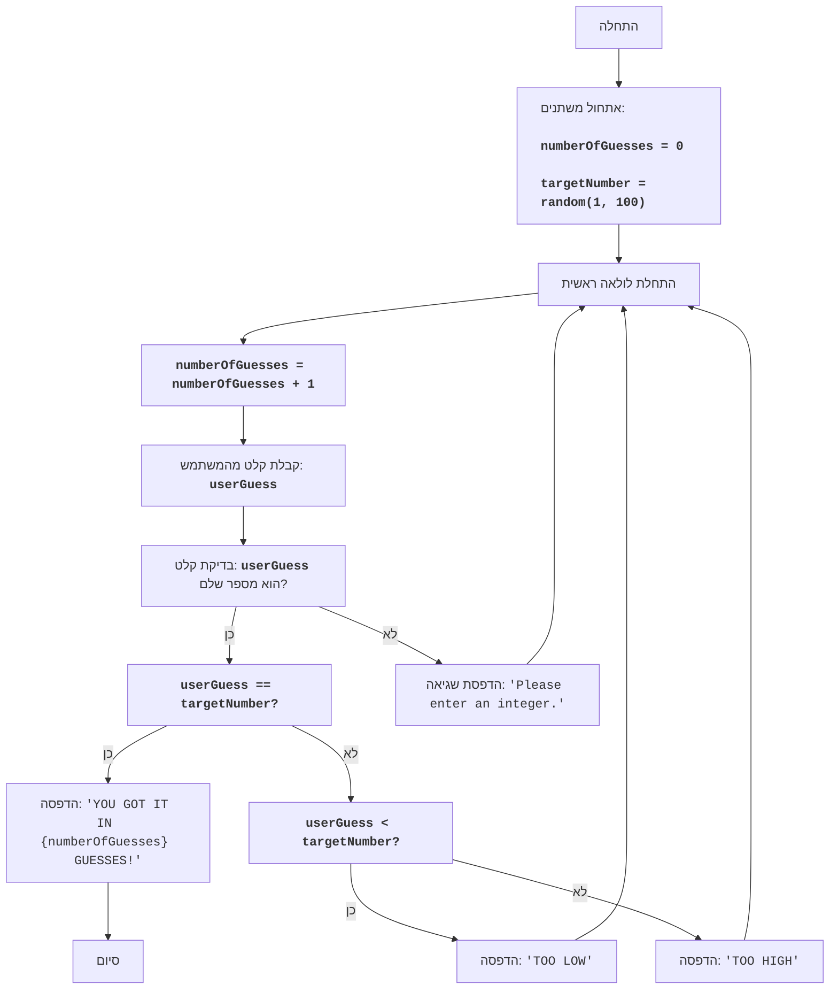

## <algorithm>

1. **התחלה:**
   - אתחל את `numberOfGuesses` (מספר הניחושים) ל-0.
   - הגרל מספר אקראי `targetNumber` בין 1 ל-100.
   *דוגמה:* `numberOfGuesses = 0`, `targetNumber = 42`.

2. **לולאה ראשית:**
   - התחל לולאה אינסופית (שתסתיים רק כאשר השחקן ינחש נכון).
   - הגדל את `numberOfGuesses` ב-1.
   *דוגמה:* `numberOfGuesses = 1`.

3. **קלט מהמשתמש:**
   - בקש מהמשתמש לנחש מספר בין 1 ל-100.
   - המר את הקלט לערך שלם (integer) וקרא לו `userGuess`.
   - אם הקלט לא ניתן להמרה לערך שלם, הדפס הודעת שגיאה ודלג לאיטרציה הבאה של הלולאה.
   *דוגמה:* המשתמש מזין `50`, ולכן `userGuess = 50`.
   *דוגמה לשגיאה:* המשתמש מזין `"abc"`, הדפס `"Please enter an integer."` ועבור לאיטרציה הבאה.

4. **בדיקת ניחוש:**
   - אם `userGuess` שווה ל-`targetNumber`:
       - הדפס הודעת ניצחון עם מספר הניחושים.
       - צא מהלולאה (סיום המשחק).
   *דוגמה:* אם `userGuess = 42` וגם `targetNumber = 42`, הדפס `"YOU GOT IT IN 1 GUESSES!"` וסיים את המשחק.
   - אם `userGuess` קטן מ-`targetNumber`:
       - הדפס `"TOO LOW"`.
   *דוגמה:* אם `userGuess = 20` וגם `targetNumber = 42`, הדפס `"TOO LOW"`.
   - אחרת (אם `userGuess` גדול מ-`targetNumber`):
       - הדפס `"TOO HIGH"`.
   *דוגמה:* אם `userGuess = 70` וגם `targetNumber = 42`, הדפס `"TOO HIGH"`.

5. **סיום:**
   - המשחק מסתיים לאחר שהשחקן ניחש נכון את המספר, הלולאה מסתיימת.

## <mermaid>

**הסבר על התלויות:**
- `random`: המודול `random` הוא חלק מספריית הפייתון הסטנדרטית ומשמש ליצירת מספרים אקראיים, במקרה הזה, ליצירת המספר אותו השחקן צריך לנחש. לא נדרשת התקנה חיצונית כדי להשתמש בו.

## <explanation>

**ייבואים (Imports):**
-   `import random`: מייבא את המודול `random` שמאפשר יצירת מספרים אקראיים. המודול הזה הוא חלק מהספרייה הסטנדרטית של פייתון ואינו תלוי בחבילות אחרות של `src.`.

**משתנים (Variables):**
-   `numberOfGuesses`: משתנה מסוג `int`, שנועד לספור את מספר הניחושים שביצע השחקן. הוא מאותחל ל-0 בתחילת המשחק ומוגדל ב-1 בכל ניסיון ניחוש.
-   `targetNumber`: משתנה מסוג `int`, שמייצג את המספר האקראי שהמחשב בחר. הוא נוצר פעם אחת בתחילת המשחק בעזרת `random.randint(1, 100)`.
-  `userGuess`: משתנה מסוג `int`, המשמש לקליטת הניחוש של המשתמש. הערך שלו נקבע על ידי פונקציית הקלט `input()` ולאחר מכן מומר למספר שלם באמצעות `int()`.

**פונקציות (Functions):**
-   `random.randint(a, b)`: פונקציה מהמודול `random` שמחזירה מספר שלם אקראי בין `a` ל-`b`, כולל שניהם. במקרה הזה, היא משמשת לבחירת המספר האקראי אותו צריך לנחש, בטווח שבין 1 ל-100.
    *דוגמה:* `random.randint(1, 100)` יכולה להחזיר 25, 88, או כל מספר שלם אחר בין 1 ל-100.
-   `input(prompt)`: פונקציה מובנית בפייתון שמציגה את ההודעה `prompt` למשתמש ומחזירה את הקלט שלו כטקסט.
    *דוגמה:* `input("Guess a number between 1 and 100: ")` תציג למשתמש את ההודעה ותחזיר את הקלט שלו כטקסט.
-   `int(x)`: פונקציה מובנית בפייתון שמנסה להמיר את הקלט `x` למספר שלם. אם ההמרה נכשלת (למשל, אם הקלט הוא טקסט שאינו ניתן להמרה למספר שלם), מתקבלת שגיאת `ValueError`.
    *דוגמה:* `int("42")` מחזירה את הערך השלם 42. `int("abc")` תגרום ל-`ValueError`.

**לולאות (Loops):**
-   `while True:`: יוצרת לולאה אינסופית, שתמשיך להתבצע עד שהפקודה `break` תגרום לה לצאת ממנה. הלולאה הזו מהווה את הליבה של המשחק ומאפשרת לשחקן לנחש שוב ושוב עד שינחש נכון.

**טיפול בשגיאות (Error Handling):**
-   `try...except ValueError:`: מבנה המשמש לטיפול בשגיאות שעלולות להתרחש במהלך ההמרה של הקלט מהמשתמש למספר שלם (`int()`). אם המשתמש מזין משהו שאינו מספר שלם, הקוד שבבלוק `except` יופעל וידפיס הודעת שגיאה. פעולה זו מונעת קריסה של התוכנית ומאפשרת למשתמש לנסות שוב.

**הערות על הקוד:**
-   הקוד משתמש בפונקציית `f-string` (מחרוזות מעוצבות) כדי להציג את מספר הניחושים בהודעת הניצחון בצורה קריאה יותר.
-   אפשר לשפר את הקוד על ידי הוספת הגבלת ניחושים או דרגות קושי שונות. בנוסף, אפשר ליצור לולאה נוספת כדי לאפשר לשחקן לשחק שוב מבלי להפעיל את התוכנית מחדש.

**שרשרת קשרים:**
-   הקוד הזה עומד בפני עצמו ואינו תלוי בקבצים אחרים בפרויקט, מלבד המודול `random` שהוא חלק מהספרייה הסטנדרטית של פייתון. הוא מייצג את המשחק עצמו ואינו מתקשר עם חלקים אחרים במערכת.