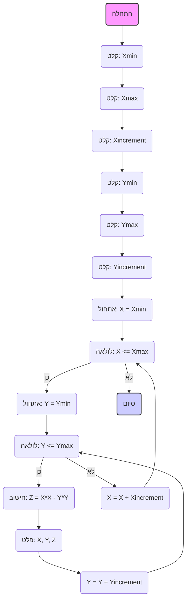

## <algorithm>

1. **התחלה:**
   - התחלת ביצוע התוכנית.

2. **קבלת קלט משתמש עבור X:**
   - בקשה מהמשתמש להזין את הערך המינימלי של X (`Xmin`). לדוגמה: `Xmin = 1.0`.
   - בקשה מהמשתמש להזין את הערך המקסימלי של X (`Xmax`). לדוגמה: `Xmax = 5.0`.
   - בקשה מהמשתמש להזין את גודל הצעד עבור X (`Xincrement`). לדוגמה: `Xincrement = 1.0`.

3. **קבלת קלט משתמש עבור Y:**
   - בקשה מהמשתמש להזין את הערך המינימלי של Y (`Ymin`). לדוגמה: `Ymin = 2.0`.
   - בקשה מהמשתמש להזין את הערך המקסימלי של Y (`Ymax`). לדוגמה: `Ymax = 6.0`.
   - בקשה מהמשתמש להזין את גודל הצעד עבור Y (`Yincrement`). לדוגמה: `Yincrement = 1.0`.

4. **לולאה חיצונית (עבור X):**
   - אתחול `X` לערך `Xmin`. לדוגמה: `X = 1.0`.
   - כל עוד `X` קטן או שווה ל-`Xmax` (תנאי לולאה):
     - **לולאה פנימית (עבור Y):**
       - אתחול `Y` לערך `Ymin`. לדוגמה: `Y = 2.0`.
       - כל עוד `Y` קטן או שווה ל-`Ymax` (תנאי לולאה):
         - **חישוב Z:** חישוב הערך של `Z` לפי הנוסחה `Z = X*X - Y*Y`. לדוגמה: עבור `X = 1`, `Y = 2` נקבל `Z = 1*1 - 2*2 = -3`.
         - **פלט:** הדפסת ערכי `X`, `Y` ו-`Z`. לדוגמה: `X: 1.0, Y: 2.0, Z: -3.0`.
         - הגדלת `Y` ב-`Yincrement`. לדוגמה: `Y = Y + 1 = 3.0`.
       - סיום הלולאה הפנימית כאשר `Y` גדול מ-`Ymax`.
     - הגדלת `X` ב-`Xincrement`. לדוגמה: `X = X + 1 = 2.0`.
   - סיום הלולאה החיצונית כאשר `X` גדול מ-`Xmax`.

5. **סיום:** סיום ביצוע התוכנית.

## <mermaid>

## <explanation>

**ייבואים (Imports):**

- אין ייבוא מודולים בקוד הזה. הקוד עובד באופן עצמאי ללא תלות בספריות חיצוניות או מודולים אחרים.

**מחלקות (Classes):**

- אין הגדרת מחלקות בקוד הזה.

**פונקציות (Functions):**

- אין פונקציות מוגדרות בקוד הזה. כל ההיגיון מרוכז בקטע קוד אחד.

**משתנים (Variables):**

- `Xmin`: משתנה מסוג `float` המכיל את הערך המינימלי עבור ציר X, נקלט מהמשתמש.
- `Xmax`: משתנה מסוג `float` המכיל את הערך המקסימלי עבור ציר X, נקלט מהמשתמש.
- `Xincrement`: משתנה מסוג `float` המכיל את גודל הצעד עבור ציר X, נקלט מהמשתמש.
- `Ymin`: משתנה מסוג `float` המכיל את הערך המינימלי עבור ציר Y, נקלט מהמשתמש.
- `Ymax`: משתנה מסוג `float` המכיל את הערך המקסימלי עבור ציר Y, נקלט מהמשתמש.
- `Yincrement`: משתנה מסוג `float` המכיל את גודל הצעד עבור ציר Y, נקלט מהמשתמש.
- `X`: משתנה מסוג `float` המשמש כאינדקס ללולאה החיצונית, מייצג את ערך X הנוכחי.
- `Y`: משתנה מסוג `float` המשמש כאינדקס ללולאה הפנימית, מייצג את ערך Y הנוכחי.
- `Z`: משתנה מסוג `float` המכיל את הערך המחושב לפי הנוסחה `Z = X*X - Y*Y`.

**הסברים מפורטים:**

- **מנגנון קליטת קלט:** הקוד מתחיל בקליטת ערכים מספריים מהמשתמש עבור הגבולות וגודל הצעד של ציר X וציר Y. הוא משתמש בבלוק `try-except` כדי לטפל בשגיאות קלט לא תקין (כגון קלט שאינו מספרי). במקרה של שגיאה, התוכנית מדפיסה הודעת שגיאה ויוצאת.
- **לולאות:** הקוד משתמש בלולאה חיצונית `while` עבור ציר X, ובתוך הלולאה הזו יש לולאה פנימית `while` עבור ציר Y.
- **חישוב Z:** בתוך הלולאה הפנימית, הערך של `Z` מחושב בהתבסס על ערכי `X` ו-`Y` הנוכחיים.
- **פלט:** הקוד מדפיס את ערכי `X`, `Y` ו-`Z` עבור כל זוג של ערכים בתוך הלולאות.
- **הגדלת ערכים:** לאחר כל איטרציה של הלולאה הפנימית, הערך של `Y` גדל ב-`Yincrement`, ובסיום כל איטרציה של הלולאה החיצונית, הערך של `X` גדל ב-`Xincrement`.
- **סיום התוכנית:** התוכנית מסתיימת כאשר הלולאה החיצונית מסיימת את כל האיטרציות, כלומר, כאשר ערך `X` גדול מ-`Xmax`.

**בעיות אפשריות ושיפורים:**
- **העדר אימות קלט:** הקוד בודק רק אם הקלט הוא מספרי, אך לא בודק אם הערכים שהוזנו הגיוניים. לדוגמה, `Xmin` יכול להיות גדול מ-`Xmax`, מה שיוביל ללולאה שלא תתבצע. יש להוסיף בדיקות נוספות כדי לוודא שהקלט תקין (למשל, `Xincrement` חייב להיות גדול מ-0, `Xmax` חייב להיות גדול מ-`Xmin` וכו׳).
- **העדר תכנון תלת מימדי:** הקוד מחשב את הערכים אבל לא מציג אותם בגרף תלת מימדי. הוא רק מדפיס את הערכים לקונסולה. יש להוסיף קוד כדי להציג גרף תלת מימדי באמצעות ספריות גרפיקה כמו matplotlib.
- **העדר מודולריות:** הקוד לא מודולרי וכולו כתוב כסקריפט אחד. ניתן לפרק את הקוד למספר פונקציות או מחלקות כדי להפוך אותו לקריא ומאורגן יותר.

**שרשרת קשרים עם חלקים אחרים בפרויקט:**
- הקוד הזה הוא משחק בסיסי בפני עצמו ואינו תלוי בחלקים אחרים בפרויקט. הוא משמש כדוגמה פשוטה ליישום אלגוריתם חישובי בסיסי.