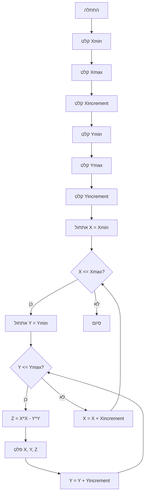

## <algorithm>
1. **התחלה:**
   - התחלת ביצוע התוכנית.

2. **קלט ערכי X:**
   -  הצגת הודעה למשתמש: "הכנס את הערך המינימלי של X: ".
   - קליטת ערך מינימלי של X מהמשתמש, והמרתו למספר עשרוני (float) ושמירתו במשתנה `Xmin`. לדוגמה: `Xmin = 1.0`.
   - הצגת הודעה למשתמש: "הכנס את הערך המקסימלי של X: ".
   - קליטת ערך מקסימלי של X מהמשתמש, והמרתו למספר עשרוני (float) ושמירתו במשתנה `Xmax`. לדוגמה: `Xmax = 5.0`.
   - הצגת הודעה למשתמש: "הכנס את הקפיצה (increment) של X: ".
   - קליטת קפיצת הערך של X מהמשתמש, והמרתו למספר עשרוני (float) ושמירתו במשתנה `Xincrement`. לדוגמה: `Xincrement = 1.0`.

3. **קלט ערכי Y:**
   - הצגת הודעה למשתמש: "הכנס את הערך המינימלי של Y: ".
   - קליטת ערך מינימלי של Y מהמשתמש, והמרתו למספר עשרוני (float) ושמירתו במשתנה `Ymin`. לדוגמה: `Ymin = 2.0`.
   - הצגת הודעה למשתמש: "הכנס את הערך המקסימלי של Y: ".
   - קליטת ערך מקסימלי של Y מהמשתמש, והמרתו למספר עשרוני (float) ושמירתו במשתנה `Ymax`. לדוגמה: `Ymax = 6.0`.
   - הצגת הודעה למשתמש: "הכנס את הקפיצה (increment) של Y: ".
   - קליטת קפיצת הערך של Y מהמשתמש, והמרתו למספר עשרוני (float) ושמירתו במשתנה `Yincrement`. לדוגמה: `Yincrement = 1.0`.

4. **לולאה חיצונית על X:**
   - אתחול משתנה `X` עם הערך `Xmin` (דוגמה: `X = 1.0`).
   - התחלת לולאת `while` שתמשיך לפעול כל עוד `X` קטן או שווה ל-`Xmax`.

   5. **לולאה פנימית על Y:**
      - אתחול משתנה `Y` עם הערך `Ymin` (דוגמה: `Y = 2.0`).
      - התחלת לולאת `while` שתמשיך לפעול כל עוד `Y` קטן או שווה ל-`Ymax`.

      6. **חישוב Z:**
         - חישוב הערך של Z לפי הנוסחה `Z = X*X - Y*Y`.
         - לדוגמה: אם `X = 1.0` ו-`Y = 2.0`, אז `Z = 1.0*1.0 - 2.0*2.0 = -3.0`.

      7. **פלט ערכי X, Y, Z:**
         - הצגת הערכים של X, Y ו-Z למשתמש, לדוגמה: "X: 1.0, Y: 2.0, Z: -3.0".

      8. **עדכון Y:**
         - עדכון הערך של Y על ידי הוספת `Yincrement` לערך הנוכחי של Y. לדוגמה: `Y = 2.0 + 1.0 = 3.0`.

      9. **חזרה ללולאה הפנימית:**
          - חזרה לשלב 5, כל עוד `Y <= Ymax`.

   10. **עדכון X:**
        - עדכון הערך של X על ידי הוספת `Xincrement` לערך הנוכחי של X. לדוגמה: `X = 1.0 + 1.0 = 2.0`.

   11. **חזרה ללולאה החיצונית:**
         - חזרה לשלב 4, כל עוד `X <= Xmax`.

12. **סיום:**
   - סיום ביצוע התוכנית.

## <mermaid>

## <explanation>
### ייבואים (Imports)
אין ייבוא ספציפי בקוד זה.

### מחלקות (Classes)
אין מחלקות בקוד זה.

### פונקציות (Functions)
אין פונקציות מוגדרות בקוד זה. הקוד פועל ברצף של פקודות בלולאות.

### משתנים (Variables)
- `Xmin`: משתנה מסוג `float` המייצג את הערך המינימלי של X, הנקלט מהמשתמש.
- `Xmax`: משתנה מסוג `float` המייצג את הערך המקסימלי של X, הנקלט מהמשתמש.
- `Xincrement`: משתנה מסוג `float` המייצג את קפיצת הערך של X, הנקלט מהמשתמש.
- `Ymin`: משתנה מסוג `float` המייצג את הערך המינימלי של Y, הנקלט מהמשתמש.
- `Ymax`: משתנה מסוג `float` המייצג את הערך המקסימלי של Y, הנקלט מהמשתמש.
- `Yincrement`: משתנה מסוג `float` המייצג את קפיצת הערך של Y, הנקלט מהמשתמש.
- `X`: משתנה מסוג `float` המשמש כאינדקס ללולאה החיצונית, הערך שלו משתנה במהלך ריצת התוכנית.
- `Y`: משתנה מסוג `float` המשמש כאינדקס ללולאה הפנימית, הערך שלו משתנה במהלך ריצת התוכנית.
- `Z`: משתנה מסוג `float` המייצג את הערך המחושב של הפונקציה Z = X*X - Y*Y.

### הסברים מפורטים
הקוד מדגים בניית גרף תלת ממדי של פונקציה מהצורה Z = X^2 - Y^2.
הקוד מתחיל בקליטת נתוני קלט מהמשתמש עבור טווח הערכים של X ו-Y וקפיצות הערך שלהם.
לאחר קבלת הקלט, הקוד מבצע שתי לולאות מקוננות:
  - הלולאה החיצונית רצה על ערכי X מהערך המינימלי לערך המקסימלי בקפיצות שהוגדרו על ידי המשתמש.
  - הלולאה הפנימית רצה על ערכי Y מהערך המינימלי לערך המקסימלי בקפיצות שהוגדרו על ידי המשתמש.
בתוך הלולאה הפנימית, הקוד מחשב את ערך Z באמצעות הנוסחה Z = X^2 - Y^2 ופולט את הערכים של X, Y ו-Z.

**בעיות אפשריות או תחומים לשיפור:**
- **בדיקת תקינות קלט:** הקוד מטפל בשגיאות בזמן המרת הקלט למספרים אך לא בודק שהערך המקסימלי גדול מהערך המינימלי ושהקפיצה גדולה מאפס. יש להוסיף בדיקות אלו כדי למנוע התנהגות לא צפויה.
- **פלט:** הפלט מודפס לקונסולה. ניתן לשפר את הקוד כך שיציג את הגרף בצורה גרפית באמצעות ספריית גרפיקה.
- **גמישות הפונקציה:** הקוד מתוכנת לחישוב פונקציה ספציפית. ניתן להרחיב את הקוד כך שהוא יוכל לחשב פונקציות אחרות המוגדרות על ידי המשתמש.
- **תיעוד:** ניתן להוסיף תיעוד נוסף כמו דוקסטרינג לתיאור כללי של הקוד.

**שרשרת קשרים עם חלקים אחרים בפרויקט (אם רלוונטי):**
אין תלות ישירה בקוד זה עם חלקים אחרים בפרויקט. הקוד הוא עצמאי ובודד.