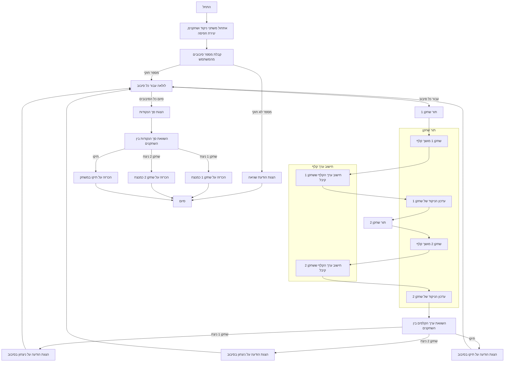

## ניתוח קוד המשחק "ACE"

### 1. **<algorithm>**

**תרשים זרימה של המשחק ACE:**

1.  **התחלה:**
    *   אתחול ניקוד שחקן 1 (`player1Score`) ל-0.
    *   אתחול ניקוד שחקן 2 (`player2Score`) ל-0.
    *   יצירת חפיסת קלפים סטנדרטית (52 קלפים).
    *   דוגמא: `deck = ['2', '3', '4', '5', '6', '7', '8', '9', '10', 'J', 'Q', 'K', 'A'] * 4`

2.  **קבלת מספר סיבובים:**
    *   בקשה מהמשתמש להזין את מספר הסיבובים שרוצים לשחק.
    *   דוגמא: קלט משתמש: `5`, המשתנה `numberOfRounds` יהיה 5.

3.  **לולאה עבור כל סיבוב:**
    *   לולאה שחוזרת על עצמה מספר הפעמים שנקבע (`numberOfRounds`).
        *   דוגמא: עבור סיבוב 1:  `roundNumber` = 1, ועבור סיבוב 5: `roundNumber` = 5.

    4.  **תור שחקן 1:**
        *   הגרלת קלף אקראי מחפיסת הקלפים והחזרת הקלף וערכו המספרי.
           * לדוגמא, קריאה לפונקציה `draw_card(deck)` עשויה להחזיר: `card1` = 'Q', `card1Value` = 10.
        *   הצגת הקלף ששחקן 1 קיבל וערכו.
           * לדוגמא, הפלט יהיה: "שחקן 1 קיבל Q (10 נקודות)".
        *   עדכון הניקוד של שחקן 1.
           * לדוגמא, אם לפני כן `player1Score` היה 20, לאחר קבלת 'Q' ערכו יהיה 30.

    5.  **תור שחקן 2:**
        *   הגרלת קלף אקראי מחפיסת הקלפים והחזרת הקלף וערכו המספרי.
            * לדוגמא, קריאה לפונקציה `draw_card(deck)` עשויה להחזיר: `card2` = 'A', `card2Value` = 1.
        *   הצגת הקלף ששחקן 2 קיבל וערכו.
            * לדוגמא, הפלט יהיה: "שחקן 2 קיבל A (1 נקודות)".
        *   עדכון הניקוד של שחקן 2.
            * לדוגמא, אם לפני כן `player2Score` היה 15, לאחר קבלת 'A' ערכו יהיה 16.

    6.  **השוואת תוצאות הסיבוב:**
        *   אם ערך הקלף של שחקן 1 גבוה יותר משל שחקן 2, מוצגת הודעה ששחקן 1 ניצח בסיבוב.
        *   אם ערך הקלף של שחקן 2 גבוה יותר משל שחקן 1, מוצגת הודעה ששחקן 2 ניצח בסיבוב.
        *   אם ערכי הקלפים שווים, מוצגת הודעה על תיקו בסיבוב.
            * לדוגמא, אם `card1Value` = 10 ו- `card2Value` = 1, הפלט יהיה: "שחקן 1 ניצח בסיבוב".

7.  **הצגת תוצאות המשחק:**
    *   הצגת הניקוד הכולל של שחקן 1.
       * לדוגמא, אם `player1Score` = 75, הפלט יהיה: "שחקן 1: 75 נקודות".
    *   הצגת הניקוד הכולל של שחקן 2.
        * לדוגמא, אם `player2Score` = 60, הפלט יהיה: "שחקן 2: 60 נקודות".

8.  **הכרזת מנצח המשחק:**
    *   אם הניקוד הכולל של שחקן 1 גבוה יותר משל שחקן 2, מוצגת הודעה ששחקן 1 ניצח במשחק.
    *   אם הניקוד הכולל של שחקן 2 גבוה יותר משל שחקן 1, מוצגת הודעה ששחקן 2 ניצח במשחק.
    *   אם הניקוד הכולל של השחקנים שווה, מוצגת הודעה על תיקו במשחק.
        * לדוגמא, אם `player1Score` = 75 ו- `player2Score` = 60, הפלט יהיה: "שחקן 1 ניצח במשחק!".

9. **סוף המשחק.**

### 2. **<mermaid>**

**ניתוח תלויות מיובאות:**
הקוד מייבא רק את מודול `random` של פייתון, שמשמש ליצירת מספרים אקראיים לצורך הגרלת קלפים מחפיסת הקלפים. אין תלויות נוספות בחבילות חיצוניות או בתוך `src.`.

### 3. **<explanation>**

**ייבואים (Imports):**

*   `import random`: מודול פייתון המכיל פונקציות ליצירת מספרים פסאודו-אקראיים. המודול משמש כאן לצורך הגרלת קלפים אקראיים מתוך החפיסה.

**פונקציות (Functions):**

*   `calculate_card_value(card)`:
    *   **פרמטרים**: `card` (מחרוזת) - מייצגת קלף מסוים (לדוגמא: 'A', '2', 'K').
    *   **ערך מוחזר**: מספר שלם - הערך המספרי של הקלף.
    *   **מטרה**: חישוב הערך המספרי של קלף על פי חוקי המשחק (אס = 1, J/Q/K = 10, שאר הקלפים על פי הערך הנקוב שלהם).
    *   **דוגמאות שימוש**:
        *   `calculate_card_value('A')` תחזיר 1.
        *   `calculate_card_value('10')` תחזיר 10.
        *   `calculate_card_value('Q')` תחזיר 10.
        *   `calculate_card_value('7')` תחזיר 7.
        *   `calculate_card_value('X')` תחזיר 0 (טיפול בשגיאה, אם מועבר קלף לא חוקי).

*   `draw_card(deck)`:
    *   **פרמטרים**: `deck` (רשימה) - רשימה של מחרוזות המייצגות את הקלפים בחפיסה.
    *   **ערך מוחזר**: טאפל שמכיל:
        *   `card` (מחרוזת) - הקלף שנבחר באקראי.
        *   `card_value` (מספר שלם) - הערך המספרי של הקלף שנבחר.
    *   **מטרה**: בחירת קלף אקראי מחפיסת הקלפים והחזרת הקלף וערכו המספרי.
    *   **דוגמאות שימוש**:
        *   בהינתן `deck = ['A', '2', 'K']`, קריאה לפונקציה עשויה להחזיר `('K', 10)`.

*   `play_ace_game()`:
    *   **פרמטרים**: אין.
    *   **ערך מוחזר**: אין (הפונקציה מבצעת פעולות ואינה מחזירה ערך).
    *   **מטרה**: לנהל את המשחק, מתחילתו ועד סופו, כולל לולאת הסיבובים, השוואת ניקוד, והכרזת מנצח.
    *   **דוגמאות שימוש**: הפונקציה מופעלת כאשר הקובץ מורץ ישירות, באמצעות התנאי `if __name__ == "__main__": play_ace_game()`.

**משתנים (Variables):**

*   `player1Score` ו- `player2Score` (מספרים שלמים): משמשים לאחסון הניקוד של כל שחקן במהלך המשחק. מאותחלים ל-0 בתחילת המשחק.
*   `deck` (רשימה של מחרוזות): מייצגת את חפיסת הקלפים, המכילה את כל הקלפים הסטנדרטיים (52 קלפים).
*    `numberOfRounds` (מספר שלם): מספר הסיבובים שהמשתמש בוחר לשחק.
* `roundNumber` (מספר שלם): אינדקס הלולאה עבור סיבוב המשחק הנוכחי.
*    `card1`, `card2` (מחרוזות): מחזיקים את הקלפים ששחקן 1 ו-2 קיבלו בסיבוב הנוכחי.
*   `card1Value`, `card2Value` (מספרים שלמים): מחזיקים את הערך המספרי של הקלפים ששחקן 1 ו-2 קיבלו בסיבוב הנוכחי.

**בעיות אפשריות או תחומים לשיפור:**

1.  **טיפול שגיאות בסיסי**: הקוד כולל טיפול שגיאות בסיסי לקלט המשתמש (מספר סיבובים). ניתן להרחיב את טיפול השגיאות לכל מקרה אפשרי (לדוגמא - קלט שאינו מספר).
2.  **הצגה**: ניתן לשפר את ממשק המשתמש כדי שיהיה ברור יותר, אולי על ידי הוספת שמות לשחקנים, או הוספה של סימון גרפי לכל קלף.
3.  **הפרדה בין לוגיקה לממשק משתמש**: ניתן להפריד את לוגיקת המשחק (כל החישובים והחוקים) מממשק המשתמש (קלט ופלט), כדי שהקוד יהיה מודולרי וקל יותר לשינוי.
4. **אפשרות למספר שחקנים**: ניתן להוסיף אפשרות למשחק עם יותר משני שחקנים.

**שרשרת קשרים עם חלקים אחרים בפרויקט:**

הקוד הזה, כמו שהוא, עומד בפני עצמו ואין לו תלות בחלקים אחרים של הפרויקט. עם זאת, ניתן למקם אותו כחלק ממודול משחקים רחב יותר, בו קיימים משחקים נוספים וקוד משותף שיכול לשמש למשחקים אחרים.

במילים אחרות, אין תלות או שיתוף ישיר עם מודולים אחרים בקוד, מלבד מודול ה-`random` של פייתון.