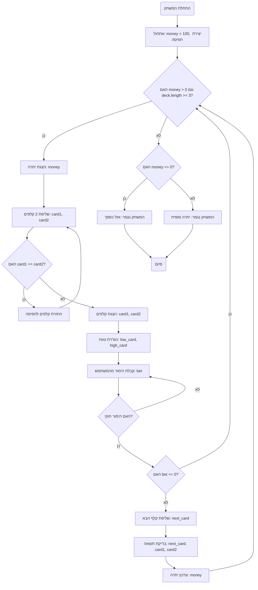

## <algorithm>

1.  **התחלת המשחק**:
    *   המשחק מודפס למסך: "ברוכים הבאים למשחק Acey Ducey!".
    *   מודפסים חוקי המשחק.
    *   משתנה `money` (יתרת כסף) מאותחל ל-100$.
    *   נוצרת חפיסת קלפים באמצעות הפונקציה `create_deck()`.
2.  **לולאת משחק ראשית**:
    *   הלולאה ממשיכה כל עוד יתרת הכסף (`money`) גדולה מ-0 וקיימים לפחות 3 קלפים בחפיסה.
        *   לדוגמה, אם `money` הוא 50$ ויש 5 קלפים בחפיסה, הלולאה ממשיכה.
    *   מודפס יתרת הכסף הנוכחית.
    *   שני קלפים נשלפים מהחפיסה באמצעות `deck.pop()`.
        *   לדוגמה, `card1` מקבל את הקלף האחרון בחפיסה (נגיד 10), ו-`card2` מקבל את הקלף האחרון לאחר מכן (נגיד 5).
    *   אם שני הקלפים זהים, הקלפים מוחזרים לתחילת החפיסה ונשלפים קלפים חדשים.
        *   לדוגמה, אם `card1` ו-`card2` הם שניהם 7, הם מוחזרים לחפיסה ונשלפים שני קלפים אחרים.
    *   שני הקלפים המוצגים מודפסים למסך.
3.  **קביעת טווח הקלפים**:
    *   הערך המינימלי בין שני הקלפים מוצב ב-`low_card`.
    *   הערך המקסימלי בין שני הקלפים מוצב ב-`high_card`.
        *   לדוגמה, אם `card1` הוא 5 ו-`card2` הוא 10, אז `low_card` יהיה 5 ו-`high_card` יהיה 10.
4.  **קבלת הימור מהמשתמש**:
    *   המשתמש מתבקש להזין הימור, בין 0 לערך של `money`.
    *   ההימור נבדק:
        *   אם ההימור קטן מ-0 או גדול מ-`money`, ההודעה "הימור שגוי" מודפסת, והלולאה ממשיכה לסיבוב הבא.
        *   אם ההימור הוא 0, ההודעה "דילגת על תורך" מודפסת, והלולאה ממשיכה לסיבוב הבא.
        *   אם הקלט אינו מספר, ההודעה "הזן מספר בבקשה" מודפסת, והלולאה ממשיכה לסיבוב הבא.
5.  **שליפת הקלף הבא**:
    *   קלף שלישי נשלף מהחפיסה באמצעות `deck.pop()` ומאוחסן ב-`next_card`.
    *   הקלף השלישי מודפס למסך.
6.  **בדיקת תוצאה**:
    *   אם הקלף השלישי זהה לאחד משני הקלפים הראשונים, או אם הוא קלף "אייס" (ערך 14), השחקן מפסיד בהימור.
        *   לדוגמה, אם `next_card` הוא 5 וגם `card1` או `card2` הם 5, או אם `next_card` הוא 14, השחקן מפסיד.
    *   אחרת, אם הקלף השלישי נמצא בין שני הקלפים הראשונים, השחקן מנצח בהימור.
        *   לדוגמה, אם `low_card` הוא 5, `high_card` הוא 10, ו-`next_card` הוא 7, השחקן מנצח.
    *   בכל מקרה אחר, השחקן מפסיד בהימור.
    *   יתרת הכסף (`money`) מתעדכנת בהתאם לתוצאה.
7.  **סיום המשחק**:
    *   אם יתרת הכסף קטנה או שווה ל-0, המשחק מסתיים והודעה "אזל כספך" מודפסת.
    *   אחרת, אם הלולאה מסתיימת (אין יותר קלפים בחפיסה), המשחק מסתיים והודעה על היתרה הסופית מודפסת.
8.  **הפעלת המשחק**:
    *   המשחק מתחיל כאשר הקובץ מופעל ישירות.

## <mermaid>

**ניתוח תלויות:**

*   אין תלויות מיובאות ב-`mermaid` עצמו.
*   התרשים מתאר את זרימת הפעולה של הקוד שסופק, ואין בו תלויות חיצוניות.

## <explanation>

**ייבואים (Imports):**

*   `import random`: מייבא את ספריית `random` של פייתון, המשמשת ליצירת מספרים אקראיים. בסקריפט זה, היא משמשת לערבוב חפיסת הקלפים באמצעות `random.shuffle(deck)`. אין תלות ישירה עם חבילות אחרות בפרויקט, מאחר ומדובר בספרייה סטנדרטית של פייתון.

**פונקציות (Functions):**

1.  **`create_deck()`:**
    *   **פרמטרים**: אין.
    *   **ערך מוחזר**: רשימה (list) של מספרים שלמים (int) המייצגים חפיסת קלפים מעורבבת.
    *   **מטרה**: יוצרת חפיסת קלפים סטנדרטית (52 קלפים) ומערבבת אותה באופן אקראי.
    *   **דוגמאות שימוש**:
        *   `deck = create_deck()` יחזיר חפיסה מעורבבת, לדוגמה: `[7, 3, 12, 9, ..., 11]`.
    *   **הסבר**:
        *   `ranks = list(range(2, 15))`: יוצרת רשימה של ערכי הקלפים (מ-2 עד 14, כאשר 14 מייצג אס).
        *   `deck = ranks * 4`: משכפלת את הרשימה של ערכי הקלפים 4 פעמים, ליצירת 4 סדרות של כל קלף.
        *   `random.shuffle(deck)`: מערבבת את סדר הקלפים באופן אקראי.

2.  **`card_name(value)`:**
    *   **פרמטרים**: `value` (מספר שלם), המייצג ערך של קלף (בין 2 ל-14).
    *   **ערך מוחזר**: מחרוזת (string) המייצגת את שם הקלף בצורה קריאה.
    *   **מטרה**: ממירה ערך מספרי של קלף לייצוג טקסטואלי, לדוגמה: "2" -> "2", "11" -> "ואלט", "14" -> "אס".
    *   **דוגמאות שימוש**:
        *   `card_name(11)` יחזיר "ואלט".
        *   `card_name(14)` יחזיר "אס".
        *   `card_name(5)` יחזיר "5".

3.  **`play_acey_ducey()`:**
    *   **פרמטרים**: אין.
    *   **ערך מוחזר**: אין.
    *   **מטרה**: מריצה את המשחק Acey Ducey.
    *   **הסבר**: הפונקציה כוללת את הלוגיקה של המשחק כולל:
        *   אתחול יתרת הכסף.
        *   יצירת חפיסת קלפים.
        *   לולאה מרכזית המריצה כל סיבוב משחק:
            *   שולפת 2 קלפים, מוודא שאינם זהים.
            *   מציגה את הקלפים לשחקן.
            *   מבקשת מהשחקן הימור.
            *   שולפת קלף שלישי.
            *   קובעת אם השחקן ניצח או הפסיד ומעדכנת את יתרת הכסף.
        *   בדיקת סיום המשחק.

**משתנים (Variables):**

*   `money` (int): יתרת הכסף של השחקן. מאותחל ל-100.
*   `deck` (list): רשימה של מספרים שלמים המייצגים חפיסת קלפים.
*   `card1`, `card2` (int): ערכים מספריים של הקלפים שנשלפו.
*   `low_card`, `high_card` (int): ערכים מספריים של הקלפים הנמוך והגבוה שנשלפו, בהתאמה.
*   `bet` (int): סכום ההימור שהשחקן הכניס.
*   `next_card` (int): הערך המספרי של הקלף השלישי שנשלף.

**בעיות אפשריות ותחומים לשיפור:**

*   **הגבלת הימורים**: הקוד מאפשר לשחקן להמר את כל יתרת הכסף שלו בכל סיבוב. אפשר לשפר את זה על ידי הוספת מגבלת הימור מקסימלית.
*   **אימות קלט**: למרות שנעשה אימות מסוים לקלט של השחקן, ניתן להרחיב את האימות כדי למנוע מצבים לא רצויים.
*   **ממשק משתמש**: ממשק המשתמש הוא בסיסי וטקסטואלי. אפשר לשפר את חווית המשתמש באמצעות ממשק גרפי.
*   **חוקים נוספים**: המשחק יכול להכיל חוקים נוספים כדי להפוך אותו למעניין יותר, כמו הוספת "ג'וקר" או בונוסים מיוחדים.

**שרשרת קשרים עם חלקים אחרים בפרויקט:**

*   לקוד זה אין תלות בחלקים אחרים בפרויקט, מכיוון שמדובר במשחק עצמאי. אם היה חלק אחר בפרויקט שהיה צריך לנהל את המשחקים, יכל להיות קשר.