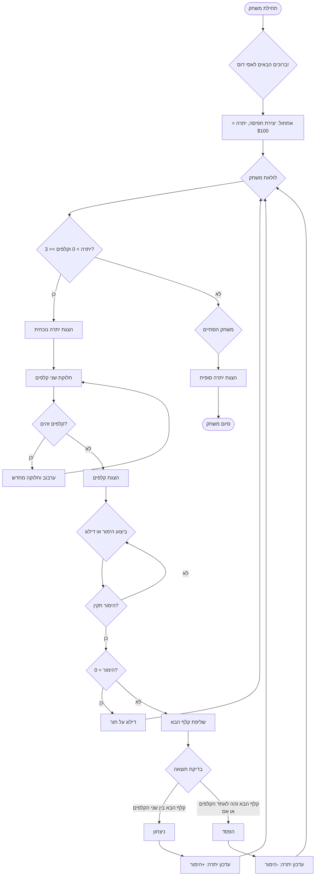

# ניתוח קוד המשחק "אסי דוס"

## <algorithm>

1.  **התחלת המשחק (Start)**:
    *   המשחק מתחיל בהצגת הודעת פתיחה.
    *   דוגמה: "ברוכים הבאים למשחק אסי דוס!"

2.  **אתחול (Initialize)**:
    *   נוצרת חפיסת קלפים חדשה.
    *   היתרה ההתחלתית של השחקן מוגדרת ל-100 דולר.
    *   דוגמה: `deck = new Deck()`, `balance = 100`

3.  **לולאת המשחק (GameLoop)**:
    *   המשחק ממשיך כל עוד לשחקן יש יתרה גדולה מ-0 ויש לפחות 3 קלפים בחפיסה.

4.  **בדיקת יתרה (CheckBalance)**:
    *   בדיקה האם היתרה של השחקן גדולה מ-0 והאם נותרו לפחות 3 קלפים בחפיסה.
    *   אם התנאי מתקיים, המשחק ממשיך; אחרת, המשחק מסתיים.

5.  **הצגת יתרה נוכחית (DisplayBalance)**:
    *   היתרה הנוכחית של השחקן מוצגת.
    *   דוגמה: "היתרה שלך: 150$"

6.  **חלוקת קלפים (DealCards)**:
    *   שני קלפים נשלפים מהחפיסה.
    *   דוגמה: `card1 = deck.drawCard()`, `card2 = deck.drawCard()`

7.  **בדיקת קלפים זהים (CheckSameCards)**:
    *   בודקים אם שני הקלפים שחולקו זהים.
    *   אם הקלפים זהים, חוזרים לערבב ולחלק מחדש.

8.  **ערבוב מחדש של קלפים (RedrawCards)**:
    *   הקלפים מוחזרים לחפיסה והחפיסה מעורבבת, ואז מחולקים שני קלפים חדשים.
    *   זרימת נתונים: הקלפים מוחזרים לחפיסה המעורבבת.

9.  **הצגת קלפים (DisplayCards)**:
    *   שני הקלפים המוצגים מוצגים לשחקן.
    *   דוגמה: "קלף ראשון: מלכה יהלום, קלף שני: 7 לב"

10. **ביצוע הימור (MakeBet)**:
     *   השחקן יכול לבצע הימור או לדלג על תור.
     *   דוגמה: השחקן מזין 20$.

11. **אימות הימור (ValidateBet)**:
     *   בודקים אם ההימור של השחקן הוא חוקי (לא גדול מהיתרה ולא שלילי).
     *   אם ההימור לא חוקי, חוזרים לביצוע הימור.

12. **בדיקת דילוג על תור (CheckPass)**:
     *   אם ההימור הוא 0, מדלגים על תור.

13. **דילוג על תור (SkipTurn)**:
     *   מדלגים על התור וחוזרים לתחילת לולאת המשחק.
     *   זרימת נתונים: קפיצה ל- GameLoop

14. **שליפת קלף הבא (DrawNextCard)**:
     *   קלף נוסף נשלף מהחפיסה.
     *   דוגמה: `card3 = deck.drawCard()`

15. **בדיקת תוצאה (CheckResult)**:
     *   התוצאה נבדקת:
        *   אם הקלף הנוסף נמצא בין שני הקלפים הראשונים, השחקן מנצח.
        *   אם הקלף הנוסף שווה לאחד משני הקלפים הראשונים, או שהוא אס, השחקן מפסיד.

16. **ניצחון (Win)**:
     *   השחקן ניצח, היתרה שלו גדלה בסכום ההימור.
     *   דוגמה: `balance += bet`

17. **הפסד (Lose)**:
     *   השחקן הפסיד, היתרה שלו קטנה בסכום ההימור.
     *   דוגמה: `balance -= bet`

18. **עדכון יתרה בניצחון (UpdateBalanceWin)**:
     *   עדכון היתרה של השחקן לאחר ניצחון.
     *   זרימת נתונים: עדכון `balance`

19. **עדכון יתרה בהפסד (UpdateBalanceLose)**:
     *   עדכון היתרה של השחקן לאחר הפסד.
     *   זרימת נתונים: עדכון `balance`

20. **סוף משחק (EndGame)**:
      *   המשחק מסתיים אם היתרה של השחקן שווה ל-0 או אם אין מספיק קלפים בחפיסה.
      *  הודעה על סיום משחק מופיעה

21. **הצגת יתרה סופית (DisplayFinalBalance)**:
     *   היתרה הסופית של השחקן מוצגת.
     *   דוגמה: "היתרה הסופית שלך: 200$"

22. **סיום (Finish)**:
     *   המשחק הסתיים.

## <mermaid>

**ניתוח תלויות Mermaid:**
אין תלויות חיצוניות נוספות עבור תרשים הזרימה של המשחק. התרשים מתאר את הלוגיקה הפנימית של המשחק.
אין ייבוא של `header` בקוד ולכן לא יתווסף תרשים של `header.py`.

## <explanation>

*   **ייבוא (Imports)**:
    *   אין ייבוא בקוד הזה. התרשים מתמקד בלוגיקה של המשחק עצמו, לא בקוד מפורט עם מחלקות ופונקציות.

*   **מחלקות (Classes)**:
    *   אין מחלקות בקוד הזה. התרשים מתאר את תהליך המשחק ברמת אלגוריתם ולא ברמת קוד.

*   **פונקציות (Functions)**:
    *   אין פונקציות בקוד הזה. התרשים מתאר את האלגוריתם הכללי ברמה גבוהה, בלי להיכנס למימוש הספציפי של פונקציות.
    
*   **משתנים (Variables)**:
    *   `balance`: משתנה מספרי המייצג את כמות הכסף של השחקן, מתחיל ב-100.
    *   `deck`: משתנה המייצג את חפיסת הקלפים.
    *   `card1`, `card2`, `card3`: משתנים המייצגים קלפים שנשלפים מהחפיסה.
    *   `bet`: משתנה מספרי המייצג את סכום ההימור של השחקן.

*   **בעיות אפשריות או תחומים לשיפור**:
    *   הקוד הוא ברמה גבוהה של אלגוריתם. חסר מימוש מפורט של מחלקות ופונקציות.
    *   אין טיפול מפורט במקרים של שגיאות קלט מהמשתמש.
    *   הקוד מניח שהחפיסה מתנהגת באופן נכון, בלי התייחסות למימוש שלה.

*   **שרשרת קשרים עם חלקים אחרים בפרויקט**:
    *   מכיוון שהקוד המוצג הוא ברמת אלגוריתם, אין קשר ישיר לחלקים ספציפיים אחרים בפרויקט. הקוד מהווה תרשים זרימה כללי של משחק אסי דוס וניתן לממש אותו בכל שפה או סביבה.

    *    התרשים מציין כי ישנו מנגנון לטיפול בחפיסה ( Deck), אך לא מציין איך הוא ממומש. זהו תחום אפשרי להרחבה בעתיד.