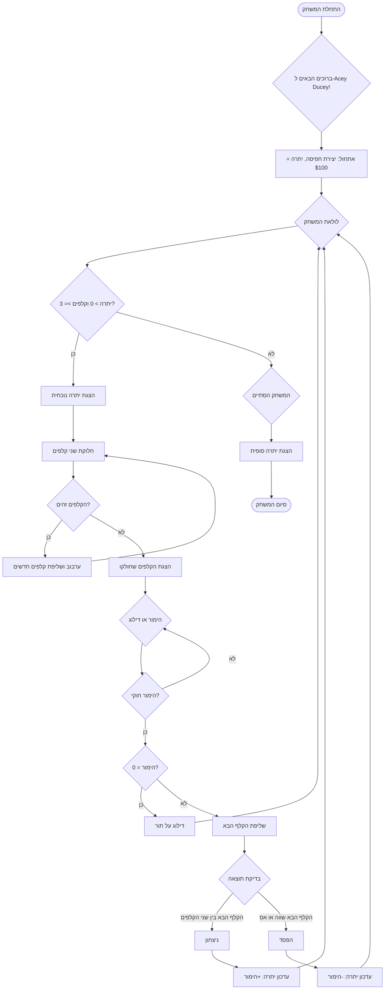

# ניתוח קוד משחק Acey Ducey

## 1. <algorithm>

הקוד המתואר מייצג את זרימת המשחק "Acey Ducey". להלן תיאור מפורט של האלגוריתם, צעד אחר צעד, עם דוגמאות:

1.  **התחלה (Start)**: המשחק מתחיל.
2.  **ברוכים הבאים (Welcome)**: הודעה מודפסת המברכת את השחקן במשחק.
    *   דוגמה: "ברוכים הבאים ל-Acey Ducey!"
3.  **אתחול (Initialize)**:
    *   נוצרת חפיסת קלפים.
    *   היתרה ההתחלתית של השחקן מוגדרת ל-$100.
4.  **לולאת משחק (GameLoop)**: המשחק ממשיך כל עוד תנאים מסוימים מתקיימים.
5.  **בדיקת יתרה (CheckBalance)**: בדיקה האם יתרת השחקן גדולה מ-0 והאם יש לפחות 3 קלפים בחפיסה.
    *   דוגמה: אם יתרת השחקן היא $10 או מספר הקלפים בחפיסה הוא 2, המשחק מסתיים.
6.  **הצגת יתרה (DisplayBalance)**: יתרת השחקן הנוכחית מוצגת.
    *   דוגמה: "יתרתך הנוכחית היא: $125".
7.  **חלוקת קלפים (DealCards)**: שני קלפים נשלפים מהחפיסה ומוצגים לשחקן.
    *   דוגמה: קלף ראשון: 5 תלתן, קלף שני: 10 יהלום.
8.  **בדיקת קלפים זהים (CheckSameCards)**: בדיקה האם שני הקלפים זהים.
    *   דוגמה: אם הקלפים הם 7 לב ו-7 תלתן, יש צורך בהגרלה חוזרת.
9.  **הגרלת קלפים חדשים (RedrawCards)**: אם הקלפים זהים, החפיסה מעורבבת מחדש וקלפים חדשים נשלפים. הזרימה חוזרת לשלב **חלוקת קלפים**.
10. **הצגת קלפים (DisplayCards)**: שני הקלפים שנשלפו מוצגים לשחקן.
    *   דוגמה: "הקלפים שלך הם: 5 תלתן ו-10 יהלום".
11. **הימור (MakeBet)**: השחקן מתבקש להמר או לוותר על תורו.
12. **אימות הימור (ValidateBet)**: בדיקה האם ההימור שהשחקן הכניס הוא חוקי (כלומר, גדול מ-0 ואינו עולה על יתרתו).
    *   דוגמה: אם יתרת השחקן היא $50 והוא מנסה להמר $60, ההימור לא חוקי והשחקן מתבקש להמר שוב.
13. **בדיקת פסילה (CheckPass)**: בדיקה האם ההימור שהשחקן הכניס הוא 0 (משמע השחקן בחר לוותר על התור).
14. **דילוג על תור (SkipTurn)**: אם ההימור הוא 0, התור מדלגים וחוזרים ללולאת המשחק.
15. **שליפת קלף הבא (DrawNextCard)**: אם ההימור גדול מ-0, קלף שלישי נשלף מהחפיסה.
16. **בדיקת תוצאה (CheckResult)**: בדיקה האם הקלף השלישי הוא בין שני הקלפים הראשונים או שהוא שווה לאחד מהם או שהוא אס.
    *   דוגמה: אם הקלפים הראשונים הם 5 ו-10 והקלף השלישי הוא 7, השחקן מנצח.
    *   דוגמה: אם הקלפים הראשונים הם 5 ו-10 והקלף השלישי הוא 10, השחקן מפסיד.
17. **ניצחון (Win)**: אם הקלף השלישי הוא בין שני הקלפים הראשונים, השחקן מנצח.
18. **הפסד (Lose)**: אם הקלף השלישי שווה לאחד מהשניים או שהוא אס, השחקן מפסיד.
19. **עדכון יתרה (UpdateBalanceWin)**: אם השחקן ניצח, היתרה שלו מתעדכנת על ידי הוספת סכום ההימור.
    *   דוגמה: אם השחקן הימר $10 וניצח, היתרה שלו גדלה ב-$10.
20. **עדכון יתרה (UpdateBalanceLose)**: אם השחקן הפסיד, היתרה שלו מתעדכנת על ידי הפחתת סכום ההימור.
    *   דוגמה: אם השחקן הימר $10 והפסיד, היתרה שלו קטנה ב-$10.
21. **חזרה ללולאת המשחק (GameLoop)**: המשחק חוזר ללולאה כדי לשחק תור נוסף, אלא אם התנאים לבדיקת היתרה לא מתקיימים.
22. **סיום משחק (EndGame)**: אם היתרה של השחקן שווה ל-0 או אין מספיק קלפים בחפיסה, המשחק מסתיים.
23. **הצגת יתרה סופית (DisplayFinalBalance)**: היתרה הסופית של השחקן מוצגת.
    *   דוגמה: "היתרה הסופית שלך היא: $25".
24. **סיום (Finish)**: המשחק מסתיים.

## 2. <mermaid>

**הסבר על התלויות:**

*   **flowchart TD**: זהו התחביר של מרמייד ליצירת תרשים זרימה, ומשמעותו היא שהתרשים יזרום מלמעלה למטה.
*   התרשים משתמש בסימנים גרפיים סטנדרטיים לתיאור:
    *   סוגריים מעוגלים `()` לייצוג התחלה וסיום.
    *   מלבנים `[]` לייצוג פעולות.
    *   מעוינים `{}` לייצוג תנאים או החלטות.
    *   חיצים `-->` לציון זרימת השליטה בין הבלוקים השונים.

## 3. <explanation>

**ייבואים (Imports):**
  * בקוד המקורי שסופק, אין ייבוא (import) ולכן, אין מה להסביר בהקשר זה. הקוד מתאר את הלוגיקה הכללית של המשחק בתרשים זרימה, ואינו כולל קוד ממשי שדורש ייבוא.

**מחלקות (Classes):**
  * גם כאן, הקוד אינו כולל הגדרת מחלקות. התרשים הזרימה מתאר את הלוגיקה הפרוצדורלית, ואין שימוש בתכנות מונחה-עצמים במקרה זה.

**פונקציות (Functions):**
  * הקוד אינו מציג פונקציות ספציפיות. התרשים הזרימה מתאר את זרימת השליטה בין הפעולות השונות במשחק, אך אינו מציין שמות או הגדרות של פונקציות.

**משתנים (Variables):**
   *  `יתרה` - מספר שלם המייצג את יתרת השחקן. מתחיל ב-100 ועשוי להשתנות במהלך המשחק.
   *  `חפיסה` - אוסף של קלפים. מופעלת במהלך המשחק ושולפים ממנה קלפים.
   *  `הימור` - מספר שלם המייצג את ההימור הנוכחי של השחקן.
   * `קלף_1`, `קלף_2`, `קלף_3` - משתנים המייצגים את הקלפים השונים שנשלפים במהלך המשחק.

**בעיות אפשריות ושיפורים:**

*   **ממשק משתמש:** התרשים הזרימה אינו מתייחס לאופן בו המשחק יוצג למשתמש. יש צורך ביישום ממשק משתמש גרפי או טקסטואלי.
*   **לוגיקה של קלפים:** התרשים הזרימה אינו מפרט את ייצוג הקלפים (למשל, ערך וסוג).
*   **קריאת קלט משתמש:** חסרה בתיאור של הקוד דרך לקבל את ההימור מהמשתמש.
*   **בדיקות שגיאות:** התרשים הזרימה אינו כולל בדיקות שגיאות מפורשות, למשל, קלט לא תקין מהמשתמש.

**שרשרת קשרים עם חלקים אחרים בפרויקט (אם רלוונטי):**

בשלב זה, אין מידע על חלקים אחרים בפרויקט, לכן אין אפשרות ליצור שרשרת קשרים. עם זאת, ניתן להניח שהמשחק יכול להיות חלק ממערכת משחקים גדולה יותר, שיכולה לכלול:

*   ממשק משתמש גרפי משותף לכל המשחקים.
*   מערכת ניהול משתמשים, כולל ניהול יתרות ונתונים סטטיסטיים של שחקנים.
*   אולי גם חבילה של משחקים נוספים.