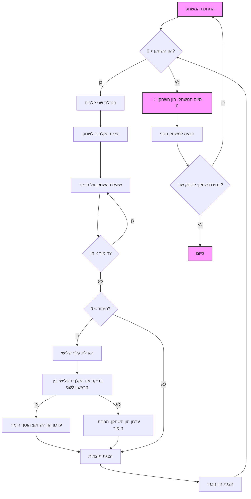

## הוראה:

נתח את הקוד שסופק בפירוט והסבר את הפונקציונליות שלו. התשובה צריכה לכלול שלושה חלקים:

1. **<algorithm>**:
   תאר את תהליך העבודה של הקוד בתרשים זרימה צעד-אחר-צעד.
   - הוסף דוגמאות לכל בלוק לוגי.
   - הצג את הזרימה של נתונים בין פונקציות, מחלקות או שיטות.

2. **<mermaid>**:
   כתוב את קוד התרשים בפורמט `mermaid`.
   - נתח והסבר את כל התלויות המיובאות ביצירת התרשים.
   **חשוב!**: ודא שכל שמות המשתנים בתרשים `mermaid` הם בעלי משמעות ותיאור. שמות כמו `A`, `B`, `C` אסורים!

   **בנוסף**:
   אם הקוד כולל את השורה `import header`, הוסף תרשים זרימה בפורמט `mermaid` המתאר את `header.py`:
   ```mermaid
   flowchart TD
       Start --> Header[<code>header.py</code><br> קביעת שורש הפרויקט]

       Header --> import[ייבוא הגדרות גלובליות: <br><code>from src import gs</code>]
   ```

3. **<explanation>**:
   ספק הסברים מפורטים:
   - **ייבואים (Imports)**: המטרה שלהם והקשר שלהם עם חבילות `src.` אחרות.
   - **מחלקות (Classes)**: התפקיד שלהן, המאפיינים, השיטות והאינטראקציה עם חלקים אחרים בפרויקט.
   - **פונקציות (Functions)**: הפרמטרים, הערכים המוחזרים, המטרה ודוגמאות לשימוש.
   - **משתנים (Variables)**: הסוג והשימוש שלהם.
   - ציין בעיות אפשריות או תחומים לשיפור.

בנוסף, צור שרשרת קשרים עם חלקים אחרים בפרויקט (אם רלוונטי).

הדבר מבטיח ניתוח מקיף ומובנה של הקוד.
## פורמט התשובה: `.md` (markdown)
**סוף ההוראה**
```md
# ניתוח קוד המשחק Acey-Ducey

## <algorithm>

1. **אתחול המשחק:**
   - הגדרת הון התחלתי של השחקן ל-100 דולר.
   - הצגת חוקי המשחק לשחקן.
   *דוגמה:*
   `player_money = 100`
   `print("ברוכים הבאים למשחק Acey-Ducey!")`
   `print("אתה מתחיל עם 100 דולר")`
   `print("חוקי המשחק הם...")`

2. **לולאת המשחק הראשית:**
   - המשחק ממשיך עד שהשחקן מאבד את כל כספו (הון השחקן שווה ל-0) או בוחר לסיים את המשחק.
   *דוגמה:*
   `while player_money > 0:`

3. **סיבוב משחק:**
   - הגרלת שתי קלפים אקראיים בין 2 ל-14 (אס = 14, ג'ק = 11, מלכה = 12, מלך = 13).
    *דוגמה:*
        `card1 = random.randint(2, 14)`
        `card2 = random.randint(2, 14)`
   - הצגת הקלפים לשחקן.
    *דוגמה:*
        `print(f"הקלף הראשון: {card1}, הקלף השני: {card2}")`
   - שאילת השחקן האם הוא רוצה להמר (או להמר 0 כדי לוותר על הסיבוב).
     *דוגמה:*
        `bet = int(input("מה ההימור שלך? (0 כדי לוותר): "))`
   - בדיקה שההימור אינו גבוה מההון הנוכחי של השחקן.
     *דוגמה:*
         `if bet > player_money:`
             `print("ההימור גבוה מדי! נסה שוב.")`

4. **תוצאות הסיבוב:**
   - אם השחקן בחר להמר (ההימור גדול מ-0):
     - הגרלת קלף שלישי אקראי.
     *דוגמה:*
         `card3 = random.randint(2, 14)`
     - בדיקה האם ערך הקלף השלישי נמצא בין שני הקלפים הראשונים.
     *דוגמה:*
       `if min(card1, card2) < card3 < max(card1, card2):`
          `player_money += bet`
          `print("ניצחת!")`
       `else:`
          `player_money -= bet`
          `print("הפסדת!")`
   - אם השחקן בחר לא להמר (ההימור הוא 0), המערכת תעבור לסיבוב הבא.
   - עדכון הון השחקן.
   - הצגת ההון העדכני לשחקן.
    *דוגמה:*
        `print(f"ההון שלך: {player_money}")`

5.  **סיום המשחק:**
   - אם הון השחקן שווה ל-0, המשחק מסתיים והודעה מתאימה מוצגת.
   - הצעה לשחקן להתחיל משחק חדש או לסיים.
    *דוגמה:*
        `if player_money <= 0:`
            `print("נגמר לך הכסף. המשחק הסתיים!")`
        `play_again = input("האם לשחק שוב? (כן/לא): ")`

## <mermaid>



## <explanation>

**הסבר מפורט:**

- **מבנה כללי:** הקוד מתאר משחק קלפים בשם Acey-Ducey. הוא מתחיל באתחול נתוני השחקן וכללי המשחק. לאחר מכן, הוא נכנס ללולאה ראשית שבה מתבצע כל סיבוב משחק. כל סיבוב כולל הגרלת קלפים, הימור של השחקן, ועדכון ההון בהתאם לתוצאת הסיבוב. המשחק מסתיים כאשר הון השחקן מגיע ל-0, או שהשחקן בוחר לסיים.

- **משתנים:**
    - `player_money`: מסוג מספר שלם, המייצג את כספו של השחקן ומתעדכן במהלך המשחק.
    - `card1`, `card2`, `card3`: מסוג מספר שלם, מייצגים את ערכי הקלפים (2-14) שהוגרלו באופן אקראי.
    - `bet`: מספר שלם, מייצג את ההימור שהשחקן מבצע בכל סיבוב.
    - `play_again`: מחרוזת, מייצגת את בחירת השחקן האם לשחק שוב או לסיים.
- **פונקציות:**
  -  קוד זה אינו משתמש בפונקציות מוגדרות ע"י משתמש. הוא מסתמך על פונקציות מובנות בפייתון כמו `input` לקבלת קלט מהמשתמש, ו- `print` להדפסת פלט. כמו כן, הוא משתמש בפונקציות מודול ה-`random`  (`random.randint`) להגרלת ערכים אקראיים.
- **תיאור תהליך המשחק:**
  1. המשחק מאתחל את הון השחקן, ומציג את חוקי המשחק.
  2. המשחק נכנס ללולאה ראשית שבה השחקן משחק עד שנגמר כספו או שהחליט לסיים את המשחק.
  3. בכל סיבוב, המשחק מגריל שני קלפים אקראיים ומציג אותם לשחקן.
  4. השחקן מתבקש להמר, או לוותר על הסיבוב בהימור 0.
  5. אם השחקן הימר, מגרילים קלף שלישי. אם הקלף השלישי נמצא בין הקלף הראשון והשני, השחקן מנצח ומקבל את סכום ההימור. אחרת, השחקן מפסיד וסכום ההימור מופחת מההון שלו.
  6. בסוף כל סיבוב, ההון של השחקן מתעדכן, ומוצג לו.
  7. כאשר לשחקן נגמר הכסף, או שהחליט לא לשחק יותר, המשחק נגמר.
- **בעיות אפשריות ותחומים לשיפור:**
    - **התמודדות עם ערכים שווים:** כרגע, אם שני הקלפים הראשונים שווים, הקוד לא יגיב כהלכה. כדאי להוסיף בדיקה שמטפלת במקרה הזה.
    - **ממשק משתמש:** הקוד משתמש בטקסט פשוט. ניתן לשפר את חווית המשתמש על ידי שימוש בממשק משתמש גרפי (GUI).
    - **אבסטרקציה של הקלפים:** ניתן להגדיר קלאס לקלף, עם תכונות כמו ערך וצורה, שיהפוך את הקוד לקריא יותר.

- **שרשרת קשרים עם חלקים אחרים בפרויקט:**
    -  מכיוון שאין קוד אמיתי כאן אלא רק תיאור, אין קשרים ספציפיים עם חלקים אחרים בפרויקט. אך, ניתן לשלב קוד זה בתוך פרויקט משחקים גדול יותר, עם ממשק משתמש, מערכת שמירת נתונים וכו.
- **סיכום**:
    הקוד מתאר משחק קלפים פשוט עם חוקים ברורים, ניתן להוסיף שיפורים על ידי אבסטרציה ושיפור חווית המשתמש.
```