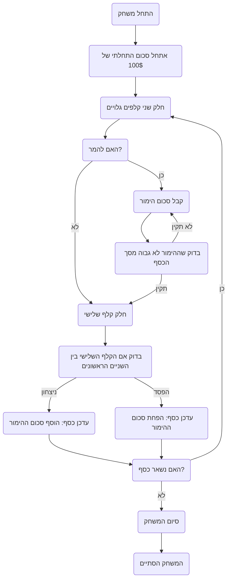

## ניתוח קוד משחק הקלפים Acey Ducey

### <algorithm>

1.  **אתחול:**
    *   המשחק מתחיל עם סכום כסף התחלתי של 100$. ניתן לשנות את הסכום הזה בשורה 170.
    *   המשחק ממשיך עד שהשחקן מפסיד את כל כספו או מפריע לתוכנית.

2.  **התחלת סיבוב:**
    *   הדילר (המחשב) מחלק שני קלפים גלויים.
    *   דוגמה: קלף ראשון - 5 תלתן, קלף שני - 10 לב.

3.  **הימור:**
    *   השחקן יכול לבחור להמר או לא.
    *   אם השחקן בוחר להמר, הוא נדרש להכניס סכום כסף שהוא מוכן להמר.
    *   סכום ההימור חייב להיות בתוך הטווח של כמות הכסף שיש לשחקן.
    *   דוגמה: השחקן מהמר על 20$.

4.  **חלוקת קלף שלישי:**
    *   הדילר מחלק קלף שלישי גלוי.
    *   דוגמה: קלף שלישי - 7 יהלום.

5.  **בדיקת ניצחון/הפסד:**
    *   המשחק בודק אם הערך של הקלף השלישי נמצא בין הערכים של שני הקלפים הראשונים.
        *   אם הקלף השלישי בין שני הקלפים הראשונים, השחקן מנצח וזוכה בסכום ההימור.
            *   דוגמה: 7 בין 5 ו-10. השחקן זכה ב-20$.
        *   אם הקלף השלישי אינו בין שני הקלפים הראשונים, השחקן מפסיד את סכום ההימור.
            *   דוגמה: 2 בין 5 ו-10. השחקן הפסיד 20$.

6.  **עדכון כסף:**
    *   סכום הכסף של השחקן מעודכן בהתאם לתוצאה (ניצחון או הפסד).

7.  **המשך משחק:**
    *   המשחק חוזר לשלב 2 כל עוד יש לשחקן כסף והוא לא מפריע לתוכנית.

8.  **סיום משחק:**
    *   המשחק מסתיים כאשר לשחקן נגמר הכסף או שהוא מפריע לתוכנית.

### <mermaid>

### <explanation>

* **ייבואים (Imports):**
  אין ייבוא מוגדר בקוד שסופק, כיוון שהוא רק תיאור של משחק Acey Ducey, ולא קוד בפועל.

* **מחלקות (Classes):**
  אין הגדרות של מחלקות בקוד שסופק. זהו תיאור מילולי של משחק, ולכן אין בו שימוש במושגים של תכנות מונחה עצמים.

* **פונקציות (Functions):**
    * אין פונקציות מוגדרות בקוד. מדובר בתיאור של כללי המשחק, ולא בקוד שאפשר להריץ.

* **משתנים (Variables):**
    * `Q`: מציין את סכום הכסף ההתחלתי של השחקן, שמתחיל ב-$100.
    * `Bet`: מציין את סכום הכסף שהשחקן מהמר בכל סיבוב.
    * `Card1`, `Card2`, `Card3`: מציינים את הערכים של הקלפים המחולקים.
  
* **שרשרת קשרים עם חלקים אחרים בפרויקט:**
    * לא רלוונטי, מכיוון שהקוד הוא רק תיאור מילולי, ולא חלק מפרויקט גדול יותר. אם היה מדובר בקוד אמיתי, היינו בודקים את האינטראקציה שלו עם חלקים אחרים כמו GUI, לוגיקת משחק, וכו'.

* **בעיות אפשריות ושיפורים:**
    * הקוד כרגע הוא רק תיאור של המשחק. אם נרצה להפוך אותו לקוד, נצטרך לממש:
        *  אופן ייצוג הקלפים וערכיהם.
        *   אופן בחירת ההימור של השחקן.
        *   אופן חלוקת הקלפים בצורה רנדומלית.
        *   אופן עדכון סכום הכסף של השחקן.
        *   אופן הצגת המשחק למשתמש (ממשק).

   *   המשחק אינו כולל בדיקות תקינות קלט (למשל, מה קורה אם השחקן מכניס הימור שלילי).