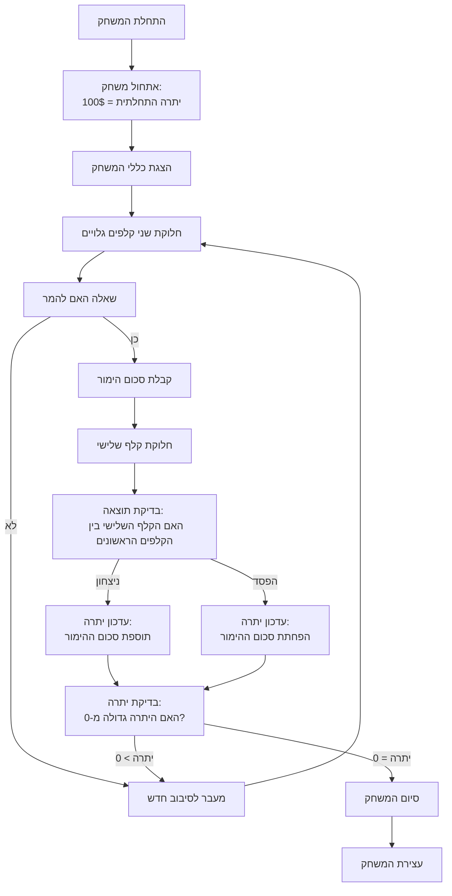

## ניתוח קוד המשחק Acey Ducey

### 1. <algorithm>

הקוד שסופק מתאר את כללי המשחק Acey Ducey. זהו משחק קלפים שבו שחקן מהמר על כך שקלף שלישי שיחולק יהיה בערך בין שני קלפים ראשונים. הנה תיאור תהליך המשחק:

1.  **אתחול המשחק:**
    *   המשחק מתחיל עם יתרה כספית התחלתית של $100 (אפשר לשנות בהמשך).
    *   מוצגים לשחקן הסבר קצר על המשחק וכלליו.

2.  **סיבוב משחק:**
    *   המחשב מחלק שני קלפים גלויים. לדוגמה, נניח שהקלפים הם 4 ו-10.
    *   השחקן מתבקש להמר על כך שהקלף השלישי יהיה בעל ערך בין הקלפים הראשונים (במקרה הזה בין 4 ל-10).

3.  **הימור:**
    *   אם השחקן בוחר להמר, הוא צריך לציין סכום הימור.
    *   אם השחקן בוחר לא להמר, המשחק עובר לשלב הבא.

4.  **חלוקת הקלף השלישי:**
    *   הקלף השלישי מחולק. לדוגמה, נניח שהוא 7.

5.  **בדיקת תוצאה:**
    *   המשחק בודק אם הקלף השלישי נמצא בין שני הקלפים הראשונים (4 ו-10).
    *   אם כן, השחקן מנצח ומקבל את סכום ההימור שלו בחזרה.
    *   אם לא, השחקן מפסיד את סכום ההימור.

6.  **עדכון יתרה:**
    *   יתרת הכסף של השחקן מתעדכנת בהתאם לתוצאה.
    *   אם היתרה מגיעה ל-0, המשחק מסתיים.
    *   אם לא, המשחק ממשיך לסיבוב חדש.

7.  **סיום משחק:**
    *   המשחק מסתיים כאשר השחקן מאבד את כל כספו או שהוא בוחר להפסיק את המשחק.

**דוגמה לזרימת נתונים בין שלבים:**

*   **אתחול:** היתרה ההתחלתית (100$) מועברת לשלב ההימור.
*   **סיבוב משחק:** הקלפים המחולקים מועברים לשלב בדיקת התוצאה.
*   **הימור:** סכום ההימור מועבר לשלב בדיקת התוצאה.
*   **בדיקת תוצאה:** הערך של הקלף השלישי מועבר לשלב עדכון היתרה.
*   **עדכון יתרה:** היתרה החדשה מועברת לשלב הבא.

### 2. <mermaid>

אין קוד `import header` בקוד שסופק, לכן לא נדרש תרשים זרימה עבור header.py.

**ניתוח תלויות:**
אין תלויות מיובאות, מכיוון שהקוד הוא תיאור מילולי של המשחק ולא קוד Python פעיל. התרשים מתאר את הזרימה הלוגית של המשחק עצמו.

### 3. <explanation>

**ייבואים (Imports):**

אין ייבואים בקוד שסופק. הקוד הוא תיאור טקסטואלי של המשחק בלבד. במידה והיה מדובר בקוד בפועל, ייבוא של מודולים כגון `random` (לצורך חלוקת הקלפים) או `input` (לצורך קבלת קלט מהמשתמש) היה נפוץ.

**מחלקות (Classes):**

אין שימוש במחלקות בקוד שסופק. ביישום מלא של המשחק, ייתכן שהיו מחלקות עבור קלפים, חפיסת קלפים, או שחקן.

**פונקציות (Functions):**

אין פונקציות מוגדרות בקוד שסופק. במידה ומדובר בקוד ממשי, היו פונקציות שמבצעות:

*   אתחול המשחק (לדוגמה, קביעת יתרה התחלתית).
*   חלוקת קלפים (בחירת קלפים באופן אקראי).
*   קבלת הימור מהשחקן.
*   בדיקת תוצאת המשחק.
*   עדכון יתרת השחקן.
*   הצגת תוצאות לשחקן.

**משתנים (Variables):**

*   **Q:** משתנה שמייצג את יתרת הכסף של השחקן. בתחילה, הוא מוגדר ל-100$, וערכו משתנה בהתאם לתוצאות המשחק.

**בעיות אפשריות ותחומים לשיפור:**

*   **אין קוד:** הקוד שסופק הוא תיאור מילולי בלבד, לכן הוא אינו ניתן להרצה. נדרש לכתוב קוד בשפת תכנות (כגון Python) כדי לממש את המשחק בפועל.
*   **קלט/פלט:** אין התייחסות לאיך השחקן יבצע את ההימור או יראה את הקלפים. יש צורך בגישה לקלט מהשחקן והצגת פלט ברור.
*   **ממשק משתמש:** נדרש לממש ממשק משתמש (text-based או גרפי) כדי להפוך את המשחק לידידותי למשתמש.
*   **בדיקות קלט:** יש צורך לבדוק את הקלט מהמשתמש כדי לוודא שהוא חוקי (למשל, שההימור הוא מספר חיובי שאינו עולה על היתרה).

**שרשרת קשרים עם חלקים אחרים בפרויקט:**

הקוד שסופק הוא עצמאי ואינו תלוי בחלקים אחרים בפרויקט, מכיוון שהוא תיאור מילולי של המשחק ולא קוד פעיל. אם היה ממומש כקוד, הוא היה יכול להיות חלק ממודול גדול יותר של משחקי מחשב, או להיות עצמאי לחלוטין.

**סיכום:**

הקוד שסופק מתאר באופן ברור את כללי המשחק Acey Ducey. עם זאת, הוא לא קוד מחשב שניתן להריץ. כדי להפוך אותו למשחק פועל, יהיה צורך לממש את כל הפונקציות הדרושות בשפת תכנות, כולל טיפול בקלט/פלט, בדיקת תנאים, עדכון יתרה, וכו'.