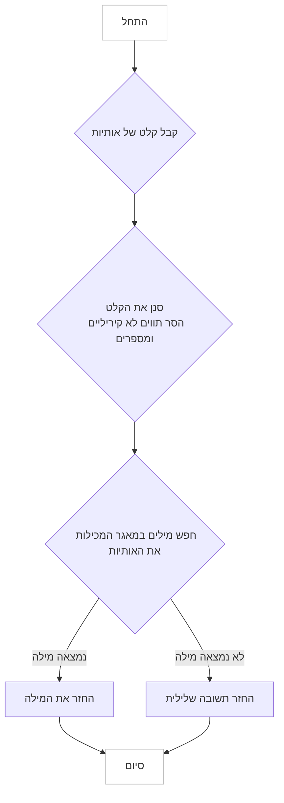

## ניתוח קוד - הוראות יצירת אנאגרמות

### <algorithm>

1.  **קבלת קלט:**
    - המודל מקבל קלט של מספר אותיות. לדוגמה: "а, б, в".
    - המודל מסנן את הקלט, ומתעלם מתווים שאינם קיריליים ומספרים. לדוגמה: "а, б, в, 1, z" יהפוך ל "а, б, в".

2.  **חיפוש מילים:**
    - המודל מחפש במאגר נתונים של מילים בשפה הרוסית.
    - המודל מחפש מילים המכילות את כל האותיות שניתנו (או חלק מהן) בקלט.
    - לדוגמה: עבור הקלט "а, б, в", המודל יכול למצוא את המילה "бав".

3.  **החזרת תוצאה:**
    - אם נמצאה מילה, המודל מחזיר אותה. לדוגמה: "бав".
    - אם לא נמצאה מילה, המודל מחזיר תשובה שלילית. לדוגמה: "לא נמצאה מילה מתאימה".

4.  **דוגמאות:**
    - קלט: "а, м, г" - פלט: "гам"
    - קלט: "с, о, т, н" - פלט: "сон" או "нос" (אחת מהן או רשימה של כולן).
    - קלט: "ы, щ, ж" - פלט: "не найдено"
    - קלט: "а, 1, b, в" - פלט: "а, в". ואז לחפש מילים שכוללות "а, в" (למשל: "ав").

### <mermaid>

### <explanation>

**הוראות המודל:**

ההוראות מיועדות למודל AI שיוצר אנאגרמות. הנה פירוט של ההוראות:

*   **מטרה:** המטרה היא לייצר מילים קיימות בשפה הרוסית, תוך שימוש באותיות שסופקו כקלט. אם אין מילה כזו, המודל יחזיר תשובה שלילית.
*   **סינון קלט:** ההוראות מציינות כי המודל צריך לסנן את הקלט ולהתעלם מתווים שאינם קיריליים ומספרים. זה מבטיח שהמודל יתמקד רק באותיות הרלוונטיות.
*   **חיפוש מילים:** המודל צריך לחפש במאגר נתונים של מילים בשפה הרוסית, למצוא מילים המכילות את כל האותיות שניתנו (או חלק מהן) ולספק את המילה כפלט.
*   **טיפול במקרים שליליים:** במקרה שבו אין מילה מתאימה, המודל יחזיר תשובה שלילית, כגון "לא נמצאה מילה מתאימה".

**ייבואים (Imports):**

אין ייבוא ישירות בקוד ההוראות עצמו, אך מודל האנאגרמות עשוי להשתמש בספריות חיצוניות לעיבוד שפה טבעית, ניתוח טקסט או מילונים.

**מחלקות (Classes):**

אין מחלקות ישירות בקוד ההוראות עצמו, אך יישום בפועל של מודל האנאגרמות עשוי להשתמש במחלקות שונות לייצוג מילים, מאגרי נתונים ופונקציות חיפוש.

**פונקציות (Functions):**

לא מוצגות פונקציות ישירות בקוד ההוראות עצמו, אך יישום בפועל של מודל האנאגרמות עשוי לכלול פונקציות כגון:

*   `filter_input(input_string)`: מסננת את הקלט ומסירה תווים שאינם קיריליים ומספרים.
*   `find_anagram(letters)`: מחפשת מילים מתאימות במאגר הנתונים.
*   `return_result(word)`: מחזירה את המילה שנמצאה או תשובה שלילית.

**משתנים (Variables):**

*   `input_string`: המשתנה שמאחסן את הקלט של האותיות.
*   `filtered_letters`: המשתנה שמאחסן את האותיות לאחר הסינון.
*   `found_word`: המשתנה שמאחסן את המילה שנמצאה (אם קיימת).

**בעיות אפשריות ותחומים לשיפור:**

*   **יעילות החיפוש:** חיפוש מילים במאגר נתונים גדול יכול להיות איטי. יש לייעל את החיפוש באמצעות אלגוריתמים מתאימים.
*   **גמישות:** ניתן להוסיף גמישות למודל על ידי ציון מספר האותיות המקסימלי במילה (אם רלוונטי) או מתן אפשרות למצוא כמה מילים ולא רק אחת.
*   **טיפול בשגיאות:** יש ליישם מנגנוני טיפול בשגיאות על מנת למנוע קריסה של המודל במקרים של קלט לא תקין.

**שרשרת קשרים:**

מודל זה יכול להיות קשור למודלים אחרים בפרויקט, כגון מודל לעיבוד שפה טבעית, מודל לניהול מאגרי נתונים ומודל ממשק משתמש.

**לסיכום**, ההוראות מגדירות את תהליך העבודה של מודל ליצירת אנאגרמות. המודל מקבל קלט של אותיות, מסנן אותו, מחפש מילים רלוונטיות ומחזיר את התוצאה. כדי ליישם את המודל באופן יעיל, יש לייעל את החיפוש במאגר הנתונים ולהוסיף מנגנוני טיפול בשגיאות.