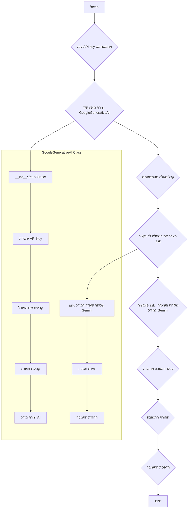

## ניתוח קוד

### <algorithm>
1. **ייבוא מודול `google.generativeai`**:
   - הקוד מתחיל בייבוא המודול `google.generativeai`, אשר מספק כלים ליצירת אינטראקציה עם מודלים של Google AI.
   - **דוגמה**: `import google.generativeai as genai`

2. **הגדרת מחלקה `GoogleGenerativeAI`**:
   - המחלקה מאגדת את כל הלוגיקה הנדרשת לאינטראקציה עם מודל ה-Gemini.
   - **דוגמה**: `class GoogleGenerativeAI:`

3. **הגדרת קונסטנטות `MODELS`**:
   - קונסטנטה זו מגדירה רשימה של שמות מודלים זמינים.
   - **דוגמה**: `MODELS = ["gemini-1.5-flash-8b", "gemini-2-13b", "gemini-3-20b"]`

4. **אתחול המחלקה `__init__`**:
   - הפונקציה מקבלת `api_key` ו`model_name` כפרמטרים, כאשר `model_name` ברירת מחדל היא `"gemini-2.0-flash-exp"`.
   - היא מאתחלת את `self.api_key` ו-`self.model_name`.
   - היא מגדירה את התצורה של `genai` באמצעות ה-API key.
   - היא יוצרת מופע של מודל `genai.GenerativeModel` עם שם המודל הנבחר.
   - **דוגמה**: 
     ```python
     def __init__(self, api_key: str, model_name: str = "gemini-2.0-flash-exp"):
        self.api_key = api_key
        self.model_name = model_name
        genai.configure(api_key=self.api_key)
        self.model = genai.GenerativeModel(model_name=self.model_name)
     ```
    - זרימת נתונים:  קבלת מפתח API ושם מודל --> הגדרת תצורה של המודל --> יצירת מופע של המודל

5. **שיטת `ask`**:
   - מקבלת שאלה `q` (מחרוזת) כקלט.
   - משתמשת ב-`self.model.generate_content(q)` כדי ליצור תגובה ממודל ה-AI.
   - מחזירה את התגובה `response.text` כפלט.
   - אם מתרחשת שגיאה, היא מחזירה הודעת שגיאה.
   - **דוגמה**:
     ```python
      def ask(self, q: str) -> str:
        try:
            response = self.model.generate_content(q)
            return response.text
        except Exception as ex:
            return f"Error: {str(ex)}"
     ```
   - זרימת נתונים: קבלת שאלה --> העברת השאלה למודל ה-AI --> קבלת תשובה --> החזרת התשובה או הודעת שגיאה

6. **שימוש לדוגמה**:
   - הקוד מקבל מהמשתמש מפתח API ושאלה.
   - הוא יוצר מופע של המחלקה `GoogleGenerativeAI` עם מפתח ה-API.
   - הוא שולח את השאלה באמצעות שיטת `ask` ומדפיס את התגובה.
   - זרימת נתונים:  קבלת מפתח API ושאלה מהמשתמש --> יצירת מופע של המחלקה --> שליחת שאלה למודל --> קבלת תשובה והדפסה

### <mermaid>


### <explanation>
**ייבואים (Imports)**:
- `import google.generativeai as genai`:
    - מייבאת את הספריה `google.generativeai`, שאחראית על אינטראקציה עם מודלי AI של גוגל.
    - נותנת לה את השם `genai` לשימוש קצר יותר בקוד.
    - אין תלות בחבילות `src.` אחרות.

**מחלקות (Classes)**:
- `class GoogleGenerativeAI`:
    - תפקיד: לעטוף את כל הפונקציונליות הנדרשת ליצירת אינטראקציה עם מודל ג'מיני.
    - מאפיינים:
        - `MODELS`: רשימה של מודלים זמינים.
        - `api_key`: מפתח API לאימות.
        - `model_name`: שם המודל בו יש להשתמש.
        - `model`: מופע של מודל ה-AI.
    - שיטות:
        - `__init__`: מאתחלת את המופע עם מפתח API ושם מודל.
        - `ask`: שולחת שאלה למודל ומחזירה תשובה.
    - האינטראקציה עם חלקים אחרים:
         - המופע של המחלקה נוצר בשימוש לדוגמא עם מפתח API שהמשתמש מספק
         -שיטת ה-`ask` משמשת לשלוח שאלה למודל ולקבל את התשובה.

**פונקציות (Functions)**:
- `__init__(self, api_key: str, model_name: str = "gemini-2.0-flash-exp")`:
    - פרמטרים: `api_key` (מחרוזת) ו-`model_name` (מחרוזת, אופציונלי, ברירת מחדל: `"gemini-2.0-flash-exp"`).
    - ערך מוחזר: אין.
    - מטרה: מאתחלת את המחלקה עם מפתח ה-API ושם המודל, מגדירה את תצורת ה-API ויוצרת מופע של המודל.
    - דוגמה לשימוש:
      ```python
      model = GoogleGenerativeAI(api_key="YOUR_API_KEY", model_name="gemini-2-13b")
      ```
- `ask(self, q: str) -> str`:
    - פרמטרים: `q` (מחרוזת) - השאלה.
    - ערך מוחזר: מחרוזת - התשובה מהמודל או הודעת שגיאה.
    - מטרה: שולחת שאלה למודל ומחזירה את התשובה.
    - דוגמה לשימוש:
      ```python
      response = model.ask("מהו קוד פייתון לחישוב עצרת?")
      print(response)
      ```

**משתנים (Variables)**:
- `MODELS`: רשימה (list) של מחרוזות המכילות שמות מודלים.
- `api_key`: מחרוזת (str) המכילה את מפתח ה-API.
- `model_name`: מחרוזת (str) המכילה את שם המודל.
- `model`: מופע של מחלקה `genai.GenerativeModel`.
- `q`: מחרוזת (str) המכילה את השאלה.
- `response`: מחרוזת (str) המכילה את התשובה.

**בעיות אפשריות ותחומים לשיפור**:
- **טיפול בשגיאות**: הקוד מטפל בשגיאות בסיסיות בפונקציה `ask`, אך ניתן להוסיף טיפול שגיאות מפורט יותר, כולל סוגי שגיאות ספציפיים (כגון שגיאת רשת, שגיאת API).
- **מודלים מוגדרים**:  רשימת המודלים `MODELS` היא קבועה, ניתן לשקול אפשרות לקבל רשימה דינמית או להשתמש בהגדרות.
- **אבטחה**: מפתח ה-API מוקלד על ידי המשתמש. יש לטפל בו בצורה מאובטחת יותר, לדוגמה, דרך משתני סביבה או קובץ תצורה ולא דרך קלט ישיר מהמשתמש.
- **הגדרות תצורה**: קשה להגדיר פרמטרים נוספים ל-`genai.GenerativeModel`. כדאי לספק דרך קלה להעביר פרמטרים נוספים.

**שרשרת קשרים עם חלקים אחרים בפרויקט**:
- קוד זה מהווה מודול עצמאי ואין לו תלות ישירה בחלקים אחרים בפרויקט. עם זאת, ניתן להשתמש בו כחלק ממערכת גדולה יותר שבה נדרשת אינטראקציה עם מודלי AI של גוגל.

## הערות נוספות

- הקוד מספק דרך פשוטה ונוחה להתחיל לעבוד עם מודל ג'מיני של גוגל.
- הוא מתאים למשימות פשוטות של שאילתות מבוססות טקסט.
- הקוד קל להבנה וניתן להרחבה בקלות על ידי הוספת תכונות נוספות.